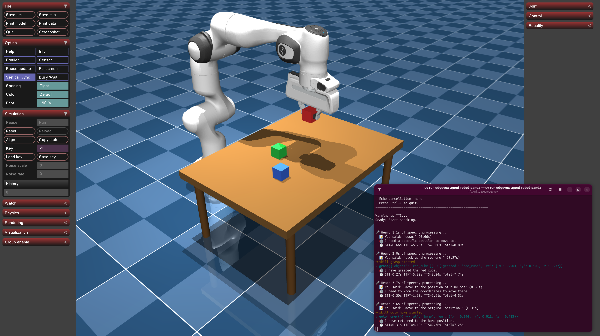
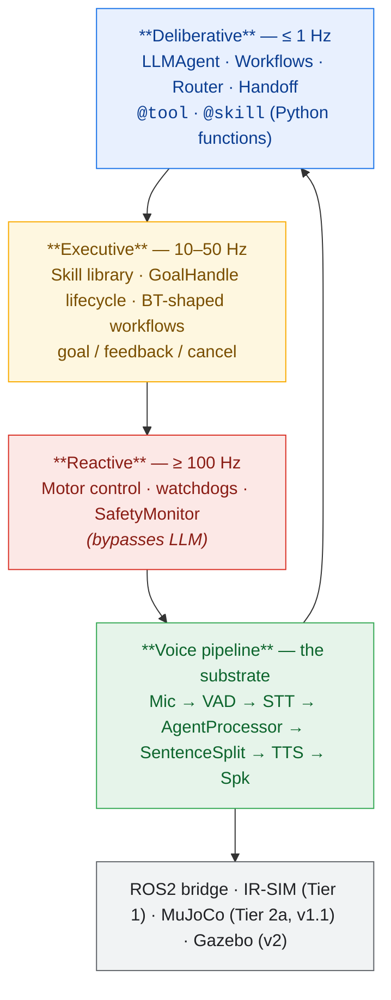

# EdgeVox

**Offline voice agent framework for robots.**
**Sub-second local voice pipeline. Fully private.**

[](https://www.python.org)
[](LICENSE)




---

**Agents + Skills + Workflows** &nbsp;|&nbsp; **2D sim (IR-SIM)** &nbsp;|&nbsp; **0.8s voice TTFT** &nbsp;|&nbsp; **15 languages** &nbsp;|&nbsp; **56 voices** &nbsp;|&nbsp; **ROS2-native**

---

## Why EdgeVox?

- **Voice is the interface** — streaming STT → LLM → TTS pipeline hits first audio in ~0.8 s on an RTX 3080, runs on a Jetson Orin Nano, CPU fallback on a laptop.
- **Agents are the program model** — write `@tool` and `@skill` functions in Python; compose them with `Sequence`, `Fallback`, `Loop`, `Parallel`, and `Router` workflows; delegate across agents with OpenAI-SDK-style handoffs.
- **Robots are the target** — cancellable skills with `GoalHandle`, hard-stop safety monitor that bypasses the LLM, three-tier simulation (stdlib → IR-SIM → sim-to-real planned), ROS2 bridge.
- **Everything is offline** — no cloud APIs, no telemetry, no vendor lock. Gemma 4 via llama.cpp, faster-whisper, Kokoro/Piper/Supertonic TTS. Your mic audio never leaves the machine.

## 30-second demo

```bash
pip install 'edgevox[sim]'
edgevox-setup                      # downloads ~3 GB of models, one time
edgevox-agent robot-irsim --text-mode
```

A matplotlib window opens showing a 10×10 apartment with four rooms (kitchen, living room, bedroom, office). Type:

```
you: please go to the kitchen
Scout: I have navigated to the kitchen.
you: drive to the bedroom
(mid-flight) you: stop
Scout: Stopped.
```

The blue robot drives visibly, stops in ~200 ms when you say "stop" (the safety monitor preempts before the LLM is consulted), resumes on the next command. Swap `--text-mode` for `--simple-ui` to drive it by voice.

## Features

### Agent framework

- **`@tool` / `@skill` decorators** — auto-derive JSON schemas from Python signatures + docstrings
- **`LLMAgent`** with per-run history isolation, reentrant, thread-safe
- **Workflows**: `Sequence`, `Fallback`, `Loop`, `Parallel`, `Router`, `Retry`, `Timeout` — behavior-tree-shaped, nestable
- **Handoffs** — OpenAI-SDK-style "agent-as-return-value" (2 LLM hops per delegation vs smolagents' 3)
- **Cancellable skills** — `GoalHandle` lifecycle with `poll` / `cancel` / `feedback`, mid-flight preempt in ~200 ms
- **`SafetyMonitor`** — stop-word preempt before the LLM is consulted
- **`EventBus`** — thread-safe pub/sub for observability, metrics, main-thread scheduling
- **`SimEnvironment` protocol** — agent code swaps cleanly between `ToyWorld` (stdlib), `IrSimEnvironment` (IR-SIM), and (planned) MuJoCo / Gazebo adapters
- **Parallel tool/skill dispatch** inside a single turn via `ThreadPoolExecutor`
- **5 built-in example agents** — `home`, `robot`, `dev`, `robot-scout`, `robot-irsim`

### Voice pipeline (substrate)

- **Sub-second streaming** — 0.8 s first-audio on RTX 3080 (VAD 32 ms + faster-whisper + Gemma 4 E2B + Kokoro)
- **15 languages** with 56 voices across 4 TTS backends
- **Voice interrupt** — speak over the bot to cut it off
- **4 wake words** — "Hey Jarvis", "Alexa", "Hey Mycroft", "Okay Nabu"
- **4 interfaces** — TUI (Textual), Web UI (FastAPI + Vue), simple CLI, text mode
- **ROS2 bridge** — pub/sub topics with proper QoS for multi-robot setups
- **Auto hardware detection** — CUDA / Metal / CPU fallback, VRAM-aware GPU-layer selection

## Quick Start

```bash
# 1. Install uv (fast Python package manager)
curl -LsSf https://astral.sh/uv/install.sh | sh

# 2. Create a virtual environment
uv venv --python 3.12
source .venv/bin/activate

# 3. Install llama-cpp-python (GPU or CPU, your choice)
uv pip install llama-cpp-python \
    --extra-index-url https://abetlen.github.io/llama-cpp-python/whl/cu124
# For Apple Silicon: CMAKE_ARGS="-DGGML_METAL=on" uv pip install llama-cpp-python
# For CPU only:      uv pip install llama-cpp-python

# 4. Install EdgeVox with the sim extra (pulls in ir-sim)
uv pip install -e '.[sim]'

# 5. Download models (~3 GB)
edgevox-setup

# 6a. Run a voice agent with a visible robot
edgevox-agent robot-irsim --text-mode

# 6b. OR run the classic voice pipeline
edgevox
```

## Build your own agent

```python
from edgevox.agents import AgentContext, GoalHandle, ToyWorld, skill
from edgevox.examples.agents.framework import AgentApp
from edgevox.llm import tool


@tool
def set_light(room: str, on: bool, ctx: AgentContext) -> str:
    """Turn a room's light on or off.

    Args:
        room: the room name, e.g. "kitchen".
        on: true to turn on, false to turn off.
    """
    ctx.deps.apply_action("set_light", room=room, on=on)
    return f"{room} light is now {'on' if on else 'off'}"


@skill(latency_class="slow", timeout_s=30.0)
def navigate_to(room: str, ctx: AgentContext) -> GoalHandle:
    """Drive the robot to a named room.

    Args:
        room: target room, e.g. "kitchen", "bedroom".
    """
    return ctx.deps.apply_action("navigate_to", room=room)


AgentApp(
    name="Scout",
    instructions="You are Scout, a terse home robot. Confirm what you did in one sentence.",
    tools=[set_light],
    skills=[navigate_to],
    deps=ToyWorld(),
    stop_words=("stop", "halt", "freeze"),
).run()
```

Launch with `python my_agent.py --text-mode` and you have a voice-controllable robot running on a stdlib-only reference sim. Swap `ToyWorld()` for `IrSimEnvironment()` and a matplotlib window opens. Full guide: [`docs/guide/agents.md`](docs/guide/agents.md).

The five built-in agents are subcommands of `edgevox-agent`:

| Command | What it does |
|---|---|
| `edgevox-agent home` | Home automation — lights, thermostat, timers, weather |
| `edgevox-agent robot` | Simple robot demo with pose + battery |
| `edgevox-agent dev` | Developer toolbox — arithmetic, unit conversion, notes |
| `edgevox-agent robot-scout` | Full agent demo on `ToyWorld` (stdlib, no extra deps) |
| `edgevox-agent robot-irsim` | Full agent demo on IR-SIM with matplotlib window |

Each one supports `--text-mode`, `--simple-ui`, or (default) full TUI.

## Simulation tiers

| Tier | Sim | Dependencies | Role | Status |
|---|---|---|---|---|
| 0 | `ToyWorld` | stdlib only | unit tests, trivial examples | shipped |
| 1 | `IrSimEnvironment` | `pip install ir-sim` | day-one 2D visual demo (matplotlib, diff-drive, LiDAR) | shipped |
| 2 | MuJoCo | `pip install mujoco` | 3D physics, URDF, no ROS2 needed | planned |
| 2 | Gazebo Harmonic | ROS2 + Ubuntu | sim-to-real graduation path | planned |

All tiers implement the same `SimEnvironment` protocol — agent code doesn't change when you swap backends. The `robot-irsim` demo above is the Tier 1 experience.

## Voice pipeline

EdgeVox's original identity and the agent framework's substrate. Streaming STT → LLM → TTS with voice interrupt, wake words, 15 languages, TUI and web UIs. Run it without any agent code:

```bash
edgevox                         # full TUI (default)
edgevox --web-ui                # browser interface
edgevox --wakeword "hey jarvis"
edgevox-cli                     # simple CLI
edgevox-cli --text-mode         # no microphone needed
```

### Languages & backends

| Language | STT | TTS | Voices |
|---|---|---|---|
| English, French, Spanish, Hindi, Italian, Portuguese, Japanese, Chinese | faster-whisper | Kokoro | 25 |
| Vietnamese | sherpa-onnx (Zipformer) | Piper | 20 |
| German, Russian, Arabic, Indonesian | faster-whisper | Piper | varies |
| Korean | faster-whisper | Supertonic | 10 |
| Thai | faster-whisper | PyThaiTTS | 1 |

Models are hosted on [`nrl-ai/edgevox-models`](https://huggingface.co/nrl-ai/edgevox-models) (HuggingFace) with fallback to upstream repos.

Full TUI + slash-command reference: [`docs/guide/commands.md`](docs/guide/commands.md).

## Hardware requirements

| Device | RAM | GPU | Expected latency |
|--------|-----|-----|-------------------|
| PC (i9 + RTX 3080 16 GB) | 64 GB | CUDA | **~0.8 s** |
| Jetson Orin Nano | 8 GB | CUDA | ~1.5-2 s |
| MacBook Air M1 | 8 GB | Metal | ~2-3 s |
| Any modern laptop | 16 GB+ | CPU only | ~2-4 s |

## ROS2 integration

EdgeVox publishes voice pipeline events and accepts voice commands over ROS2 topics with proper QoS. Topics live under a configurable namespace (default `/edgevox`).

```bash
source /opt/ros/jazzy/setup.bash
edgevox --ros2
edgevox --ros2 --ros2-namespace /robot1/voice
```

The bridge exposes **9 published topics** (`transcription`, `response`, `state`, `metrics`, `bot_token`, …) and **6 subscribed topics** (`tts_request`, `interrupt`, `set_language`, …) plus **3 parameters** (`language`, `voice`, `muted`). Full reference: [`docs/reference/config.md`](docs/reference/config.md).

**Planned (v2): `RosActionSkill`** — wraps an `rclpy.action.ActionClient` as an EdgeVox skill so voice commands drive real robot action servers (Nav2, MoveIt2, Spot SDK, Unitree) with full goal / feedback / cancel semantics. The existing `SimEnvironment` protocol means your agent code won't change when you graduate from IR-SIM to a real robot — just swap the `deps`.

## Architecture

EdgeVox follows the classical robotics three-layer pattern. The agent framework lives only in the **deliberative** layer; safety reflexes and real-time control never touch the LLM.



The LLM never enters the reactive layer. Safety reflexes bypass it. Skills expose *intents* (`navigate_to(room)`), not *control* (`set_speed(mps)`). Every other design choice flows from this rule.

Full architecture writeup: [`docs/plan.md`](docs/plan.md) — grounded in cross-framework research against ADK, smolagents, Pipecat, LangGraph, OpenAI Agents SDK, PydanticAI, VLA systems, and 7 simulators.

## Model sizes

| Component | Model | Size | RAM |
|---|---|---|---|
| VAD | Silero VAD v6 | ~2 MB | ~10 MB |
| STT | whisper-small | 500 MB | ~600 MB |
| STT | whisper-large-v3-turbo | 1.5 GB | ~2 GB |
| LLM | Gemma 4 E2B IT Q4_K_M | 1.8 GB | ~2.5 GB |
| TTS | Kokoro 82M | 200 MB | ~300 MB |
| Wake | pymicro-wakeword | ~5 MB | ~10 MB |

- **M1 Air (8 GB):** whisper-small + Q4_K_M = **3.4 GB**
- **PC with GPU:** whisper-large-v3-turbo + Q4_K_M = **5.8 GB**

## Documentation

- **[Agents & Tools guide](docs/guide/agents.md)** — full agent framework reference: tools vs skills, workflows, safety monitor, simulation tiers, threading model, anti-patterns
- **[Architecture plan](docs/plan.md)** — v4 plan grounded in 8-framework + 7-sim comparison
- **[Quick start](docs/guide/quickstart.md)**
- **[TUI commands](docs/guide/commands.md)**
- **[CLI reference](docs/reference/cli.md)**
- **[ROS2 bridge reference](docs/reference/config.md)**

Full site: [EdgeVox Docs](https://edgevox-ai.github.io/edgevox/) (VitePress). Run locally:

```bash
cd docs && npm run dev
```

## License

MIT
