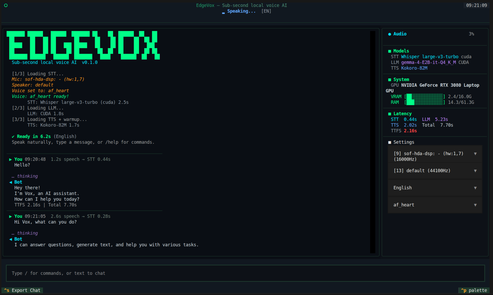
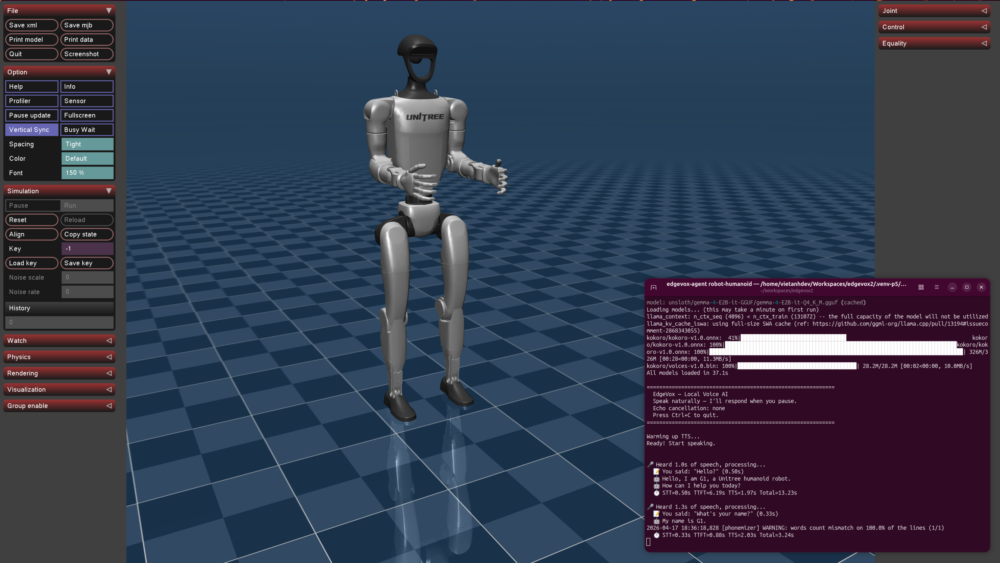
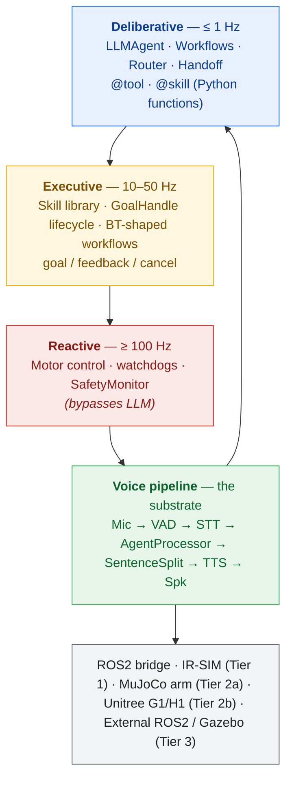

# EdgeVox

**Offline voice agent framework for robots.**
**Sub-second local voice pipeline. Fully private.**

[](https://www.python.org)
[](LICENSE)






---

**Agents + Skills + Workflows** &nbsp;|&nbsp; **2D sim (IR-SIM)** &nbsp;|&nbsp; **3D sim (MuJoCo)** &nbsp;|&nbsp; **0.8s voice TTFT** &nbsp;|&nbsp; **15 languages** &nbsp;|&nbsp; **56 voices** &nbsp;|&nbsp; **ROS2-native**

---

## Why EdgeVox?

- **Voice is the interface** — streaming STT → LLM → TTS pipeline hits first audio in ~0.8 s on an RTX 3080, runs on a Jetson Orin Nano, CPU fallback on a laptop.
- **Agents are the program model** — write `@tool` and `@skill` functions in Python; compose them with `Sequence`, `Fallback`, `Loop`, `Parallel`, and `Router` workflows; delegate across agents with OpenAI-SDK-style handoffs.
- **Robots are the target** — cancellable skills with `GoalHandle`, hard-stop safety monitor that bypasses the LLM, three-tier simulation (stdlib → IR-SIM → MuJoCo), ROS2 bridge.
- **Everything is offline** — no cloud APIs, no telemetry, no vendor lock. Gemma 4 via llama.cpp, faster-whisper, Kokoro/Piper/Supertonic TTS. Your mic audio never leaves the machine.

## 30-second demo

**2D — IR-SIM (mobile robot navigation)**

```bash
pip install 'edgevox[sim]'
edgevox-setup                      # downloads ~3 GB of models, one time
edgevox-agent robot-irsim --text-mode
```

A matplotlib window opens showing a 10×10 apartment with four rooms. Type "go to the kitchen" — the blue robot drives visibly. Say "stop" mid-flight and it halts in ~200 ms (the safety monitor preempts before the LLM is consulted). Swap `--text-mode` for `--simple-ui` to drive it by voice.

**3D — MuJoCo (tabletop arm pick-and-place)**

```bash
pip install 'edgevox[sim-mujoco]'
edgevox-agent robot-panda --text-mode
```

A MuJoCo viewer opens with a Franka Panda arm above a table with three colored cubes. Type "pick up the red cube" — the arm moves, grasps, and lifts. Voice commands control `move_to`, `grasp`, `release`, and `goto_home` skills.

**3D — MuJoCo humanoid (Unitree G1 / H1)**

```bash
pip install 'edgevox[sim-mujoco]'
edgevox-agent robot-humanoid --simple-ui
```

A Unitree humanoid (auto-fetched from `nrl-ai/edgevox-models` on first use, ~15 MB) appears in the MuJoCo viewer standing on its home keyframe. Say "walk forward half a meter", "turn left ninety degrees", "stand" — a procedural gait swings the legs + arms while the root advances. Plug in an ONNX walking policy via `MujocoHumanoidEnvironment.set_walking_policy(...)` for real RL locomotion.

**Real robot or external sim via ROS2**

```bash
source /opt/ros/jazzy/setup.bash
edgevox-agent robot-external --text-mode
```

Subscribes to `odom`, optionally `scan` + `camera/image_raw`, and publishes `cmd_vel` + `goal_pose`. Drives any Gazebo Harmonic world, Isaac Sim (via ROS2 bridge), or a real mobile robot that speaks the standard contract — the same agent code works unchanged.

## Features

### Agent framework

- **`@tool` / `@skill` decorators** — auto-derive JSON schemas from Python signatures + docstrings
- **`LLMAgent`** with per-run history isolation, reentrant, thread-safe
- **Workflows**: `Sequence`, `Fallback`, `Loop`, `Parallel`, `Router`, `Supervisor`, `Orchestrator`, `Retry`, `Timeout` — behavior-tree-shaped + multi-agent patterns, nestable
- **Handoffs** — OpenAI-SDK-style "agent-as-return-value" (2 LLM hops per delegation vs smolagents' 3); LangGraph-style `state_update` writes blackboard keys before the target runs
- **Grammar-constrained tool calling** — auto-built GBNF from `ToolRegistry` schemas; `tool_choice_policy="required_first_hop"` is the canonical SLM loop-break (no malformed JSON, no fabricated tool names)
- **Hooks** — 6 fire points (`on_run_start`, `before_llm`, `after_llm`, `before_tool`, `after_tool`, `on_run_end`), priority-ordered (Safety 100 → Observability 0), 12 built-ins ship + 3 SLM hardening hooks
- **Memory** — bi-temporal `Fact` schema (`facts_as_of(t)`), `JSONMemoryStore` + `SQLiteSessionStore`, `Compactor` with tokenizer-exact counts, file-based `NotesFile`
- **Artifacts** — versioned, indexed, exposable as LLM tools via `make_artifact_tools(store)`
- **Cancellable skills** — `GoalHandle` lifecycle with `poll` / `cancel` / `feedback`, mid-flight preempt in ~200 ms
- **`SafetyMonitor`** — stop-word preempt before the LLM is consulted
- **`EventBus`** — thread-safe pub/sub for observability, metrics, main-thread scheduling
- **`SimEnvironment` protocol** — agent code swaps cleanly between `ToyWorld` (stdlib), `IrSimEnvironment` (IR-SIM), and `MujocoArmEnvironment` (MuJoCo)
- **Parallel tool/skill dispatch** inside a single turn via `ThreadPoolExecutor`
- **8 built-in example agents** — `home`, `robot`, `dev`, `robot-scout`, `robot-irsim`, `robot-panda`, `robot-humanoid`, `robot-external`

### Voice pipeline (substrate)

- **Sub-second streaming** — 0.8 s first-audio on RTX 3080 (VAD 32 ms + faster-whisper + Gemma 4 E2B + Kokoro)
- **15 languages** with 56 voices across 4 TTS backends
- **Robust voice interrupt** — speak over the bot to cut it off; `specsub` AEC on by default + energy-ratio gate so the bot doesn't hear itself; LLM generation aborted via llama-cpp `stopping_criteria` (≤40 ms cancellation latency); back-to-back barge-ins re-arm cleanly
- **4 wake words** — "Hey Jarvis", "Alexa", "Hey Mycroft", "Okay Nabu"
- **4 interfaces** — TUI (Textual), Web UI (FastAPI + Vue), simple CLI, text mode
- **ROS2-native** — voice-pipeline bridge, TF2 / Nav2 / sensor adapter, `edgevox_msgs/action/ExecuteSkill` action server, external-sim driver for Gazebo / Isaac / real hardware
- **Auto hardware detection** — CUDA / Metal / CPU fallback, VRAM-aware GPU-layer selection

## Quick Start

```bash
# 1. Install uv (fast Python package manager)
curl -LsSf https://astral.sh/uv/install.sh | sh

# 2. Create a virtual environment
uv venv --python 3.12
source .venv/bin/activate

# 3. Install llama-cpp-python (GPU or CPU, your choice)
uv pip install llama-cpp-python \
    --extra-index-url https://abetlen.github.io/llama-cpp-python/whl/cu124
# For Apple Silicon: CMAKE_ARGS="-DGGML_METAL=on" uv pip install llama-cpp-python
# For CPU only:      uv pip install llama-cpp-python

# 4. Install EdgeVox with the sim extra (pulls in ir-sim)
uv pip install -e '.[sim]'

# 5. Download models (~3 GB)
edgevox-setup

# 6a. Run a voice agent with a visible robot
edgevox-agent robot-irsim --text-mode

# 6b. OR run the classic voice pipeline
edgevox
```

## Build your own agent

```python
from edgevox.agents import AgentContext, GoalHandle, ToyWorld, skill
from edgevox.examples.agents.framework import AgentApp
from edgevox.llm import tool


@tool
def set_light(room: str, on: bool, ctx: AgentContext) -> str:
    """Turn a room's light on or off.

    Args:
        room: the room name, e.g. "kitchen".
        on: true to turn on, false to turn off.
    """
    ctx.deps.apply_action("set_light", room=room, on=on)
    return f"{room} light is now {'on' if on else 'off'}"


@skill(latency_class="slow", timeout_s=30.0)
def navigate_to(room: str, ctx: AgentContext) -> GoalHandle:
    """Drive the robot to a named room.

    Args:
        room: target room, e.g. "kitchen", "bedroom".
    """
    return ctx.deps.apply_action("navigate_to", room=room)


AgentApp(
    name="Scout",
    instructions="You are Scout, a terse home robot. Confirm what you did in one sentence.",
    tools=[set_light],
    skills=[navigate_to],
    deps=ToyWorld(),
    stop_words=("stop", "halt", "freeze"),
).run()
```

Launch with `python my_agent.py --text-mode` and you have a voice-controllable robot running on a stdlib-only reference sim. Swap `ToyWorld()` for `IrSimEnvironment()` and a matplotlib window opens. Full guide: [`docs/guide/agents.md`](docs/guide/agents.md).

The five built-in agents are subcommands of `edgevox-agent`:

| Command | What it does |
|---|---|
| `edgevox-agent home` | Home automation — lights, thermostat, timers, weather |
| `edgevox-agent robot` | Simple robot demo with pose + battery |
| `edgevox-agent dev` | Developer toolbox — arithmetic, unit conversion, notes |
| `edgevox-agent robot-scout` | Full agent demo on `ToyWorld` (stdlib, no extra deps) |
| `edgevox-agent robot-irsim` | Full agent demo on IR-SIM with matplotlib window |
| `edgevox-agent robot-panda` | MuJoCo Franka Panda — voice pick-and-place |
| `edgevox-agent robot-humanoid` | MuJoCo Unitree G1 / H1 — voice walk / turn / stand |
| `edgevox-agent robot-external` | Drive any external ROS2 robot (Gazebo, Isaac, real hardware) |

Each one supports `--text-mode`, `--simple-ui`, or (default) full TUI. Any of them composes with `--ros2` to attach the full ROS2 bridge + Nav2 / TF2 / sensor adapter + `execute_skill` action server.

## Simulation tiers

| Tier | Sim | Dependencies | Role | Status |
|---|---|---|---|---|
| 0 | `ToyWorld` | stdlib only | unit tests, trivial examples | shipped |
| 1 | `IrSimEnvironment` | `pip install ir-sim` | 2D visual demo (matplotlib, diff-drive, LiDAR) | shipped |
| 2a | `MujocoArmEnvironment` | `pip install mujoco` | 3D physics, Franka Panda pick-and-place | shipped |
| 2b | `MujocoHumanoidEnvironment` | `pip install mujoco` | Unitree G1 / H1, procedural gait, ONNX policy slot | shipped |
| 3 | `ExternalROS2Environment` | sourced ROS2 workspace | Gazebo Harmonic, Isaac Sim (ROS2 bridge), real robots | shipped |

All tiers implement the same `SimEnvironment` protocol — agent code doesn't change when you swap backends. `robot-irsim` is Tier 1; `robot-panda` is Tier 2a; `robot-humanoid` is Tier 2b; `robot-external` is Tier 3 and can point at any Gazebo world or real robot that publishes `nav_msgs/Odometry` and accepts `geometry_msgs/Twist`.

## Voice pipeline

EdgeVox's original identity and the agent framework's substrate. Streaming STT → LLM → TTS with voice interrupt, wake words, 15 languages, TUI and web UIs. Run it without any agent code:

```bash
edgevox                         # full TUI (default)
edgevox --web-ui                # browser interface
edgevox --wakeword "hey jarvis"
edgevox-cli                     # simple CLI
edgevox-cli --text-mode         # no microphone needed
```

### Languages & backends

| Language | STT | TTS | Voices |
|---|---|---|---|
| 🇺🇸 English, 🇫🇷 French, 🇪🇸 Spanish, 🇮🇳 Hindi, 🇮🇹 Italian, 🇧🇷 Portuguese, 🇯🇵 Japanese, 🇨🇳 Chinese | faster-whisper | Kokoro | 25 |
| 🇻🇳 Vietnamese | sherpa-onnx (Zipformer) | Piper | 20 |
| 🇩🇪 German, 🇷🇺 Russian, 🇸🇦 Arabic, 🇮🇩 Indonesian | faster-whisper | Piper | varies |
| 🇰🇷 Korean | faster-whisper | Supertonic | 10 |
| 🇹🇭 Thai | faster-whisper | PyThaiTTS | 1 |

Models are hosted on [`nrl-ai/edgevox-models`](https://huggingface.co/nrl-ai/edgevox-models) (HuggingFace) with fallback to upstream repos.

Full TUI + slash-command reference: [`docs/guide/commands.md`](docs/guide/commands.md).

## Hardware requirements

| Device | RAM | GPU | Expected latency |
|--------|-----|-----|-------------------|
| PC (i9 + RTX 3080 16 GB) | 64 GB | CUDA | **~0.8 s** |
| Jetson Orin Nano | 8 GB | CUDA | ~1.5-2 s |
| MacBook Air M1 | 8 GB | Metal | ~2-3 s |
| Any modern laptop | 16 GB+ | CPU only | ~2-4 s |

## ROS2 integration

EdgeVox ships a full ROS2 surface, opt-in with `--ros2` on any agent or the voice pipeline. Topics live under a configurable namespace (default `/edgevox`).

```bash
source /opt/ros/jazzy/setup.bash
edgevox --ros2                                      # voice pipeline
edgevox-agent robot-humanoid --simple-ui --ros2     # G1 + voice + ROS2
edgevox-agent robot-external --text-mode            # drive an external ROS2 robot
```

**Published**: `transcription`, `response`, `state` (transient-local), `audio_level`, `metrics`, `bot_token`, `bot_sentence`, `wakeword`, `info`, `robot_state` (sim snapshot), `agent_event` (JSON stream of tool calls / skill goals / handoffs / safety preempts). With a sim attached, `RobotROS2Adapter` adds `/tf`, `pose`, `scan` (IR-SIM lidar), `image_raw` (MuJoCo camera).

**Subscribed**: `tts_request`, `command`, `text_input`, `interrupt`, `set_language`, `set_voice`, `cmd_vel` (Nav2 Twist), `goal_pose` (Nav2 PoseStamped).

**Services**: `list_voices`, `list_languages`, `hardware_info`, `model_info` — each an `std_srvs/srv/Trigger` returning JSON.

**Actions**: `execute_skill` (`edgevox_msgs/action/ExecuteSkill`) — generic `skill_name` + `arguments_json` goal so any agent skill is callable by a stock `rclpy.action.ActionClient`. Build the companion interface package with `colcon build --packages-select edgevox_msgs`.

Launch files under `launch/`: `edgevox.launch.py`, `edgevox_irsim.launch.py`, `edgevox_panda.launch.py`. Full reference: [`docs/guide/ros2.md`](docs/guide/ros2.md).

## Architecture

EdgeVox follows the classical robotics three-layer pattern. The agent framework lives only in the **deliberative** layer; safety reflexes and real-time control never touch the LLM.



The LLM never enters the reactive layer. Safety reflexes bypass it. Skills expose *intents* (`navigate_to(room)`), not *control* (`set_speed(mps)`). Every other design choice flows from this rule.

Full architecture writeup: [`docs/plan.md`](docs/plan.md) — grounded in cross-framework research against ADK, smolagents, Pipecat, LangGraph, OpenAI Agents SDK, PydanticAI, VLA systems, and 7 simulators.

## Model sizes

| Component | Model | Size | RAM |
|---|---|---|---|
| VAD | Silero VAD v6 | ~2 MB | ~10 MB |
| STT | whisper-small | 500 MB | ~600 MB |
| STT | whisper-large-v3-turbo | 1.5 GB | ~2 GB |
| LLM | Gemma 4 E2B IT Q4_K_M | 1.8 GB | ~2.5 GB |
| TTS | Kokoro 82M | 200 MB | ~300 MB |
| Wake | pymicro-wakeword | ~5 MB | ~10 MB |

- **M1 Air (8 GB):** whisper-small + Q4_K_M = **3.4 GB**
- **PC with GPU:** whisper-large-v3-turbo + Q4_K_M = **5.8 GB**

## Documentation

- **[Agents & Tools guide](docs/guide/agents.md)** — full agent framework reference: tools vs skills, workflows, safety monitor, simulation tiers, threading model, anti-patterns
- **[Architecture plan](docs/plan.md)** — v4 plan grounded in 8-framework + 7-sim comparison
- **[Quick start](docs/guide/quickstart.md)**
- **[TUI commands](docs/guide/commands.md)**
- **[CLI reference](docs/reference/cli.md)**
- **[ROS2 guide](docs/guide/ros2.md)** — bridge topics, services, `execute_skill` action, TF2 / Nav2 / sensor interop, launch files

### Harness architecture

In-depth docs for each subsystem of the agent harness:

- **[Agent loop](docs/guide/agent-loop.md)** — six-fire-point loop, parallel dispatch, handoff short-circuit, cancel-token plumbing
- **[Hooks](docs/guide/hooks.md)** — fire points, payloads, priority scale, built-ins, SLM hardening
- **[Memory](docs/guide/memory.md)** — `MemoryStore` / `SessionStore` / `Compactor` / `NotesFile`, bi-temporal facts
- **[Multi-agent](docs/guide/multiagent.md)** — Blackboard, Supervisor, Orchestrator, BackgroundAgent (OTP restart policies)
- **[Interrupt & barge-in](docs/guide/interrupt.md)** — `cancel_token` to llama-cpp `stopping_criteria`, AEC defaults, repeatable interrupts
- **[Tool calling](docs/guide/tool-calling.md)** — parser chain, GBNF grammar-constrained decoding, `tool_choice_policy`

Architecture decisions:

- **[ADR-001](docs/adr/001-cancel-token-plumbing.md)** — Cancel-token plumbing for barge-in
- **[ADR-002](docs/adr/002-typed-ctx-hook-state.md)** — Typed `AgentContext` fields + hook-owned state
- **[ADR-003](docs/adr/003-grammar-constrained-decoding.md)** — GBNF grammar-constrained tool decoding

Full site: [EdgeVox Docs](https://edgevox-ai.github.io/edgevox/) (VitePress). Run locally:

```bash
cd docs && npm run dev
```

## License

MIT
