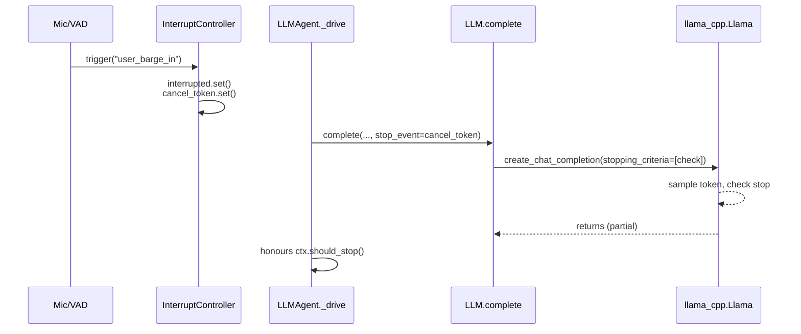

# ADR-001: Cancel-token plumbing for barge-in

- **Status:** Accepted
- **Date:** 2026-04-18
- **PR:** PR-1 (correctness bug fixes)

## Context

Voice-agent barge-in requires that, when a user speaks over TTS playback, the pipeline actually stops — TTS audio, in-flight LLM generation, and (when the policy allows) the currently running skill. Before this change, `InterruptController` exposed a single `interrupted: threading.Event` that consumers polled in hot loops, and `InterruptPolicy.cancel_llm` was a documented behaviour but never wired into the LLM backend.

The effect: a barge-in stopped TTS and the agent loop between hops, but the llama-cpp sampling loop ran to completion of `max_tokens` (typically 256 tokens on the `gemma-4-e2b` default, ~2–4 s on CPU). User-perceived interrupt latency was an order of magnitude above the ≤400 ms first-token budget that governs the rest of the pipeline.

## Decision

Add a second dedicated event, `InterruptController.cancel_token: threading.Event`, piped into `llama_cpp.Llama`'s `stopping_criteria` via a new `stop_event` parameter on `LLM.complete`.

- `cancel_token` is set when `trigger()` fires **and** the policy has `cancel_llm=True`.
- `reset()` clears `cancel_token`, `interrupted`, and `latest` atomically.
- `LLM.complete(messages, …, stop_event=ev)` installs a `StoppingCriteriaList([lambda tokens, logits: ev.is_set()])` that llama-cpp evaluates once per sampled token. Cancellation latency is a single decode step (≈15–40 ms on a 3B SLM).
- The agent loop (`LLMAgent._drive`) threads `ctx.interrupt.cancel_token` into every `llm.complete` call when an `InterruptController` is present on the context.

`InterruptController.history` is also ring-buffered to `max_history=500` so long voice sessions can't slow-leak memory via interrupt events.

## Alternatives considered

1. **Leave `cancel_llm` advisory, rely on `stream=True` + break.** Works for the pure chitchat path but not for multi-hop tool calls, which are non-streaming. Inconsistent UX across turn types.
2. **Cooperative `max_tokens=1` resampling.** Replace one long call with many short ones, checking interrupts between each. Worse latency, worse perplexity.
3. **Run llama-cpp in a subprocess and SIGTERM it.** Heaviest possible solution; loses KV cache and typically costs ≥200 ms to restart.

## Consequences

- **Correctness:** barge-in now enforceably stops generation; the old advisory semantics are gone.
- **Portability:** requires `llama_cpp.StoppingCriteriaList`, available since llama-cpp-python 0.2. Third-party LLM shims that implement `complete()` get a defensive `stop_event` kwarg default; existing test doubles were updated.
- **Thread-safety:** `stopping_criteria` runs inside the decode loop while holding `_inference_lock`. The check itself is a non-blocking `Event.is_set()` — zero overhead in steady state.
- **Observability:** `history` truncates silently past 500 entries. If an operator needs full history they can bump `max_history` at construction.

## Verification

See `tests/harness/test_interrupt.py`:

- `test_cancel_token_set_on_trigger` — trigger sets the token.
- `test_cancel_token_respects_policy` — `cancel_llm=False` policies leave the token clear.
- `test_reset_clears_cancel_token_and_latest` — reset clears both signals and drops stale `latest`.
- `test_history_bounded` — ring-buffer caps memory.

Manual: start a long voice reply, speak into mic after 500 ms, verify audio stops within the first TTS chunk and LLM generation actually halts (inspect logs for the `stopping_criteria` short-circuit).
