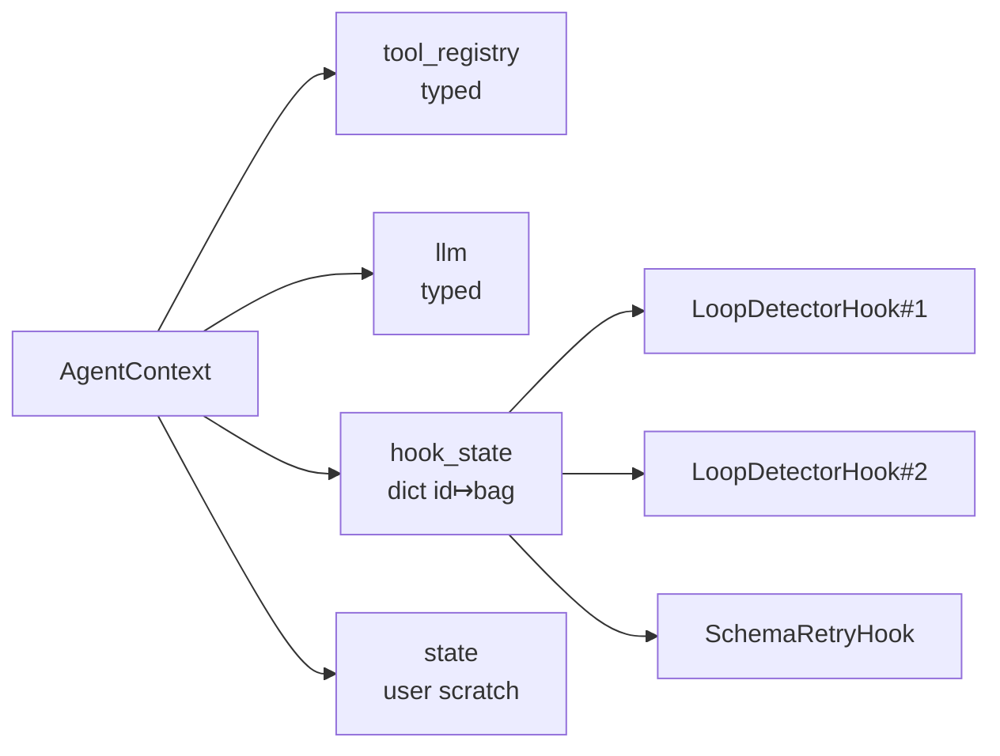

# ADR-002: Typed `AgentContext` fields + hook-owned state

- **Status:** Accepted
- **Date:** 2026-04-18
- **PR:** PR-2 (structural cleanup)

## Context

The harness accumulated two pieces of hidden coupling:

1. `LLMAgent.run()` stashed the running tool registry and LLM into `ctx.state["__tool_registry__"]` / `ctx.state["__llm__"]`. Hooks that needed them (notably `SchemaRetryHook` and `ContextCompactionHook`) reached into this dict with magic keys. The keys weren't typed, weren't discoverable, and made `ctx.state` a mixed surface for user scratch and framework plumbing.
2. SLM-hardening hooks (`LoopDetectorHook`, `SchemaRetryHook`) stored their per-turn state inside `ctx.session.state["__loop_detector__"]` etc. Two instances of the same hook on one context shared state — fine for defaults but fragile as soon as a user composed two independent instances (different thresholds per tool, say).

The fragility wasn't theoretical — grammar decoding (PR-5) and output validators (P2) need their own per-hook state too, and the magic-key pattern was about to collide.

## Decision

### Typed fields on `AgentContext`

Promote the two hot scratchpad keys to typed fields:

```python
@dataclass
class AgentContext:
    ...
    tool_registry: ToolRegistry | None = None
    llm: LLM | None = None
    hook_state: dict[int, dict[str, Any]] = field(default_factory=dict)
```

`LLMAgent.run()` sets `ctx.tool_registry` / `ctx.llm` at entry and restores the previous values on exit (supports nested runs). The legacy `ctx.state["__tool_registry__"]` / `["__llm__"]` keys are still populated for one release so external hook packages can migrate — framework code no longer reads them.

### Hook-owned state container

Each hook stores per-turn state under `ctx.hook_state[id(self)]`:

```python
def _counts(self, ctx):
    state = ctx.hook_state.setdefault(id(self), {"counts": {}})
    return state.setdefault("counts", {})
```

Keying by `id(self)` is what guarantees instance isolation. Two `LoopDetectorHook()` instances on one context now carry independent counters.



## Alternatives considered

1. **Subclass `AgentContext` per agent type.** Rejected — hooks must compose across agents; a typed pipeline shouldn't force subclass sprawl.
2. **Weak references for hook state.** Premature. `id(self)` works cleanly because the hook instance is alive for the entire run; the dict entry is rebuilt on `ON_RUN_START`.
3. **Descriptor-based hook state (`self.state.counts = …`).** Looks cleaner but requires each hook to carry its own lock for thread-safe multi-agent use. `ctx.hook_state` inherits the context's existing single-run ownership model.

## Consequences

- Hooks that were reaching into `ctx.session.state["__xxx__"]` must migrate to `ctx.hook_state[id(self)]`. Framework-shipped hooks are done; third-party hook packages get one release of back-compat via the legacy keys.
- `estimate_tokens(messages, llm=None)` now accepts an optional LLM for exact tokenisation; `TokenBudgetHook` + `ContextCompactionHook` use `ctx.llm` automatically. The `chars // 4` heuristic remains as a fallback (test doubles, offline paths).
- `ctx.state` is now user-scratch only — hooks must not write magic keys there.

## Verification

See `tests/harness/test_hook_integration.py`:

- `test_typed_ctx_fields_populated_during_run` — hooks see typed `ctx.tool_registry` and `ctx.llm` during run.
- `test_hook_owned_state_isolated_per_instance` — two instances of the same hook class keep independent state via `id(hook)` keying.
- `test_nested_run_restores_prior_pointers` — nested runs restore outer pointers and legacy keys.

Existing SLM hook tests (`test_slm_hooks.py`) cover `LoopDetectorHook` / `SchemaRetryHook` migration to the new container.
