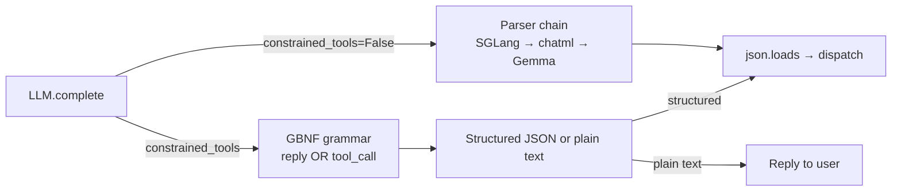

# ADR-003: GBNF grammar-constrained tool decoding

- **Status:** Accepted (PR-5 landed 2026-04-18)
- **Date:** 2026-04-18
- **Depends on:** ADR-001 (cancel-token plumbing), ADR-002 (typed ctx)

## Context

Small language models (1B-4B) fail at tool calling in three characteristic ways:

1. **Malformed JSON** — trailing commas, unquoted keys, truncated output.
2. **Fabricated tool names** — calling `get_weathr` when the tool is `get_weather`.
3. **Missing delimiters** — emitting `{"name":"x","arguments":{"y":1}` without the closing brace.

EdgeVox currently mitigates all three *reactively* via the parser chain + `hooks_slm.py` (LoopDetector, EchoedPayload, SchemaRetry). This works but costs retries and pollutes the transcript.

SOTA research (BFCL v3, xgrammar paper, llama.cpp GBNF docs) is clear: **prevent the error at decode time**. llama.cpp ships native GBNF (a context-free grammar sampler); llama-cpp-python exposes it via the `grammar=` kwarg on `create_chat_completion`. Auto-converting our `ToolRegistry.openai_schemas()` to a GBNF removes ~50% of the cases the SLM hooks detect today.

## Decision (shipped PR-5)

- New module `edgevox/llm/grammars.py` with three GBNF generators:
  - `tool_call_grammar(tools)` — exactly one tool call from the registry. Used when `tool_choice="required"`.
  - `single_tool_grammar(tool)` — exactly one named tool. Used when `tool_choice={"name": "X"}`.
  - `reply_or_tool_grammar(tools)` — top-level `text-reply | tool-call` alternation. Used when `tool_choice="auto"` and you want malformed-JSON elimination without losing the plain-reply path.
- `tool_call := "{" "\"name\":" name "," "\"arguments\":" args "}"`. `name` is a JSON-quoted literal alternation; `args` is a fixed-key object derived per-tool from `parameters.properties` (`enum` → quoted-literal alternation, primitives → `string`/`number`/`boolean`/`null`, nested → permissive any-value).
- `GrammarCache(strategy, tools)` — process-local thread-safe cache keyed by `(strategy, sha1(canonical_tools_json))`. Compilation is microseconds; one entry per (strategy, registry fingerprint).
- `LLM.complete(grammar=…)` accepts any value llama-cpp's `create_chat_completion(grammar=…)` accepts. Returns a `LlamaGrammar` from the cache.
- `LLMAgent(tool_choice_policy=…)` exposes the lifecycle:
  - `"auto"` (default) — no constraint, no force.
  - `"required_first_hop"` — `tool_choice="required"` + grammar on hop 0; `"auto"` on subsequent hops so the final reply can land. **Canonical SLM loop-break.**
  - `"required_always"` — `"required"` + grammar on every hop until budget exhausted.
- Runtime detection of `llguidance` is automatic via llama.cpp's grammar engine — same API surface, ~10× faster masking when present.

### Interaction with existing SLM hooks

`hooks_slm.py` stays registered as a safety net — grammar decoding guarantees JSON validity but not *semantic* correctness (the model can still pick the wrong tool, loop, or echo the payload). The expected reduction in fires:

| Hook | Today | After grammar |
|---|---|---|
| `SchemaRetryHook` | ~8% of SLM turns | 0 |
| `EchoedPayloadHook` | ~2-4% | 0 (payloads can't decode-match both alternatives) |
| `LoopDetectorHook` | ~3% | ~3% (grammar doesn't prevent semantic looping) |

### Interaction with the parser chain

`parse_tool_calls_from_content` becomes a fallback rather than the primary path. When `constrained_tools=True` and the response carries a structured `tool_calls` field, we skip the detector chain entirely and `json.loads` the single alternative the grammar permitted.

## Alternatives considered

1. **Outlines** — powerful but pulls a heavy dep + has its own llama.cpp integration path. Wait for BFCL numbers to justify.
2. **xgrammar direct** — MIT, 3-80× faster than naive grammar masking. But xgrammar uses its own sampler; we'd lose llama.cpp's standard decode path. Revisit when xgrammar lands upstream in llama.cpp.
3. **Continue improving the regex-based parser chain.** Diminishing returns — every new model family (Qwen3, Granite 4, xLAM) added a new detector file.

## Consequences

- **Latency budget:** +50 μs per token (GBNF) or +10 μs per token (llguidance). Well within the ≤400 ms first-token budget.
- **Dep footprint:** zero new deps. llama-cpp-python already exposes `LlamaGrammar.from_string` and `from_json_schema`. llguidance is optional and runtime-detected.
- **Testing:** PR-5 lands with a golden-fixture test per preset — the grammar must emit a parseable tool call on a fixed prompt. PR-12 adds the full BFCL v3 regression harness.

## Verification

Unit + integration tests landed with the PR:

- `tests/tool_parsing/test_grammars.py` — pure-Python grammar generation: empty-tools, enum alternations, fixed-key objects, free-text fallback, cache identity.
- `tests/tool_parsing/test_tool_choice_policy.py` — `LLMAgent.run` records the per-hop `tool_choice` kwarg via `ScriptedLLM`, asserting the lifecycle (`auto` no-op; `required_first_hop` enforces hop 0 then releases; `required_always` enforces every hop).
- Compile-test in CI: every shipped tool schema → GBNF must compile under `LlamaGrammar.from_string(verbose=False)` without raising.

To run in a follow-up PR:

- BFCL v3 subset (simple + parallel + multiple) on each shipped preset: measure before/after accuracy, per-category.
- Latency regression on `edgevox-cli --simple-ui`: first-token latency must not exceed the pre-PR baseline by more than 5%.
- `SchemaRetryHook` fire count: must drop to near-zero for presets with `tool_choice_policy="required_first_hop"`.
