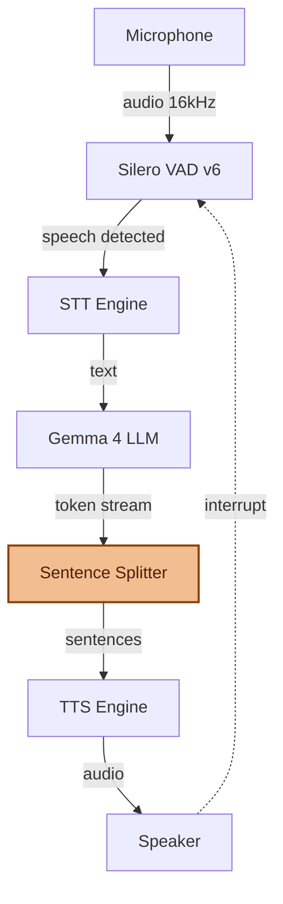
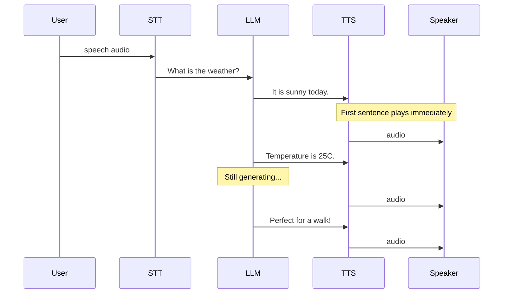
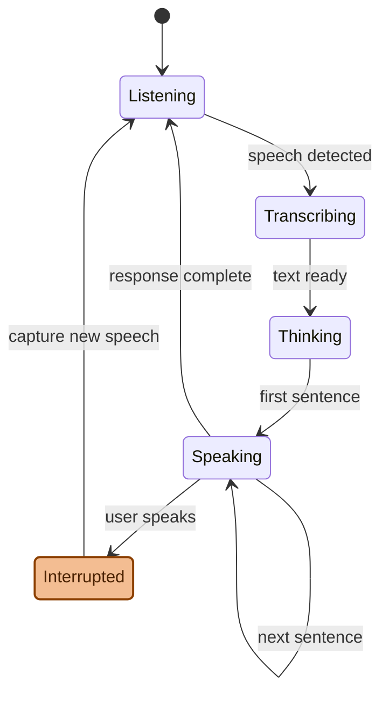
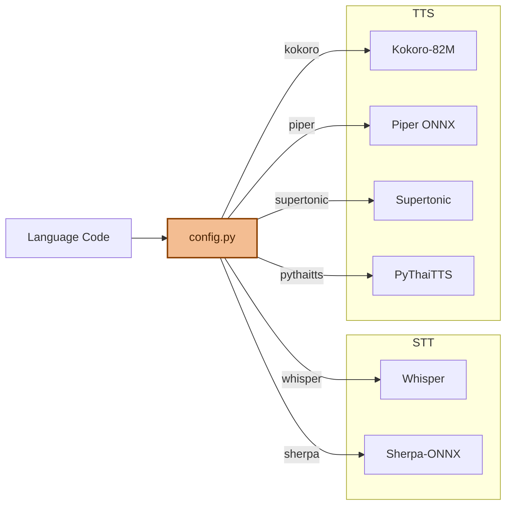
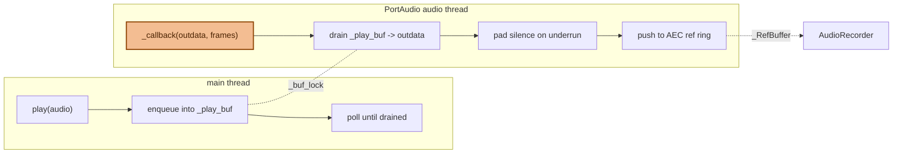
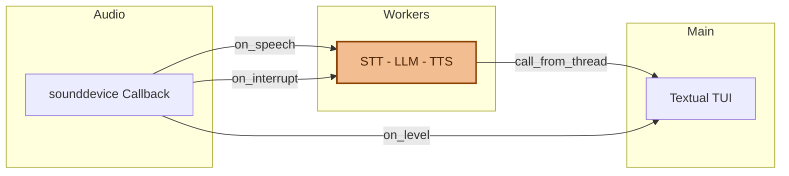

# Architecture

EdgeVox uses a streaming pipeline architecture optimized for minimum time-to-first-speech (TTFS).

## Pipeline Flow



## Streaming Strategy

The key to sub-second latency is **sentence-level streaming**:



1. LLM generates tokens one at a time
2. `stream_sentences()` buffers tokens until a sentence boundary (`.`, `!`, `?`)
3. Each complete sentence is immediately sent to TTS
4. TTS audio plays while LLM continues generating

This means the user hears the first sentence **before the LLM finishes the full response**.

## Interrupt Detection



While the bot is speaking:
- The microphone continues monitoring via VAD
- If speech is detected during playback, the audio output is immediately stopped
- The new speech is captured and processed as the next turn
- This enables natural conversational flow

## Language-Aware Model Selection



The `create_stt()` and `create_tts()` factories consult `config.py` to pick the best model:

```python
# Automatic per-language selection
cfg = get_lang("vi")
# cfg.stt_backend == "sherpa"      -> SherpaSTT
# cfg.tts_backend == "piper"       -> PiperTTS

cfg = get_lang("en")
# cfg.stt_backend == "whisper"     -> WhisperSTT
# cfg.tts_backend == "kokoro"      -> KokoroTTS

cfg = get_lang("ko")
# cfg.tts_backend == "supertonic"  -> SupertonicTTS
```

## VAD (Voice Activity Detection)

- **Silero VAD v6** processes 32ms chunks (512 samples at 16kHz)
- Detects speech start/end with configurable thresholds
- Audio is buffered during speech, then sent to STT as a complete utterance
- Runs on CPU — negligible overhead

## Latency Breakdown

Typical latency on RTX 3080:

| Stage | Time | Notes |
|-------|------|-------|
| VAD | ~0ms | Runs inline with mic callback |
| STT | ~0.40s | Whisper large-v3-turbo, float16 |
| LLM (first token) | ~0.33s | Gemma 4 Q4_K_M, 33 layers GPU |
| TTS (first sentence) | ~0.08s | Kokoro-82M |
| **TTFS** | **~0.81s** | Time to first speech |

## Audio Playback

EdgeVox uses a **callback-based** PortAudio output stream backed by a numpy buffer. The audio thread is fed continuously by a lock-protected ring; on every callback it copies up to `frames` samples into the device's `outdata` buffer and pads with silence on underrun.



Why callback instead of `stream.write()`:

- **No ALSA underruns.** A blocking `stream.write()` loop intermittently failed with `alsa_snd_pcm_mmap_begin` / `PaAlsaStream_SetUpBuffers` whenever streaming TTS couldn't deliver chunks fast enough. With a callback the device never starves — silence is emitted instead.
- **Lock-free interrupts.** `interrupt()` flushes the queued buffer instead of aborting the stream, eliminating the abort/restart race that crashed PortAudio under load.
- **AEC reference is captured on the audio thread.** The played samples are downsampled to 16 kHz mono and pushed into a chunked numpy ring (`_RefBuffer`) — O(1) per push, no Python-level per-sample iteration in the audio callback.

## Threading Model



- **Main thread**: Textual TUI event loop (or FastAPI event loop in web mode)
- **Audio thread**: `sounddevice` callback for mic input
- **Worker threads**: `@work(thread=True)` for STT/LLM/TTS processing
- **Lock**: `_processing` mutex prevents overlapping utterances
- **Event**: `_interrupted` signals playback cancellation

## Web UI Architecture

In `--web-ui` mode, the pipeline runs as a FastAPI server with WebSocket:

```
Browser ↔ WebSocket ↔ FastAPI ↔ STT/LLM/TTS pipeline
```

- Audio is captured by the browser's `MediaRecorder` API and streamed as raw PCM
- TTS audio is sent back as WAV binary frames
- Language/voice switching is done via JSON control messages
- Text input and `/say` commands bypass STT and go directly to LLM or TTS
