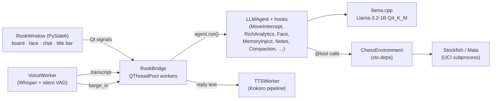

# RookApp — Desktop Chess Robot

Voice-controlled offline chess partner. Pure PySide6 app — no browser,
no web server, no Node toolchain, no Tauri. One Python process hosts
the Qt UI, the `LLMAgent`, llama-cpp, and the Stockfish subprocess.


## Install

```bash
# 1. Install the desktop extra.
uv pip install -e '.[desktop]'

# 2. Stockfish must be on $PATH at runtime (GPL — we only speak UCI
#    over a pipe, so the app stays MIT).
sudo apt-get install -y stockfish      # Linux
brew install stockfish                 # macOS
#    Windows: https://stockfishchess.org/download/ — drop on PATH.

# 3. Download EdgeVox STT + LLM + TTS weights (~3 GB, one time).
edgevox-setup
```

The `desktop` extra pulls in (licence in brackets):

| Package | Purpose |
|---|---|
| `PySide6>=6.6` [LGPL-3, dynamic] | UI toolkit |
| `qtawesome>=1.4` [MIT] | Font Awesome + Phosphor icon glyphs |
| `rlottie-python>=1.3` [LGPL-2.1, dynamic] | Optional — Lottie-backed robot face |
| `pillow>=10` [MIT/HPND] | Frame rendering for rlottie |

`rlottie-python` is optional. When it's missing or the asset bundle isn't
available, the face widget falls back to a pure-Qt `RobotFaceWidget`
(checked at runtime via `lottie_face.is_available()`).

## Launch

```bash
edgevox-chess-robot
```

The window paints immediately and the status pill cycles from
**loading…** through step labels (`"downloading …"`, etc.) to **online**
once llama-cpp + Stockfish are up. Model load is handled by a
`QThreadPool` worker so the event loop never stalls.

### CLI flags

All flags are optional — every knob also has an env var and a persisted
setting, in that priority order (CLI > env > QSettings > default).

```bash
edgevox-chess-robot \
    --persona trash_talker \          # grandmaster | casual | trash_talker
    --user-plays black \              # white (default) | black
    --engine stockfish \              # stockfish | maia
    --stockfish-skill 12 \            # 0–20
    --maia-weights ~/maia-1500.pb.gz  # required with --engine maia
    -v                                # or --verbose, debug logging
```

### Env vars

Same surface as `RookConfig.from_env`, so migrating from the old
chess_robot server flow doesn't require renaming anything:

| Env var | Maps to |
|---|---|
| `EDGEVOX_CHESS_PERSONA` | `--persona` |
| `EDGEVOX_CHESS_USER_PLAYS` | `--user-plays` |
| `EDGEVOX_CHESS_ENGINE` | `--engine` |
| `EDGEVOX_CHESS_STOCKFISH_SKILL` | `--stockfish-skill` |
| `EDGEVOX_CHESS_MAIA_WEIGHTS` | `--maia-weights` |

### Models

| Role | Default | Notes |
|---|---|---|
| LLM | `hf:bartowski/Llama-3.2-1B-Instruct-GGUF:Llama-3.2-1B-Instruct-Q4_K_M.gguf` | Tool-call-capable 1B SLM; `MoveInterceptHook` handles the chess tools deterministically so the LLM only needs natural conversation. |
| STT | Whisper (lazy) | Loaded on first mic click — text-only users never pay the cost. |
| TTS | Kokoro (lazy) | Loaded on first reply; muted → not loaded at all. |

## In-app controls

The title bar exposes four icon buttons: **🎤 mic**, **↻ new game**,
**☰ menu**, and the window controls.

The **☰** button opens a dropdown:

- **New game** — wipes memory + notes + chat history + persisted session, then prompts Rook to announce the new match
- **Settings…** — preferences dialog
- **About RookApp** — brief status line in the title bar

Keyboard shortcut: **Ctrl+N** / **Cmd+N** for new game.

### Settings dialog

| Field | Options | Applies |
|---|---|---|
| Persona | `casual`, `grandmaster`, `trash_talker` | **live** — swaps agent instructions, face hook, accent colour. Engine strength waits for next *new game* so the in-progress board isn't clobbered. |
| Piece set | Fantasy (default) · Celtic · Spatial | live |
| Board theme | Wood · Green · Blue · Gray · Dark wood · Night | live |
| Enable voice input | on / off | next launch |
| Mute sound effects | on / off | live (controls whether Kokoro loads at all) |
| Debug mode | on / off | live — taps `before_llm` / `after_llm` / `on_run_end` and dumps the messages array + raw reply + final reply into the chat as monospace bubbles |
| Microphone | PortAudio input devices | next launch |
| Speaker | PortAudio output devices | next launch |

Preferences persist via `QSettings("EdgeVox", "RookApp")`. A live preview
strip in the dialog shows the selected theme + piece set together before
you hit **OK**.

## Persona accents

Each persona carries a colour that threads through the title bar, chat
chips, persona label, and face highlight:

| Persona | Accent |
|---|---|
| `grandmaster` | `#7aa8ff` (blue) |
| `casual` | `#ffb066` (orange) |
| `trash_talker` | `#ff5ad1` (magenta) |

## On-disk state

Everything is stored under Qt's per-user `AppDataLocation` (falls back to
`~/.rookapp` on bare headless CI):

- `memory.db` — `SQLiteMemoryStore` in WAL mode for long-term facts, crash-safe atomic writes. Older installs that wrote `memory.json` are migrated transparently on first launch; the legacy file is renamed to `memory.json.migrated` and left in place as a backup.
- `notes.md` — `NotesFile` scratchpad the `NotesInjectorHook` reads
- `sessions.json` — `JSONSessionStore` chat history, restored on next launch
- `game.json` — board + move history (FEN + SAN), so a crashed match resumes exactly where it was
- `QSettings` — platform-native registry/plist/INI for UI preferences (piece set, board theme, audio devices)

**New game** wipes all four so commentary from a previous game can't leak
into a fresh board.

## Architecture



Blocking agent turns run on a `QThreadPool` worker; agent events become
Qt signals via the bridge's `_Signals` bus (`state_changed`,
`chess_state_changed`, `face_changed`, `reply_finalised`, `user_echo`,
`error`, `ready`, `load_progress`, `debug_event`).

### Barge-in

Voice interrupt runs through the same `InterruptController` the rest of
EdgeVox uses:

1. `AudioRecorder` energy-ratio gate detects the user speaking over TTS.
2. `VoiceWorker.barge_in` signal reaches `RookWindow._on_barge_in`.
3. `TTSWorker.interrupt()` cuts playback; `Bridge.cancel_turn()` trips
   the controller which plumbs `cancel_token` into
   `LLM.complete(stop_event=…)` — llama-cpp halts within one decode step
  .
4. `ctx.stop` flips so the agent loop exits between hops.

The recorder is linked to the global `InterruptiblePlayer`, so TTS
playback already pauses the mic queue at the source — no double-gating.

### Hooks installed on the agent

- `MoveInterceptHook` — deterministic move application so a missed tool
  call can't freeze the board
- `RichChessAnalyticsHook` — hidden system-role briefing with FEN,
  perspective, eval, opening, threats
- `RobotFaceHook` — emits `robot_face` events → translated to the
  `face_changed` Qt signal
- `MoveCommentaryHook` — captures the latest move outcome
- `ThinkTagStripHook`, `VoiceCleanupHook`, `SentenceClipHook`,
  `BriefingLeakGuard` — TTS sanitation before reply reaches the chat
  bubble
- `MemoryInjectionHook`, `NotesInjectorHook`, `ContextCompactionHook`,
  `TokenBudgetHook`, `PersistSessionHook` — standard memory plumbing
- `default_slm_hooks()` — the SLM hardening stack for 1B-class models
- `_DebugTapHook` — always installed; emits only when **Debug mode** is
  on (zero-cost path otherwise)

## Packaging an installer

Single-file binaries are produced by
`.github/workflows/rookapp-desktop.yml` for tags matching `rook-v*`
(macOS arm/intel, Windows, Linux AppImage). Locally:

```bash
uv pip install -e '.[desktop]' pyinstaller
cat > rookapp_entry.py <<'PY'
from edgevox.apps.chess_robot_qt.main import main
if __name__ == "__main__":
    main()
PY
pyinstaller \
    --name RookApp --onefile --windowed \
    --hidden-import edgevox.apps.chess_robot_qt \
    --collect-submodules edgevox \
    rookapp_entry.py
```

Output lands under `dist/`. The bundle ships code only; STT / LLM / TTS
weights download to the Hugging Face cache on first run. Stockfish must
still be present on `$PATH` at runtime.

## Licence notes

- PySide6 — LGPL-3, dynamic-linked (MIT-app compatible)
- qtawesome, pillow — MIT / HPND
- rlottie-python — LGPL-2.1 via ctypes (dynamic-linked)
- Maurizio Monge piece sets — MIT
- Kokoro TTS — MIT
- Stockfish — GPL, **out-of-process**: we talk UCI over a pipe, never
  link it, so the app stays MIT.
