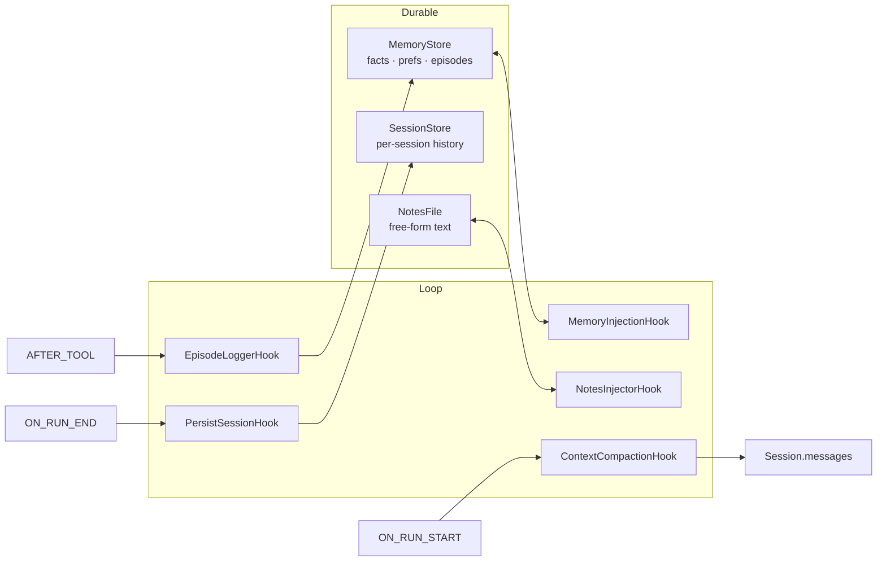

# Memory

EdgeVox agents have three complementary memory surfaces, all optional and all pluggable via Protocols:

- **`MemoryStore`** — long-term durable facts, preferences, and episodes.
- **`SessionStore`** — whole-conversation persistence keyed by session id.
- **`NotesFile`** — plain-text working-memory scratchpad (Anthropic NOTES.md pattern).

Plus a **`Compactor`** that summarises old turns when the session crosses a token budget.



## `MemoryStore`

A `Protocol`; three implementations ship:

| Class | Backing | Use case |
|---|---|---|
| **`SQLiteMemoryStore`** *(recommended default)* | stdlib `sqlite3` + WAL mode | crash-safe atomic writes, multi-process-safe, indexed `facts_as_of(t)` queries |
| `JSONMemoryStore` | debounced JSON file | prototyping, human-readable inspection |
| `VectorMemoryStore` | `sqlite-vec` extension + injectable `embed_fn` | semantic retrieval — `store.search_facts("what's safe to cook?", k=3)`; opt in via `pip install 'edgevox[memory-vec]'` |

All three share the same bi-temporal semantics and render-for-prompt layout, so swapping stores doesn't change what the LLM sees. `VectorMemoryStore` is in the `[memory-vec]` extra; the embedding model is user-supplied via `embed_fn=...` (e.g. `llama_embed(llm)` to reuse a `llama-cpp` instance loaded with `embedding=True`).

```python
from llama_cpp import Llama
from edgevox.agents import VectorMemoryStore, llama_embed

embedder = Llama(
    model_path="nomic-embed-text-v1.5.Q4_K_M.gguf",
    embedding=True,
    n_ctx=2048,
    verbose=False,
)
store = VectorMemoryStore("./vec.db", embed_fn=llama_embed(embedder))
store.add_fact("user.allergies", "peanuts, shellfish")
store.add_fact("kitchen.fridge.contents", "milk, eggs, cheese")
for fact, distance in store.search_facts("what's safe to cook?", k=3):
    print(f"{distance:.3f}  {fact.key}: {fact.value}")
```

Write your own backend (Redis, Mongo, remote HTTP, …) by implementing the `MemoryStore` Protocol — the four built-in hooks that consume a store (`MemoryInjectionHook`, `NotesInjectorHook`, `PersistSessionHook`, `ContextCompactionHook`) read through the Protocol, never the concrete class.

### `SessionStore` — per-conversation history

Distinct from the per-user `MemoryStore`: a `SessionStore` persists an entire `Session` (messages, tool-call history, state dict) keyed by session-id so a user can resume a conversation after a restart. Two implementations ship:

| Class | Backing | Use case |
|---|---|---|
| `JSONSessionStore` | one JSON file per session | default, human-readable, fine through ~500 turns / 100 sessions |
| `SQLiteSessionStore` | stdlib `sqlite3` with a single `sessions` table | multi-user services, thousands of sessions, indexed lookup by `updated_at` |

Both implement the same three-method `SessionStore` Protocol (`load(id) / save(session) / delete(id)`), so `PersistSessionHook` reads through the Protocol:

```python
from edgevox.agents import PersistSessionHook, SQLiteSessionStore

sessions = SQLiteSessionStore("./sessions.db")
agent = LLMAgent(..., hooks=[PersistSessionHook(session_store=sessions, session_id="user-42")])
```

Swap the store without changing the agent code — the JSONSessionStore → SQLite migration is a one-line change the same way JSON → SQLite memory is.

### Data model

- **`Fact(key, value, scope, source)`** — durable key/value with scope (`"global"`, `"user"`, `"env:kitchen"`, …).
- **`Preference(key, value)`** — user preferences, rendered separately.
- **`Episode(kind, payload, outcome, agent)`** — one-line records of tool/skill outcomes. Ring-buffered at 500 by default.

### Rendering

`store.render_for_prompt(max_facts=20, max_episodes=5)` returns a markdown block ready to splice into the system prompt. `MemoryInjectionHook` does this at `BEFORE_LLM` with an idempotent marker check so re-injection across tool hops is free.

## `NotesFile`

Plain-text scratchpad. Agents append via a tool (or directly); `NotesInjectorHook` feeds the tail into the system prompt at `BEFORE_LLM`.

Soft-bounded at 64 KiB by default (configurable via `max_size_chars`). When an append would exceed the bound, the file is rewritten keeping the newest bytes plus a single `(earlier notes truncated)` marker — a long-running voice session that logs a note per turn can't slow-leak disk or prompt space. `max_size_chars=0` disables the cap for power users.

## `Compactor`

Summarises middle turns when the session crosses `trigger_tokens` (default 4000). Preservation priority follows Anthropic's context-engineering guidance:

1. **System prompt** — always kept verbatim, position 0.
2. **Last `keep_last_turns`** — verbatim (default 4).
3. **Middle** — compressed into one assistant message via an LLM call.

Wired to the loop via `ContextCompactionHook` at `ON_RUN_START` (never mid-turn — would break tool-call chains).

## `estimate_tokens`

```python
estimate_tokens(messages: Iterable[dict], llm: LLM | None = None) -> int
```

When `llm` is supplied, every message body is tokenised exactly via `LLM.count_tokens` (uses the loaded GGUF's tokenizer). Without it, the function falls back to `chars // 4` — which is known-wrong for code (~15-25% under) and for CJK / Vietnamese / Thai (massively under).

`TokenBudgetHook` and `ContextCompactionHook` read `ctx.llm` and pass it through, so the running agent's real tokenizer drives every context-window decision. Test doubles without a tokenizer fall back gracefully.

## Typical wiring

```python
from edgevox.agents import LLMAgent
from edgevox.agents.memory import JSONMemoryStore, Compactor, NotesFile
from edgevox.agents.hooks_builtin import (
    MemoryInjectionHook, EpisodeLoggerHook,
    NotesInjectorHook, ContextCompactionHook,
    TokenBudgetHook, PersistSessionHook,
)

store = JSONMemoryStore("~/.edgevox/memory/kitchen.json")
notes = NotesFile("~/.edgevox/memory/kitchen-notes.md")

agent = LLMAgent(
    name="kitchen",
    description="Home-kitchen assistant",
    instructions="You help in the kitchen.",
    hooks=[
        MemoryInjectionHook(store),
        NotesInjectorHook(notes),
        TokenBudgetHook(max_context_tokens=3500),
        ContextCompactionHook(Compactor(trigger_tokens=3000)),
        EpisodeLoggerHook(store, agent_name="kitchen"),
        PersistSessionHook(session_store=..., session_id="kitchen"),
    ],
)
```

## Memory-as-tools

``memory_tools(store)`` returns a list of three ``Tool`` objects the LLM can call directly to curate memory during a turn: ``remember_fact``, ``forget_fact``, ``recall_fact``. Wire them into the agent the same way as any other tool:

```python
from edgevox.agents.memory import JSONMemoryStore
from edgevox.agents.memory_tools import memory_tools

store = JSONMemoryStore("./memory.json")
agent = LLMAgent(..., tools=memory_tools(store))
```

Drop tools via ``include=(...)`` — e.g. ``memory_tools(store, include=("recall_fact",))`` hides ``remember_fact`` and ``forget_fact`` when you inject memory via a hook and just want the LLM to look things up. Each call is scoped (default ``"global"``; pass ``user`` / ``env:<name>`` via the ``scope`` arg the model sees in the schema) and bypasses the debounce on ``JSONMemoryStore`` only for the in-memory state — run ``store.flush()`` (or rely on ``PersistSessionHook``) to commit to disk.

## Bi-temporal facts

`Fact` carries `valid_from` / `valid_to` plus a `supersedes` link to the fact it replaced. When you `add_fact` with the same key, the prior fact gets `valid_to = now` (and `invalidated_at = now`) and the new fact is appended with `supersedes` pointing at it. Lets the agent answer "what did I believe at t?" without destroying history.


## See also

- [`hooks.md`](./hooks.md) — memory-related hooks + composition.
- [`agent-loop.md`](./agent-loop.md) — where compaction + injection hooks fire.
