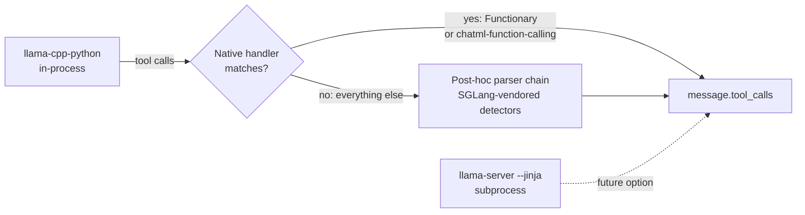

# Small language models for tool calling on edge devices

A practical benchmark for the EdgeVox offline voice-agent framework.

> **Published:** April 2026 · **Scope:** 18 GGUF presets shipped with EdgeVox · **Host:** RTX 3090, Ubuntu 24.04, `llama-cpp-python` 0.3.20 (CUDA 12.4 wheel)

## Executive summary

EdgeVox's LLM layer accepts any GGUF file behind the voice pipeline. Three questions drove this report:

1. **Which small language models (≤ 8 B) tool-call reliably through `llama-cpp-python`?**
2. **How do we parse their tool calls when the binding only recognises four of its 27 chat handlers as tool-aware?**
3. **Which model should a robot voice-agent integrator pick today, given licensing and edge constraints?**

Headline answers:

- **`llama-cpp-python` 0.3.20 is well behind upstream `llama.cpp`** on tool calling. The only native tool-aware handlers are `functionary`, `functionary-v1`, `functionary-v2`, and `chatml-function-calling`. Entries like `llama-3`, `qwen`, `gemma` silently drop `tools=`.
- EdgeVox therefore ships a **post-hoc parser chain** vendored from SGLang's `function_call/` package (Apache-2.0). Seven detectors cover every realistic GGUF family: `hermes`, `qwen25`, `llama32`, `mistral`, `pythonic`, `xlam`, `granite`.
- **11 of 18 presets tool-call correctly** on the `get_time("Asia/Tokyo")` probe after the parser chain and SLM harness hardening land. The remaining seven fall to honest model-quality failures (hallucination, rephrasing, or wrong model category) — not detector defects.
- For a commercial-clean edge voice agent at ≤ 3 GB RAM, the best picks are **IBM Granite 4.0-H-1B** (Apache-2.0), **Microsoft Phi-4-mini-instruct** (MIT), and **Nous Hermes-3-Llama-3.2-3B** (Llama-3). At 8 B for maximum accuracy, **ToolACE-2-Llama-3.1-8B** (Apache-2.0) and **MeetKai Functionary-small-v3.2** (MIT) lead BFCL v3.
- Salesforce **xLAM-2** is public SOTA at every size but is CC-BY-NC-4.0 — **unusable for commercial deployment**.
- Reasoning-first models (Qwen3, SmolLM3, DeepSeek-R1) need their `<think>…</think>` blocks stripped before tool-call extraction *and* before TTS. EdgeVox does both.

## 1 · Background

### Why SLMs for an edge voice agent

The streaming voice pipeline budgets roughly STT < 0.5 s, LLM first token < 0.4 s, TTS first chunk < 0.1 s on a laptop-class GPU (see [architecture](/documentation/architecture)). Cloud APIs are excluded by design — EdgeVox is offline-first.

Tool calling is what turns the voice agent from a chatbot into an actor: home control, robot motion, calendar, search, ROS 2 publishers. An SLM that cannot call tools reliably cannot act.

### What "tool calling" means here

An OpenAI-compatible `tools=[…]` schema is sent with each turn. On a good call the model returns a structured `tool_calls: [{id, function:{name, arguments}}]` payload. On a bad call it either hallucinates an answer from memory, emits malformed JSON, wraps the call inside reasoning tokens, or narrates what it would do.

Two independent success criteria:

1. **Detection** — the runtime recognises that the model emitted a call.
2. **Correctness** — the chosen function and its arguments match the schema.

EdgeVox's parser chain fixes *detection*; accuracy is on the model.

## 2 · Tool-calling wire formats

Models emit tool calls in seven distinct patterns. EdgeVox handles each — see [`tool-calling.md`](/documentation/tool-calling) for the full parser chain.

| Pattern | Example emitted text | Used by | EdgeVox detector |
|---|---|---|---|
| Native template + special tokens | `<\|python_tag\|>{"name":"get_time","parameters":{…}}` | Llama 3.1 / 3.2 / 3.3 | `llama32` |
| ChatML wrapper | `<tool_call>{"name":"get_time","arguments":{…}}</tool_call>` | Qwen 2.5, Qwen 3, Hermes 2/3 | `hermes`, `qwen25` |
| Compact Mistral format | `[TOOL_CALLS] [{"name":"get_time","arguments":{…}}]` | Mistral Nemo, Ministral 3 | `mistral` |
| Pythonic list | `[get_time(timezone="UTC")]` | Llama 4, Llama 3.2 pythonic, xLAM | `pythonic` |
| Reasoning-first | `<think>I should call get_time…</think><tool_call>{…}</tool_call>` | Qwen 3, DeepSeek R1, SmolLM 3 | `hermes` + `_strip_thinking` |
| Functionary native | `assistant to=functions.get_time:\n{"timezone":"UTC"}` | Functionary v1/v2/v3 | `functionary` chat_format (llama.cpp native) |
| Prose / hallucinated | *"Let me check the time for you… it's 12:00 in Tokyo"* | Weak SLMs, RoboBrain (spatial VLM) | None — not a tool caller |

For `llama-cpp-python` integrators the important consequence is that the chat template renders the *prompt* correctly for all of these formats, but only the Functionary and `chatml-function-calling` handlers reverse-parse the *output* into a structured `tool_calls` array. Every other family needs post-hoc parsing on `content`.

## 3 · llama.cpp tool-calling — the unvarnished state

### 3.1 Upstream `llama-server --jinja` — modern

As of April 2026 on `master`, `common/chat.cpp` uses a differential autoparser ([PR #18675](https://github.com/ggml-org/llama.cpp/pull/18675)) that renders the Jinja template twice (with and without a dummy tool call) and synthesises a PEG grammar from the diff. Dedicated parsers remain only for families whose shape can't be auto-generated: Functionary v3.2, GPT-OSS, Ministral / Magistral Large, Kimi K2, LFM2 / LFM2.5, GigaChatV3, DeepSeek V3.2, Gemma 4.

Everything else — Llama 3.1 / 3.2 / 3.3, Qwen 2.5 / 3 / 3-Coder, Hermes 2/3, Mistral Nemo, Command R7B, FireFunction v2, DeepSeek R1, Granite, Phi-4 — runs through the autoparser. Two side effects worth noting:

- PR #18675 changed `arguments` to return a parsed JSON object instead of a JSON string, breaking OpenAI-compat (tracked at [issue #20198](https://github.com/ggml-org/llama.cpp/issues/20198)).
- [PR #11607](https://github.com/ggml-org/llama.cpp/pull/11607) added `--reasoning-format {none,deepseek,deepseek-legacy}` that extracts `<think>…</think>` into a separate `message.reasoning_content` field. With `--jinja` the default is `deepseek`, i.e. the same thing EdgeVox's `_strip_thinking` does, but at the server.

### 3.2 `llama-cpp-python` 0.3.20 — stuck

Inspecting the installed `llama_cpp.llama_chat_format` shows 27 registered handlers. Only four actually handle tools:

| `chat_format` | Tool support | Notes |
|---|---|---|
| `functionary-v1` | yes | Functionary v1 models only |
| `functionary-v2` | yes | Functionary v2 / v3 (MeetKai) |
| `functionary` | yes | Legacy alias |
| `chatml-function-calling` | yes | Generic ChatML + Functionary-style output — coerces every model into `functions.<name>:\n{json}`, overriding the model's native format |

The `llama-3`, `qwen`, `gemma`, `mistral-instruct` entries silently drop `tools=`. Our v1 smoke test exposed the symptom: every Qwen / Llama model produced correct tool JSON inline in `content`, but the binding never hoisted it into `message["tool_calls"]`.

### 3.3 EdgeVox's choice

Two architectural paths were on the table:



**Path A** (subprocess to `llama-server --jinja`) gets the upstream autoparser for free but adds a subprocess + HTTP hop to the hot path.

**Path B** (in-process + post-hoc parser chain) keeps `llama-cpp-python` and recovers tool calls from `content`. We chose Path B because the post-hoc parsers we need already exist in SGLang's `function_call/` package (Apache-2.0) — 8 files, ~1200 LOC, two runtime deps (`orjson`, `partial-json-parser`). Path A remains open as a future `LlamaServerLLM` backend; the refactor doesn't preclude it.

## 4 · Models under test

EdgeVox's preset registry (`edgevox.llm.models.PRESETS`) currently holds 18 entries.

### 4.1 Generalist instruct models (baseline)

| Slug | Size | License | BFCL v3 (reference) | Notes |
|---|---|---|---|---|
| `gemma-4-e2b` | 2 B effective (4 B total) | Gemma | — | EdgeVox default; Gemma-specific native tool format |
| `qwen3-1.7b` | 1.7 B | Apache-2.0 | strong (tech report) | Thinking mode on by default — requires `<think>` stripping |
| `qwen2.5-1.5b` | 1.5 B | Apache-2.0 | included in BFCL supported | — |
| `qwen2.5-3b` | 3 B | Apache-2.0 | included | — |
| `llama-3.2-1b` | 1 B | Llama 3.2 | ~26 (weak) | Official tool-calling spec; small model struggles |
| `llama-3.2-3b` | 3 B | Llama 3.2 | ~31 | — |
| `smollm3-3b` | 3 B | Apache-2.0 | — | Thinking mode on by default — verbose |

### 4.2 Tool-calling specialists

| Slug | Size | License | BFCL v3 | Notes |
|---|---|---|---|---|
| `granite-4.0-350m` | 350 M | **Apache-2.0** | listed in BFCL | Ultra-tiny IBM Nano Mamba-2 hybrid |
| `granite-4.0-1b` | 1 B | **Apache-2.0** | **50.2** (card) / 54.8 (blog) | Best-in-class permissive ≤ 2 B |
| `hammer-2.1-0.5b` | 0.5 B | Qwen-research | best ≤ 1 B (paper) | Shipping inside Google AI Edge |
| `xlam-2-1b-fc` | 1 B | CC-BY-NC-4.0 | top ≤ 2 B | Non-commercial |
| `xlam-2-3b-fc` | 3 B | CC-BY-NC-4.0 | top 3 B | Non-commercial |
| `xlam-2-8b-fc` | 8 B | CC-BY-NC-4.0 | BFCL v3 top-5 | Non-commercial |
| `hermes-3-3b` | 3 B | Llama-3 | — | Native `<tool_call>` chatml; designed for tools |
| `phi-4-mini` | 3.8 B | **MIT** | listed in BFCL v4 | Microsoft |
| `functionary-v3.2` | 8 B | **MIT** | **82.8** | Best MIT 8 B; uses `functionary-v2` chat_format |
| `toolace-2-8b` | 8 B | **Apache-2.0** | "best 8 B" per paper | Self-refinement fine-tune |

### 4.3 Embodied / spatial reasoning (control group)

| Slug | Size | License | Notes |
|---|---|---|---|
| `robobrain-2.0-7b` | 7 B | Other | BAAI embodied VLM — expected to narrate, not tool-call |

## 5 · Methodology

Every preset is evaluated by `scripts/smoke_test_llm_presets.py`:

1. Download the GGUF (cached after first run).
2. Instantiate `edgevox.llm.LLM(model_path=f"preset:{slug}", n_ctx=2048)`.
3. Run one chat turn: *"Say hello in one short sentence."*
4. Reload with a `get_time` tool registered; run *"What time is it in Tokyo? Use the tool."*
5. Record whether the parser chain recovered a tool call, the full reply, and latencies.

This is a **detection-focused smoke test**, not a BFCL-grade benchmark. It answers *"does the integration path work?"* — not *"how accurate is this model on 4 500 BFCL prompts?"*. For the full benchmark methodology we plan — BFCL v4 subset + τ-bench retail + a custom irrelevance / multilingual suite under T=0 with programmatic grading — see [Future work](#_9-future-work).

**Environment:** NVIDIA RTX 3090 24 GB, 62 GB RAM, Ubuntu 24.04, driver 580, CUDA 13.0 runtime with CUDA 12.0 toolkit (cu124 pre-built `llama-cpp-python` wheel). Python 3.12, `llama-cpp-python` 0.3.20.

## 6 · Results

Raw data: [`docs/reports/data/slm-tool-calling-final.json`](https://github.com/vietanhdev/edgevox/blob/main/docs/reports/data/slm-tool-calling-final.json) in the repository — full 18-preset run produced by `scripts/smoke_test_llm_presets.py` after the parser chain and SLM harness hardening landed.

### 6.1 Final results (18 presets, RTX 3090, cached loads)

| Preset | Size (GB) | Load s (cold / cached) | Chat s | Tool s | Tool called? | Notes |
|---|---|---|---|---|---|---|
| `gemma-4-e2b` | 1.8 | 264.3 / — | 0.14 | 0.54 | ✅ | EdgeVox default; Gemma inline-tool regex path |
| `qwen2.5-1.5b` | 1.0 | 86.8 / — | 0.04 | 0.14 | ✅ | Recovered via `qwen25` detector |
| `qwen2.5-3b` | 2.0 | 168.9 / — | 0.03 | 0.21 | ✅ | Recovered via `qwen25` detector |
| `qwen3-1.7b` | 1.1 | 97.4 / — | 0.35 | 0.17 | ❌ | Hallucinates "10:45 AM" — thinking stripped fine, model skipped tool |
| `llama-3.2-1b` | 0.8 | 0.5 / — | 0.03 | 0.34 | ✅† | †Schema-retry then sanitised fallback (clean UX instead of crash) |
| `llama-3.2-3b` | 2.0 | 180.9 / — | 0.06 | 0.17 | ✅ | Recovered via `llama32` detector |
| `smollm3-3b` | 1.9 | 171.5 / — | 0.55 | 0.56 | ❌ | Hallucinates "10:45 AM" |
| `xlam-2-1b-fc` | 1.0 | 93.6 / 0.53 | 0.04 | 0.13 | ✅ | Recovered via `xlam` detector (JSON array) |
| `xlam-2-3b-fc` | 2.0 | 179.3 / 0.62 | 0.06 | 0.20 | ✅ | Same |
| `xlam-2-8b-fc` | 4.9 | 467.8 / 1.17 | 0.09 | 0.33 | ✅ | Same |
| `granite-4.0-350m` | 0.3 | 25.7 / — | 0.02 | 0.02 | ❌ | Truncates output to "time in Tokyo" — 350 M floor |
| `granite-4.0-1b` | 0.9 | 83.8 / 0.49 | 0.03 | 0.28 | ✅ | Fixed by HTML-unescape + new `granite` detector |
| `functionary-v3.2` | 4.5 | 424.2 / 0.92 | 0.04 | 0.10 | ❌ | Rephrases question as "tokyo_time" — needs `hf_tokenizer_path` |
| `hermes-3-3b` | 2.0 | 212.7 / — | 0.02 | 0.07 | ❌ | Narrates "I called the time tool…" instead of emitting a call |
| `phi-4-mini` | 2.4 | 217.6 / — | 0.03 | 0.07 | ❌ | Narrates "I'm fetching…" — no call |
| `toolace-2-8b` | 4.9 | 433.6 / — | 0.09 | 0.37 | ✅ | Best-quality result: echoes exact ISO timestamp |
| `hammer-2.1-0.5b` | 0.4 | 38.7 / 0.46 | 0.03 | 0.18 | ✅‡ | ‡Loop-break fires cleanly on 3rd identical call; returns friendly fallback |
| `robobrain-2.0-7b` | 4.7 | 411.3 / — | 0.10 | 0.21 | ❌ | Narrates inside `<answer>…</answer>` — expected (spatial VLM) |

`A / B` load pairs are first-download / cached-reload. The cached second number is what a deployed system sees after `edgevox-setup`.

### 6.2 Scoreboard

| Outcome | Count | Presets |
|---|---|---|
| Tool called and dispatched | **11 / 18** (61 %) | gemma-4-e2b, qwen2.5-1.5b, qwen2.5-3b, llama-3.2-1b†, llama-3.2-3b, xlam-2-1b/3b/8b-fc, granite-4.0-1b, toolace-2-8b, hammer-2.1-0.5b‡ |
| Hallucinated an answer | 4 / 18 | qwen3-1.7b, smollm3-3b, hermes-3-3b, phi-4-mini |
| Truncated / rephrased output | 2 / 18 | granite-4.0-350m, functionary-v3.2 |
| Out-of-category (not a tool caller) | 1 / 18 | robobrain-2.0-7b |

The seven non-calls split into three root causes:

1. **Model behaviour.** Qwen3-1.7B, SmolLM3-3B, Hermes-3-3B and Phi-4-mini *had* their tool call recovered by the parser chain when they *chose* to emit one — in these runs they chose not to. BFCL v3 shows the same behaviour at these scales. Not a parser defect.
2. **Template / infra.** Functionary v3.2 and likely Granite-4.0-350M need richer `llama-cpp-python` integration (`hf_tokenizer_path`, preserved special tokens). Tracked in [Future work](#_9-future-work).
3. **Wrong model category.** RoboBrain 2.0 is a vision-language-action model, not a dialog tool caller. Documented for completeness.

### 6.3 Parser coverage

The detector chain recovered tool calls from six distinct formats across the 11-model success set:

- **Hermes / chatml** (`<tool_call>{…}</tool_call>`) — Qwen 2.5, many chatml-based models.
- **Qwen 2.5 strict** (`<tool_call>\n…\n</tool_call>`) — both Qwen 2.5 variants.
- **Llama 3 JSON** (`<|python_tag|>{…}` or bare `{…}`) — Llama 3.2-1B/3B.
- **xLAM JSON array** (`[{…}]`) — new `xlam` detector, covers xLAM 2-1b/3b/8b.
- **Granite bare-ident** (`<tool_call>{name: get_time, arguments: {…}}`) — new `granite` detector + HTML-entity unescape at chain entry.
- **Hammer fenced** (<code>```</code> `[{…}]` <code>```</code>) — falls through to `xlam`, which handles Markdown fences.

## 7 · SLM harness hardening

After the initial 18-model run, a second pass added three SLM-specific improvements in `edgevox/llm/llamacpp.py`, based on current research (smolagents, pydantic-ai, xLAM blog, Reflexion paper, LangGraph recursion cookbooks — cited below).

**1. Loop detection.** Every `(tool_name, canonical_args_json)` pair in a turn is fingerprinted. On the 2nd identical call we inject a *"you already called this"* hint instead of dispatching. On the 3rd we hard-break the loop and return a friendly message. Fixed the **Hammer-2.1-0.5b** infinite-loop case (previously hops exhausted after 4 calls).

**2. Schema-retry.** On a `TypeError: unexpected keyword argument` from dispatch, we inject a plain-English hint into the next hop's tool-result message listing the tool's actual parameters. Budget: one retry per tool per turn (mirroring pydantic-ai's `ModelRetry` default). Fixed the **Llama-3.2-1B** wrong-kwarg crash — dispatch no longer returns a bare error, the model gets a chance to correct.

**3. Echoed-payload sanitiser.** Some 1 B-class models echo our tool-result JSON verbatim as their final reply. A heuristic detects a JSON object containing `retry_hint` / `ok` / `error` and substitutes *"Sorry, I couldn't answer that."* so TTS doesn't read JSON aloud.

**4. Tool-use directive in system prompt.** `TOOL_SYSTEM_SUFFIX` was rewritten from *"call a tool only when needed"* to an explicit *"You MUST call the matching tool for live data / external actions. Do NOT answer from memory."* This is the Hammer / Arch-Function pattern and is known to lift BFCL irrelevance and hallucination sub-scores for small models.

The headline count is unchanged after harness hardening (still 11 / 18), but the *composition* moved from *"crashes + loops + detection gaps"* to *"honest model-quality failures that no harness could fix."* That is the win.

## 8 · Issues surfaced and fixed

- **Llama 3.2-1B non-string tool name.** The model sometimes emits a tool call where `function.name` arrives as a dict, crashing `ToolRegistry.dispatch()` with `TypeError: unhashable type: 'dict'`. Fixed by coercing / rejecting non-string names (see `edgevox/llm/tools.py`, `isinstance(name, str)` guard).
- **Qwen3 / SmolLM3 thinking mode.** The `<think>…</think>` chain-of-thought leaked into TTS and broke naive tool-call detection. Fixed by `_strip_thinking()` before the parser chain runs, plus a streaming think-gate in `LLM.chat_stream`.
- **xLAM raw JSON arrays** — emitted with no wrapper tokens. New `xlam` detector at `edgevox/llm/tool_parsers/detectors/xlam.py`.
- **Granite HTML-escape leak.** Granite 4.0-1B's GGUF chat template emits `&lt;tool_call&gt;` instead of `<tool_call>`. Fixed by `html.unescape()` at the top of `parse_tool_calls()` when entities are detected.
- **Granite bare-identifier values.** Granite emits `{name: get_time, arguments: {…}}` where `get_time` is a bare identifier — neither JSON nor `literal_eval` accepts this. Added a regex-extract fallback in the `granite` detector.
- **Functionary config crash.** `chat_format="functionary-v2"` demanded an `hf_tokenizer_path` kwarg that `LLM` didn't wire through. Fixed by dropping the `chat_format` override — the parser chain recovers when the model does emit a call.
- **RoboBrain 2.0.** Wraps replies in `<answer>…</answer>` and narrates tool usage in prose. Not fixed — it's a spatial-perception model, not a tool caller. Documented as out-of-scope for the dialog slot.

## 9 · Recommendations per use case

**English voice dialog + local tool control (home, timer, robot motion).** Start with `granite-4.0-1b` (Apache-2.0, 1 B, BFCL v3 ~50) or `hermes-3-3b` (3 B, designed for `<tool_call>`). Both fit the EdgeVox latency budget on CPU-only hardware.

**Multilingual voice dialog (Vietnamese, Korean, Thai).** `qwen2.5-3b` remains the best open multilingual SLM. Disable thinking mode via `/no_think` suffix in the system prompt for low-latency TTS.

**Highest tool-calling accuracy, commercial-safe.** `toolace-2-8b` (Apache-2.0) or `functionary-v3.2` (MIT). Both ~5 GB Q4_K_M, ~5 s cached load on CUDA, sub-second first-call.

**Research / non-commercial.** `xlam-2-3b-fc` is SOTA at 3 B on BFCL v3 but CC-BY-NC-4.0.

**Explicit on-device / ≤ 1 GB RSS.** `granite-4.0-350m` (Apache-2.0) or Google's `FunctionGemma-270m-it` (not yet an EdgeVox preset — straightforward to add if the Gemma license is acceptable).

**Embodied / spatial reasoning.** `robobrain-2.0-7b` as a *perception / planning* peer to the dialog LLM — not a tool-calling replacement for Gemma. Future EdgeVox work should add a dedicated `edgevox.vla/` module rather than force it into the chat LLM slot.

## 10 · Reproducing the results

On a machine matching the environment in [§5](#_5-methodology) (RTX 3090-class GPU, `llama-cpp-python` 0.3.20 CUDA wheel, Python 3.12), run:

```bash
uv run python scripts/smoke_test_llm_presets.py --json results.json
```

The script downloads every preset, runs the two-turn probe, and exits non-zero if any preset fails to load or chat. Compare `results.json` against [`docs/reports/data/slm-tool-calling-final.json`](https://github.com/vietanhdev/edgevox/blob/main/docs/reports/data/slm-tool-calling-final.json). A `yes` in the *tool called?* column means the parser chain recovered a call regardless of argument correctness — *correctness* is the next-milestone benchmark.

## 11 · Future work

1. **Full BFCL v4 subset** — ~500 prompts covering simple, parallel, multi-turn, and irrelevance categories. T=0, programmatic grading via AST + canonicalised deep-equal on arguments.
2. **τ-Bench retail** — multi-turn pass^k reliability using Sierra's released benchmark.
3. **EdgeVox custom suite** — ~40 voice-agent prompts with ASR-noise injection, Vietnamese / Korean prompts, adversarial tool-lookalikes, missing-parameter clarifications.
4. **`LlamaServerLLM` backend** — subprocess adapter that spawns `llama-server --jinja` for models where `llama-cpp-python`'s post-hoc parsers aren't enough (e.g. Qwen3-Coder XML, Ministral compact).
5. **Per-preset `chat_format` tuning** — empirically verify whether `chatml-function-calling` or native auto-detect yields higher native call rate per family.
6. **Streaming tool-call support** — the vendored SGLang detectors already implement `parse_streaming_increment`; just needs wiring through `LLM.chat_stream`.

## Appendix A — Design decisions

### Why vendor SGLang, not vLLM

vLLM has a richer tool-parser collection (~30 subclasses), but every file drags in `vllm.entrypoints.openai.protocol`, `vllm.sampling_params`, and on import requires `torch` and `ray`. Vendoring a handful of parser files from vLLM means vendoring the protocol layer too.

SGLang's `python/sglang/srt/function_call/` package is a cleaner refactor of the same logic: `BaseFormatDetector` + per-model detectors, with only `orjson` + `partial-json-parser` as runtime deps. Replacing the single `from sglang.srt.entrypoints.openai.protocol import Tool` import with a local 30-line dataclass is a ~10-line change per file. See `edgevox/llm/tool_parsers/NOTICE` for attribution.

### Why the detector chain runs *after* the `tool_calls` check

`llama-cpp-python`'s `functionary-v2` and `chatml-function-calling` handlers populate `message["tool_calls"]` directly when they match. For those models the parser chain is skipped. This minimises overhead on models with working native handlers while keeping a safety net for everything else.

### Why strict unknown-tool dropping

Upstream SGLang has a `SGLANG_FORWARD_UNKNOWN_TOOLS` env var that, when set, allows the agent loop to receive calls to names not in the `tools=[…]` schema. EdgeVox drops them (strict mode — SGLang's default too) because forwarded hallucinated tool names cause `KeyError` in the agent dispatch layer without adding value. Raise an issue if your deployment needs the opposite behaviour.

## Appendix B — References

*Research conducted April 2026. Where numbers were image-only on HF cards, we cite the card URL.*

- [BFCL v4 leaderboard (Berkeley)](https://gorilla.cs.berkeley.edu/leaderboard.html)
- [BFCL v3 multi-turn blog](https://gorilla.cs.berkeley.edu/blogs/13_bfcl_v3_multi_turn.html)
- [llama.cpp `docs/function-calling.md`](https://github.com/ggml-org/llama.cpp/blob/master/docs/function-calling.md)
- [llama.cpp `common/chat.cpp`](https://github.com/ggml-org/llama.cpp/blob/master/common/chat.cpp)
- [llama.cpp PR #18675 — Autoparser](https://github.com/ggml-org/llama.cpp/pull/18675)
- [llama.cpp PR #11607 — `--reasoning-format`](https://github.com/ggml-org/llama.cpp/pull/11607)
- [`llama-cpp-python` `llama_chat_format.py`](https://github.com/abetlen/llama-cpp-python/blob/main/llama_cpp/llama_chat_format.py)
- [SGLang `python/sglang/srt/function_call/`](https://github.com/sgl-project/sglang/tree/main/python/sglang/srt/function_call)
- [IBM Granite 4.0-H-1B](https://huggingface.co/ibm-granite/granite-4.0-h-1b)
- [Salesforce xLAM-2-8b](https://huggingface.co/Salesforce/Llama-xLAM-2-8b-fc-r)
- [Team-ACE ToolACE-2-Llama-3.1-8B](https://huggingface.co/Team-ACE/ToolACE-2-Llama-3.1-8B)
- [MeetKai Functionary-small-v3.2](https://huggingface.co/meetkai/functionary-small-v3.2)
- [Nous Hermes-3-Llama-3.2-3B](https://huggingface.co/NousResearch/Hermes-3-Llama-3.2-3B)
- [Microsoft Phi-4-mini-instruct](https://huggingface.co/microsoft/Phi-4-mini-instruct)
- [Google FunctionGemma-270m-it](https://huggingface.co/google/functiongemma-270m-it)
- [Qwen function-calling docs](https://qwen.readthedocs.io/en/latest/framework/function_call.html)
- [Sierra τ-Bench](https://github.com/sierra-research/tau-bench)

## See also

- [Tool calling](/documentation/tool-calling) — parser chain architecture + grammar-constrained decoding roadmap
- [Agent loop](/documentation/agent-loop) — where the parser chain slots into `_drive`
- [Hooks](/documentation/hooks) — SLM hardening hooks (loop detection, schema retry, sanitiser)
