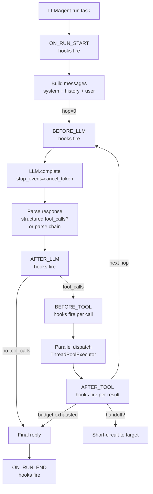
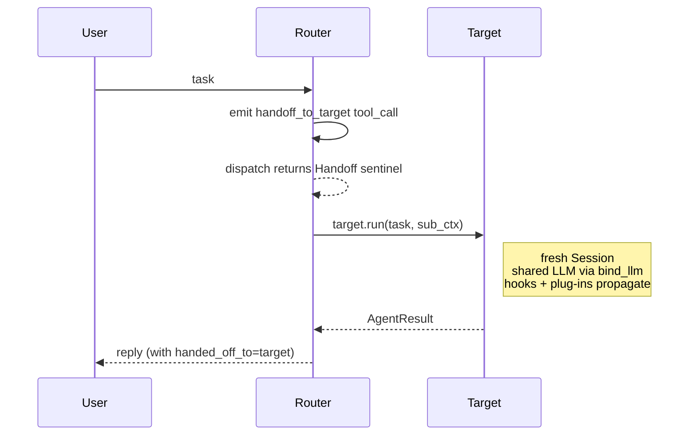

# The agent loop

`LLMAgent._drive` is the core execution loop behind every `LLMAgent.run()`. It's a ReAct-style loop (think → tool call → observe → reply) with parallel tool dispatch, a handoff short-circuit, and six hook fire points. This page documents what happens each turn — useful when debugging hook ordering, tool-call routing, or subagent handoffs.

## One turn at a glance



## Key invariants

1. **Per-run history isolation.** Every `run()` owns its own `messages` list even when multiple agents share one LLM. Parallel `LLMAgent.run()` calls never touch each other's history — the only serialisation point is `LLM._inference_lock` inside `complete()`.

2. **Handoff-as-return-value.** A synthetic `handoff_to_<agent>` tool returns a `Handoff` sentinel; the loop transfers control to the target without a second LLM hop on the router. Matches OpenAI Agents SDK semantics (`edgevox/agents/base.py`).

3. **Interrupt pre-emption at three points.** The loop checks `ctx.should_stop()` (a) before each hop, (b) between parallel tool dispatches, and (c) — via `stop_event` threaded into llama-cpp — between sampled tokens. See [ADR-001](../adr/001-cancel-token-plumbing.md).

4. **Six fire points, in fixed order.** `ON_RUN_START → BEFORE_LLM → AFTER_LLM → (BEFORE_TOOL → dispatch → AFTER_TOOL)* → ON_RUN_END`. The `BEFORE_TOOL`/`AFTER_TOOL` pair fires per tool in parallel; the others are per-turn. Hooks see payloads defined in [`hooks.md`](./hooks.md).

5. **Hop budget.** Default `max_tool_hops=3`. Hitting it ends the turn with the last `content` as the fallback reply — no runaway loops.

## Typed context plumbing

`LLMAgent.run()` publishes the running tool registry and LLM onto `ctx` via typed fields (not magic scratchpad keys):

```python
@dataclass
class AgentContext:
    ...
    tool_registry: ToolRegistry | None = None  # set during run()
    llm: LLM | None = None                      # set during run()
    hook_state: dict[int, dict[str, Any]] = field(default_factory=dict)
    state: dict[str, Any] = field(default_factory=dict)  # user scratch
```

Hooks that need the LLM (e.g. `ContextCompactionHook` for summarisation, `TokenBudgetHook` for exact token counts) read `ctx.llm`. Hooks that need per-instance state (fingerprint counters, retry budgets) write to `ctx.hook_state[id(self)]`. The legacy `ctx.state["__tool_registry__"]` / `["__llm__"]` keys still work for one release but are deprecated. See [ADR-002](../adr/002-typed-ctx-hook-state.md).

## Parallel tool dispatch

When the LLM emits N tool calls in one response, `_dispatch_batch` runs them on a `ThreadPoolExecutor(max_workers=min(N, 8))`. Order of results is preserved. A hook that returns `end_turn` at `BEFORE_TOOL` or `AFTER_TOOL` short-circuits the whole batch; the first such `HookResult` wins.

Skill dispatch (long-running goal-oriented tasks) runs synchronously inside the same worker slot but polls `ctx.should_stop()` every 50 ms so a barge-in cancels the skill cleanly.

## Tool-call parsing

`llm.complete()` returns either a structured `tool_calls` field (chat templates that natively emit OpenAI-shaped function calls) or free-form `content` (most SLMs). For the free-form case the parser chain runs against the **raw** content first — which recovers tool calls emitted inside `<think>...</think>` blocks (Qwen3 et al.) — then falls back to the `<think>`-stripped content. The user-facing reply is always derived from the stripped text so chain-of-thought never reaches TTS. See [`tool-calling.md`](./tool-calling.md).

## Handoff path



The subagent runs with a **fresh `Session`** (clean history) but the same `deps`, `bus`, `hooks` (ctx-level), `blackboard`, `memory`, `interrupt`, `artifacts`. Typed `tool_registry` / `llm` on the subagent ctx are installed by the target's own `run()` — not pre-seeded by the router.

## Streaming

`run_stream()` currently yields the final reply as a single chunk. Multi-hop flows don't stream tokens because we need to buffer the full response before knowing whether it contains tool calls. A streaming path for final-hop text — interrupt-polled between token batches — is on the roadmap; it'll keep the multi-hop path buffered.

## Debugging

- Attach `TimingHook()` to measure per-fire-point latency.
- Attach `EchoingHook()` to trace every fire point + payload.
- Attach `AuditLogHook("/tmp/audit.jsonl")` to record turns for offline replay.
- Compose `default_slm_hooks()` from `edgevox.llm.hooks_slm` to layer loop detection, echoed-payload substitution, and schema-retry on small models.

## See also

- [`hooks.md`](./hooks.md) — authoring hooks; payload shapes per fire point.
- [`interrupt.md`](./interrupt.md) — barge-in + cancel-token semantics.
- [`tool-calling.md`](./tool-calling.md) — parser chain and grammar-constrained decoding.
- [ADR-001](../adr/001-cancel-token-plumbing.md), [ADR-002](../adr/002-typed-ctx-hook-state.md).
