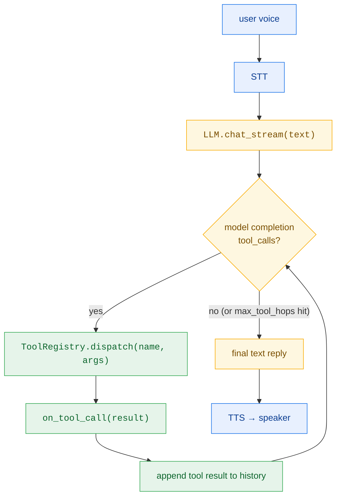
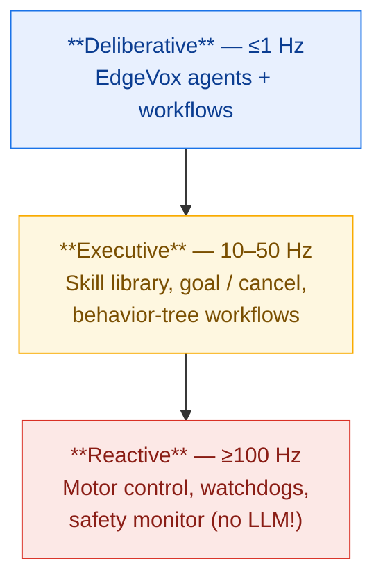
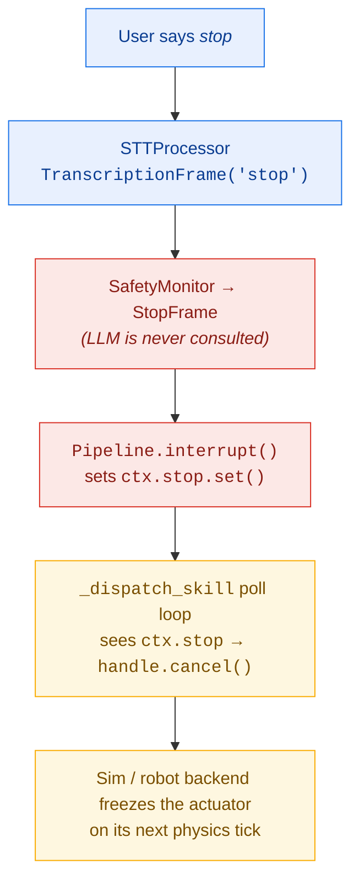

# Agents & Tools

EdgeVox ships with an **agentic layer**: your LLM can call Python functions ("tools") to look up data, mutate state, or drive hardware mid-conversation. Tools are just decorated Python functions — no schema files, no glue code.

```python
from edgevox.llm import tool

@tool
def set_light(room: str, on: bool) -> str:
    """Turn a room's light on or off.

    Args:
        room: the room name, e.g. "kitchen"
        on: true to turn on, false to turn off
    """
    ...
```

Pass the decorated function to the `LLM` (or any of the built-in surfaces) and the model can now call it by name during a voice turn.

## Quick start — run a built-in agent

Three examples ship inside the `edgevox` package and all launch via `edgevox-agent`:

```bash
# full voice with the Textual TUI (default)
edgevox-agent home

# lightweight rich-based CLI voice loop
edgevox-agent robot --simple-ui

# no microphone — keyboard chat only
edgevox-agent dev --text-mode
```

Each subcommand supports the same flags:

| Flag | What it does |
|------|-------------|
| `--text-mode` | Keyboard chat REPL, no STT / no TTS |
| `--simple-ui` | Rich-based CLI voice loop (no TUI) |
| `--model hf:repo/name:file.gguf` | Swap the default Gemma GGUF for any other HuggingFace model |
| `--language vi` | Change language (STT/TTS/LLM system prompt) |
| `--voice VOICE` | TTS voice name override (voice modes only) |
| `--tts kokoro` | TTS backend override |

Run `edgevox-agent <subcommand> --help` for the full list.

On first run the script downloads the selected GGUF (~1.8 GB for Gemma 4 E2B) to your HuggingFace cache; later runs start in a few seconds.

## Building your own agent

A complete agent is ~15 lines. Create a file anywhere in your project:

```python
# my_agent.py
from edgevox.examples.agents.framework import AgentApp
from edgevox.llm import tool

@tool
def get_stock_price(ticker: str) -> float:
    """Return the latest price for a ticker symbol.

    Args:
        ticker: uppercase stock ticker, e.g. "AAPL"
    """
    import yfinance  # example
    return yfinance.Ticker(ticker).info["currentPrice"]

@tool
def send_message(contact: str, body: str) -> str:
    """Send a short message to a contact.

    Args:
        contact: the contact's name
        body: message content
    """
    ...  # your MQTT/Matrix/SMS plumbing
    return f"sent to {contact}"

APP = AgentApp(
    name="My Voice Assistant",
    description="Stock prices and messaging.",
    tools=[get_stock_price, send_message],
    greeting="I can fetch stock prices and send messages.",
)

if __name__ == "__main__":
    APP.run()
```

Run it:

```bash
python my_agent.py              # full voice with TUI
python my_agent.py --text-mode  # text-only for development
python my_agent.py --simple-ui  # lightweight voice
```

Tool calls are automatically surfaced in the TUI chat log so you can see what the agent did during every turn.

## Wiring tools directly into the voice pipeline

If you're not using `AgentApp` (e.g. you have your own entry point), pass tools straight into the existing surfaces:

```python
from edgevox.llm import LLM

llm = LLM(tools=[get_stock_price, send_message])
```

Every EdgeVox UI surface now accepts a `tools=` parameter:

```python
# Simple rich-based voice loop
from edgevox.cli.main import VoiceBot
VoiceBot(tools=[...]).run()

# Textual TUI
from edgevox.tui import EdgeVoxApp
EdgeVoxApp(tools=[...]).run()

# Text REPL without a microphone
from edgevox.cli.main import TextBot
TextBot(tools=[...]).run()
```

The `LLM` runs a bounded agent loop: when the model emits a `tool_calls` response, EdgeVox dispatches the function, feeds the result back, and re-invokes the model until it produces a final reply. The loop is capped by `max_tool_hops` (default 3) so a misbehaving model can't spin forever.

## Observing tool invocations

Every tool call fires an `on_tool_call` callback with a `ToolCallResult`:

```python
from edgevox.llm import LLM, ToolCallResult

def trace(result: ToolCallResult) -> None:
    if result.ok:
        print(f"{result.name}({result.arguments}) -> {result.result}")
    else:
        print(f"{result.name} failed: {result.error}")

llm = LLM(tools=[...], on_tool_call=trace)
```

In TUI mode the framework automatically surfaces each call as a styled line in the chat log (orange arrow for success, red for failure). Errors raised by your tool are caught and fed back to the model so it can retry or apologise rather than crashing the conversation.

## Shipping tools as a plugin

Tools can be packaged as third-party modules that EdgeVox discovers via Python entry points. Declare your tools in your own package's `pyproject.toml`:

```toml
[project.entry-points."edgevox.tools"]
home_assistant = "my_pkg.tools:HOME_TOOLS"
```

The entry-point target can be a single `@tool`-decorated function, a list/tuple of them, or a `ToolRegistry`. Load everything at runtime:

```python
from edgevox.llm import LLM, load_entry_point_tools

llm = LLM(tools=load_entry_point_tools())
```

This is the recommended path when you want to distribute a reusable tool set without forking EdgeVox.

## Best practices

### Tool naming & schemas

- **Use verb-first, snake_case names.** `get_weather`, `set_thermostat`, `start_timer`. The model sees these names directly and picks by analogy — clear names reduce mis-routes.
- **Always type-hint parameters.** The `@tool` decorator turns `str | int | float | bool | list[T] | dict` into a JSON schema the model reads. Missing hints fall back to string.
- **Docstring = prompt.** The summary line becomes the tool description; Google-style `Args:` entries become per-parameter descriptions. The model relies heavily on these.

```python
@tool
def set_thermostat(celsius: float) -> str:
    """Set the thermostat target temperature in Celsius.

    Args:
        celsius: target temperature, must be between 10 and 30
    """
```

### Error handling

- **Raise `ValueError` for bad input.** EdgeVox catches it, feeds the error string back to the model, and the model will retry with corrected arguments. Don't swallow errors — the model can often recover if you tell it what went wrong.
- **Don't crash on transient failures.** Network/hardware tools should catch timeouts and return a structured error string.
- **Validate at the boundary.** Check parameter ranges inside the tool, not in the calling code — the model is the caller, and the only feedback channel is the return value.

### Latency

- **Voice TTFT budget: 400 ms for the first token.** Tools execute non-streaming, so a slow tool blocks speech. Keep fast-path tools (lights, sensors, state reads) under 100 ms. Offload anything that might take seconds.
- **Prefer local state over network calls.** An in-process dict is three orders of magnitude faster than an HTTP round trip.
- **Cache idempotent reads.** A tool that hits the same API every turn should memoise.

### Scoping

- **Give the model 3–10 tools, not 50.** Small local models get confused when the tool surface is huge. Split large tool sets into distinct agents (home vs. robot vs. dev).
- **Deduplicate capabilities.** If you have both `get_time` and `now_utc`, the model will flip-flop. Pick one.
- **Match the user's mental model.** Tools named after what the user says — "turn on the light" → `set_light(on=True)` — work better than API-flavoured names like `device_set_power_state`.

### Idempotency & safety

- **Make mutations idempotent where possible.** `set_light(room="kitchen", on=True)` is safe to call twice; `increment_volume()` is not.
- **Gate destructive actions.** If a tool can't be undone (delete, purchase, send), require a confirmation argument the model must pass: `delete_file(path: str, confirm: bool)`.
- **Return a human-readable result string.** The model reads this back to the user, so `"kitchen light is now on"` beats `True`.

### Testing

- **Unit test the dispatch layer, not the LLM.** Use `ToolRegistry().dispatch(name, args)` to verify your tool handles good and bad arguments without loading any model.
- **Integration test sparingly.** A live Gemma run takes ~10 seconds and is non-deterministic. One happy-path roundtrip per tool set is enough.

```python
from edgevox.llm import ToolRegistry
from my_agent import HOME_TOOLS

def test_set_light_rejects_unknown_room():
    reg = ToolRegistry().register(*HOME_TOOLS)
    outcome = reg.dispatch("set_light", {"room": "garage", "on": True})
    assert not outcome.ok
    assert "garage" in outcome.error
```

## Architecture & scalability

### How a tool call flows



Tool execution is synchronous inside the agent loop, so a slow tool blocks the whole turn. The loop is capped at 3 hops by default; override with `LLM(max_tool_hops=N)`.

### Where tools plug in

- **Per-instance**: pass `tools=[...]` to `LLM()`, `VoiceBot()`, `TextBot()`, `EdgeVoxApp()`, or `AgentApp()`. Best for project-specific agents.
- **Plugin discovery**: declare entry points under the `edgevox.tools` group. Best for shipping reusable tool sets as standalone pip packages.
- **Runtime registration**: `llm.tools.register(*funcs)` adds tools to a running LLM. Best for dynamic scenarios (e.g. enabling/disabling tools by user role).

### Scalability notes

- **Tool count.** Gemma 4 E2B handles 5–15 tools reliably. Beyond ~20, routing accuracy drops fast. Split by domain into separate `AgentApp`s.
- **Tool complexity.** Prefer flat, documented parameters over nested objects. Small models struggle with deep JSON.
- **Concurrency.** EdgeVox's pipeline is single-turn: only one agent loop runs at a time per `LLM`. Concurrent voice sessions need separate `LLM` instances.
- **State.** Tools should own their state explicitly (module-level singleton, database, hardware handle). Don't rely on LLM conversation history to track state — it gets truncated.
- **Observability.** Log every `ToolCallResult` via `on_tool_call` in production. It's the only record of what the agent actually did. Ship them to your metrics/logging backend.
- **Gemma chat template quirks.** llama-cpp-python's Gemma handler occasionally leaks raw `<|tool_call>call:...<tool_call|>` syntax instead of structured `tool_calls`. EdgeVox detects this and runs a fallback parser so your agent stays reliable without needing to swap models. Other GGUFs (Qwen, Llama) emit structured tool calls directly.

### Debugging checklist

When a tool isn't being called:

1. **Check the schema** — `print(my_tool.__edgevox_tool__.openai_schema())`. If parameters look wrong, fix the type hints.
2. **Check the description** — is your docstring summary unambiguous? Does the model know *when* to call it?
3. **Use `--text-mode`** — faster iteration than voice, and you see the agent's exact reply.
4. **Inspect history** — `llm._history` shows every turn, including the raw tool calls and results the model saw.
5. **Try a larger model** — `--model hf:unsloth/Qwen2.5-3B-Instruct-GGUF:Qwen2.5-3B-Instruct-Q4_K_M.gguf` routes tools more reliably than Gemma 4 E2B for ambiguous prompts.

---

# Agents for robots

Everything above is enough for chat-shaped agents (tool calls, tool results, one-shot replies). Driving a **physical robot** needs four more things:

1. **Cancellable actions** — `navigate_to(room)` runs for seconds; the user must be able to say "stop" and have the robot actually halt mid-trajectory.
2. **Safety reflexes that bypass the LLM** — reflexes cannot wait on token generation.
3. **Dependency injection for world state** — tools shouldn't hard-code a global `House` dict; they need a per-run context.
4. **A simulation story** — you need to test in sim before plugging in hardware.

EdgeVox ships a robotics layer that covers all four. This section explains it from the bottom up.

## The three-layer architecture

Classical robotics partitions the stack by latency budget. EdgeVox agents live in the **deliberative** layer only. Everything faster than ~1 Hz belongs below.



**Rule:** the LLM never enters the reactive layer. Safety reflexes bypass it. Skills expose *intents* (`navigate_to(room)`), not *control* (`set_speed(mps)`). Every other choice in this section follows from this.

## Tools vs Skills

Two callable kinds — pick the right one for each action:

| Property | `@tool` | `@skill` |
|---|---|---|
| Execution | Synchronous, inline | Returns a `GoalHandle` immediately |
| Duration | < 100 ms | seconds, minutes |
| Cancellable | No | Yes (via `ctx.stop`) |
| Feedback stream | No | Yes (`handle.set_feedback`) |
| Typical use | Query state, set a flag, fast compute | Navigate, grasp, dispense, wait |

```python
from edgevox.agents import AgentContext, GoalHandle, skill

@skill(latency_class="slow", timeout_s=30.0)
def navigate_to(room: str, ctx: AgentContext) -> GoalHandle:
    """Drive the robot to a named room.

    Args:
        room: target room.
    """
    # Delegating body: return a GoalHandle from the sim/robot backend.
    # EdgeVox adopts that handle directly — no wrapping, no extra thread.
    return ctx.deps.apply_action("navigate_to", room=room)

@skill(latency_class="fast")
def get_pose(ctx: AgentContext) -> dict:
    """Report the robot's current x/y pose."""
    return ctx.deps.get_world_state()["robot"]
```

When the agent loop dispatches a slow skill, it polls the returned `GoalHandle` with a 50 ms cadence, checking `ctx.stop` on every poll. If stop fires, the handle is cancelled and the worker thread exits cleanly.

## The `AgentContext` — dependency injection for state

Every `agent.run()` call is threaded through an `AgentContext`:

```python
@dataclass
class AgentContext:
    session: Session            # message history + scratchpad dict
    deps: Any = None            # your world object (sim env, robot node, ...)
    bus: EventBus               # pub-sub event stream for observability
    stop: threading.Event       # safety preempt signal
```

- `deps` is the escape hatch for user-supplied state. Pass a `ToyWorld`, an `IrSimEnvironment`, a `rclpy.Node`, whatever. Tools and skills receive it via `ctx.deps`.
- `bus` is thread-safe pub-sub; subscribers see every `AgentEvent` (tool_call, skill_goal, handoff, safety_preempt, …).
- `stop` is how the safety monitor preempts the whole run in <200 ms.

## Skills + safety preempt in one picture



The LLM never runs on the critical stop path. Stop-words land in a hardcoded set inside `SafetyMonitor`, propagate as a `StopFrame`, flip `ctx.stop`, and the skill dispatcher preempts in-flight goals. Total wall-clock: ~200 ms.

## Workflows — behavior-tree-shaped composition

Workflows compose agents. Every workflow implements the `Agent` protocol so nested compositions work:

| Workflow | Semantics | Best for |
|---|---|---|
| `Sequence` | Run in order; chain outputs; stop on first empty reply | "Plan, then execute" |
| `Fallback` | Try each until one returns non-empty | "Try the fast path, fall back to human" |
| `Loop` | Run one agent until `until(state)` is true | "Keep asking the planner" |
| `Parallel` | Run N agents concurrently; reduce replies | Fan-out queries on distinct specialists |
| `Retry` | Re-run the wrapped agent on failure | Flaky network/hardware tools |
| `Timeout` | Wall-clock deadline, sets `ctx.stop` on expiry | Bounded workflows |
| `Router.build()` | Single LLM routing call to one of N specialists via handoff | Multi-agent dispatch |

### Router + handoff — the voice-optimized multi-agent pattern

Handoff-as-return-value (OpenAI Agents SDK style) saves one LLM hop per delegation vs. smolagents' "sub-agent-as-tool":

```python
from edgevox.agents import LLMAgent, Router

light_agent = LLMAgent(
    name="lights",
    description="Controls household lights.",
    instructions="You are Sparky. Terse replies.",
    tools=[set_light, get_light_status],
)
weather_agent = LLMAgent(
    name="weather",
    description="Answers weather questions.",
    instructions="You are Skye.",
    tools=[get_weather],
)
casa = Router.build(
    name="casa",
    instructions="You are Casa. Route to the right specialist.",
    routes={"lights": light_agent, "weather": weather_agent},
)
```

Cost table (LLM calls per user turn):

| Pattern | LLM calls |
|---|---|
| Single leaf agent, chit-chat | 1 |
| Single leaf agent, one tool call | 2 |
| Router → leaf chit-chat | 2 |
| Router → leaf with one tool call | 3 |

## The EventBus — thread-safe observability

Every `AgentEvent` flows through an `EventBus`. Subscribers see every event from every agent in the program without being coupled to any one producer:

```python
from edgevox.agents import AgentContext, EventBus

bus = EventBus()
bus.subscribe("tool_call", lambda e: print(f"↳ {e.payload.name}"))
bus.subscribe("safety_preempt", lambda e: log.warning("preempt!"))
bus.subscribe_all(metrics_sink)  # receive every event kind

ctx = AgentContext(bus=bus, deps=my_world)
agent.run("go to the kitchen", ctx)
```

Event kinds fired by the framework: `agent_start`, `agent_end`, `tool_call`, `skill_goal`, `skill_feedback`, `skill_cancelled`, `handoff`, `safety_preempt`.

## Simulation — three tiers

EdgeVox ships two simulators today, with a third tier reserved for production/graduation:

| Tier | Sim | Scope | Dependencies | Status |
|---|---|---|---|---|
| 0 | `ToyWorld` | stdlib reference (2D dict) | none | shipped |
| 1 | `IrSimEnvironment` | 2D matplotlib viewer, diff-drive / Ackermann / omni, 2D LiDAR | `pip install ir-sim` | shipped |
| 2 | MuJoCo / Gazebo | 3D physics, URDF, sim-to-real | heavier | planned |

Both shipped tiers implement the same `SimEnvironment` protocol, so the agent code doesn't change when you swap backends. The deps pattern is:

```python
from edgevox.agents import ToyWorld

agent_app = AgentApp(
    name="Scout",
    instructions="You are Scout, a terse home robot.",
    skills=[navigate_to, get_pose, battery_level],
    deps=ToyWorld(),
    stop_words=("stop", "halt", "freeze"),
)
```

Swap `ToyWorld()` for `IrSimEnvironment()` and you get a matplotlib window showing the robot. Swap it again for a ROS2-node wrapper later and you're driving hardware — the agent, persona, skills, safety monitor, and tests don't change.

### Running the IR-SIM demo

```bash
# Install the optional sim extra
pip install 'edgevox[sim]'

# Voice + visible robot (matplotlib window)
edgevox-agent robot-irsim --simple-ui

# Keyboard chat + visible robot
edgevox-agent robot-irsim --text-mode

# Headless (for tests / CI)
edgevox-agent robot-irsim --text-mode --no-render
```

The demo world is a 10×10 apartment with four named rooms (kitchen, living_room, bedroom, office) and furniture obstacles. Scout drives a diff-drive robot with a 2D LiDAR around the apartment in response to voice commands.

Things to try:

- "Please go to the kitchen" — robot drives visibly across the screen.
- "Drive to the bedroom" followed by "stop" one second in — safety monitor cancels mid-flight, robot freezes.
- "What's your battery level?" — fast skill fires instantly.

## Threading model

The robotics path runs across multiple threads by design:

```
main thread           : matplotlib render pump (~20 Hz)
physics thread        : env.step() advances the sim (20 Hz)
audio recorder thread : captures mic, detects speech boundaries
pipeline worker       : STT → AgentProcessor → LLMAgent.run → _drive
skill worker(s)       : spawned by @skill bodies when non-delegating
LLM inference lock    : serializes llama_cpp calls across threads
```

- `LLM.complete(messages, tools=…)` is thread-safe (guarded by `self._inference_lock`). Multiple agents can run concurrently; they serialize only at the llama.cpp layer.
- `LLMAgent.run()` is reentrant — each call owns its own `messages` list, so two agents sharing an LLM don't corrupt each other's history.
- `ctx.bus` is thread-safe — publishers call from any thread.
- `IrSimEnvironment.tick_physics()` is thread-safe (lock-protected). `IrSimEnvironment.pump_render()` is main-thread-only and silently no-ops on worker threads.

## Scaling out

The framework is deliberately simple but scales in four directions when you need it:

- **Parallel tool calls** — when the LLM emits multiple `tool_calls` in a single response, they dispatch in parallel via a `ThreadPoolExecutor` inside `_drive`. Order of tool *results* back to the LLM is preserved.
- **`Parallel` workflow** — fan-out to N specialist agents concurrently with a user-supplied reduce function.
- **Custom subscribers on the bus** — metrics, logging, traces, WebSocket broadcasters — add without touching agent code.
- **Multi-LLM setups** — construct separate `LLM` instances (one for routing, one for execution) and bind them into different agents. Each agent's `_inference_lock` is independent.

## Testing in simulation

The test suite has a recipe for every layer:

```bash
uv run pytest tests/ --ignore=tests/integration -q
```

- `tests/test_agents_base.py` — Session, AgentContext, Handoff, LLMAgent (with mocked LLM)
- `tests/test_agents_skills.py` — `@skill`, `GoalHandle` lifecycle, fast/slow paths, mid-flight cancellation
- `tests/test_agents_workflow.py` — Sequence, Fallback, Loop, Retry, Timeout, Router
- `tests/test_agents_sim.py` — SimEnvironment protocol, ToyWorld actions
- `tests/test_safety_monitor.py` — SafetyMonitor stop-word preempt
- `tests/test_integrations_irsim.py` — IR-SIM adapter (auto-skips when `ir-sim` is missing)

Write your own tests against `ToyWorld` (zero dependencies) or an `importorskip`-guarded `IrSimEnvironment`. The mocked-LLM tests in `test_agents_base.py` are the cheapest way to verify your custom tools/skills dispatch correctly without loading a GGUF.

## Anti-patterns (what to avoid)

Every item here comes from a robotics failure mode documented in the literature. The framework encodes defenses against each:

| Anti-pattern | Defense in EdgeVox |
|---|---|
| LLM on the critical safety path | `SafetyMonitor` preempts before `LLMProcessor` — stop-words never reach the model |
| Synchronous tool blocks cancellation | `Skill` + `GoalHandle.cancel()` + `ctx.stop` lets the dispatcher abort mid-run |
| LLM hallucinates a "safe stop" tool | Safety is a pipeline processor, not a tool — no LLM tool is named `stop`/`emergency`/`halt` |
| LLM decides fine-grained motor behavior | Skills expose high-level intents only; docs forbid `set_speed(mps)`-style primitives |
| Slow skill blows voice latency for fast questions | `latency_class` field; fast skills run inline, slow skills on workers |
| Flaky hardware fails a whole turn | `Retry` decorator wraps an agent with bounded retries |
| Runaway LLM tool loop | `max_tool_hops` cap plus `Timeout` workflow decorator |
| Tool re-fetches world state every call | `deps` pattern — sim or ROS2 topics write state asynchronously; tools read |
| Sim test passes but real robot fails | Same `SimEnvironment` protocol across `ToyWorld`, `IrSimEnvironment`, future Gazebo — agent code is unchanged when swapping |
| Developer shares tool state across runs | `AgentContext.deps` is per-run, not module-global |

## What's shipped vs. planned

**Shipped (this release):**

- `Agent` / `LLMAgent` / `Session` / `AgentContext`
- `@tool` + `@skill` + `GoalHandle` + `ctx` injection
- `EventBus` + `MainThreadScheduler` + `AgentEvent`
- Workflows: `Sequence`, `Fallback`, `Loop`, `Parallel`, `Router`, `Retry`, `Timeout`
- `Handoff` sentinel with short-circuit dispatch
- `SafetyMonitor` processor + `StopFrame`
- `AgentProcessor` pipeline stage (voice mode uses this)
- `ToyWorld` (stdlib) and `IrSimEnvironment` (IR-SIM)
- Examples: `robot-scout` (ToyWorld), `robot-irsim` (IR-SIM)

**Planned (v2):**

- **MuJoCo adapter** — the fastest route to 3D simulation on a laptop without needing ROS2
- **Gazebo Harmonic adapter** — ROS2-native, production-grade sim-to-real
- **`RosActionSkill`** — wrap a `rclpy.action.ActionClient` as an EdgeVox skill with full goal/feedback/cancel semantics
- **Full TUI integration** for agent-driven apps (currently falls back to `--simple-ui`)
- **BT exporter** — serialize an EdgeVox workflow tree to BehaviorTree.CPP XML for graduation to production planners
