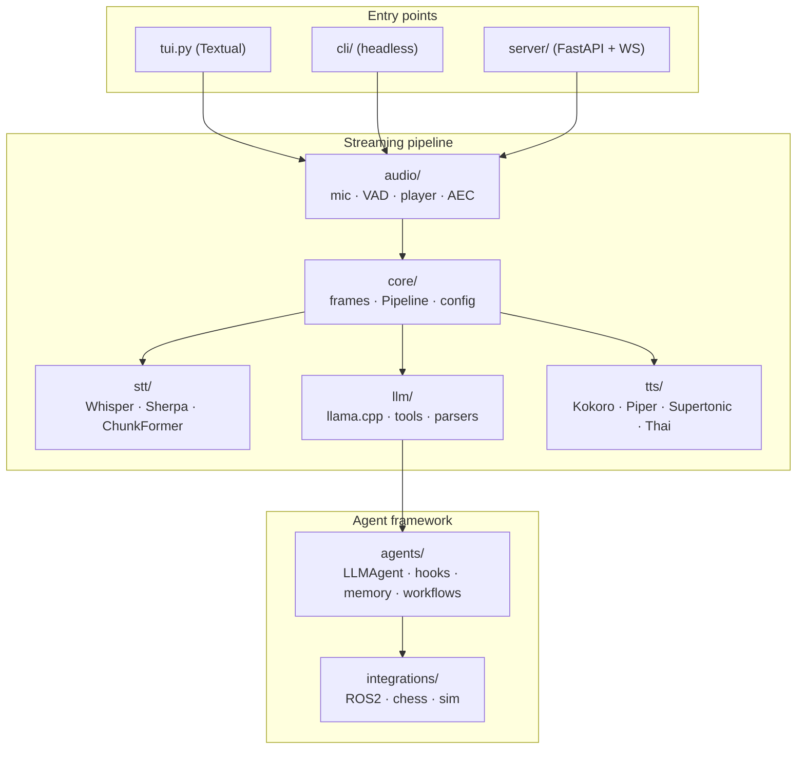
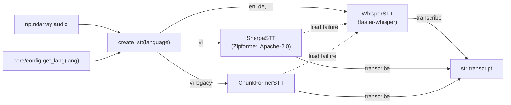
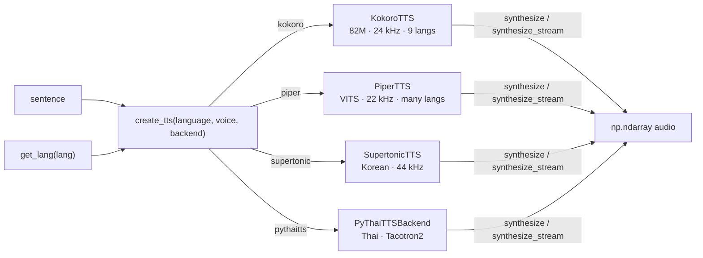
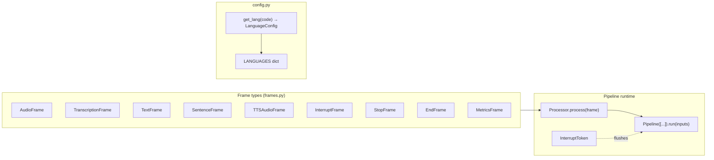
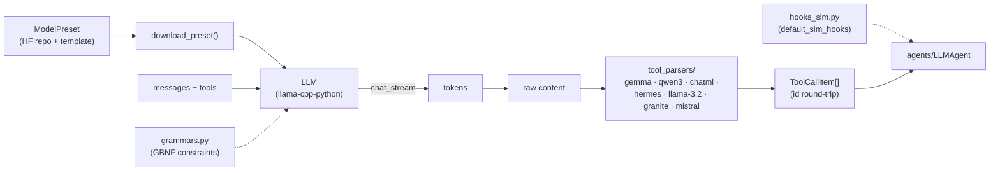
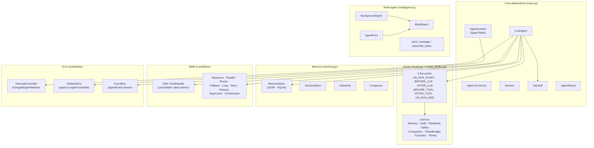
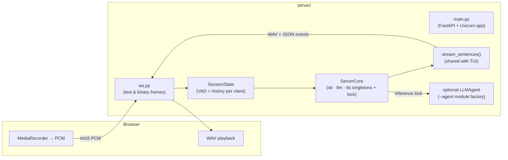
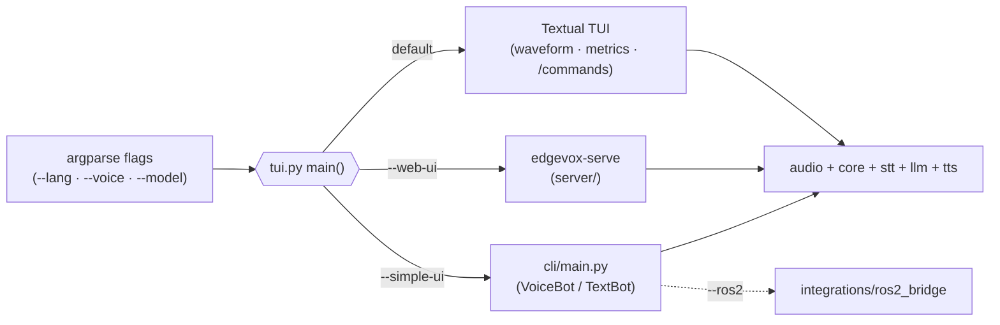
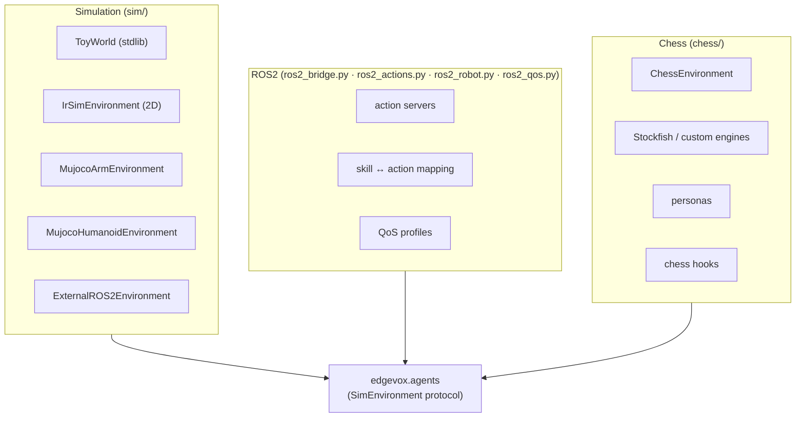

# Component Design

A top-down map of every package inside `edgevox/`. One section per module: what it's for, how the pieces fit, and where you plug in your own implementation.

If you want the dataflow-level view instead, see [Architecture](/guide/architecture) and [Voice Pipeline](/guide/pipeline). This page is the *structural* view — classes, protocols, and swap points.

## Package map at a glance



Everything above a horizontal line calls into the line below it. Components at the same level don't depend on each other — that's what keeps them swappable.

---

## `edgevox/audio/` — capture, playback, VAD, AEC

**The job.** Turn a microphone and a speaker into two tidy streams of `int16` samples at 16 kHz, with voice-activity detection on the way in and echo cancellation on the way out. Everything else in the pipeline assumes this layer just works.

```mermaid
flowchart LR
    MIC[Microphone] --> REC["AudioRecorder<br/>(Silero VAD v6)"]
    REC -->|on_speech(audio)| USER["pipeline callback"]
    REC -->|on_level(rms)| TUI["TUI meter"]
    REC -->|on_interrupt()| PLAYER

    USER --> PLAYER["InterruptiblePlayer<br/>(PortAudio callback)"]
    PLAYER --> SPK[Speaker]
    PLAYER -->|reference signal| AEC["AEC backend<br/>(NLMS · specsub · DTLN)"]
    AEC --> REC

    WAKE["WakeWordDetector<br/>(optional, ONNX)"] --> REC
```

**Key pieces.**

- `AudioRecorder` — listens on a mic, runs Silero VAD on 32 ms frames, emits a full utterance once speech ends. Also exposes `on_level` for UI meters and `on_interrupt` so the player can duck while the user is talking.
- `InterruptiblePlayer` / `play_audio` — opens one persistent PortAudio output stream and a numpy ring buffer. A callback drains the buffer on every audio tick and pads silence on underrun. `interrupt()` flushes the buffer; it never touches the stream itself. See [ADR-001](/adr/001-cancel-token-plumbing) for why this matters.
- `create_aec(backend)` — strategy-pattern factory for echo cancellation. Implementations in `aec.py`: `none`, `nlms`, `specsub`, `dtln`. The player pushes the played signal into a lock-free `_RefBuffer` that the recorder consumes as the AEC reference.
- `WakeWordDetector` — optional openWakeWord-style ONNX model that can gate the pipeline until a trigger phrase.

**Swap point.** Subclass `AECBackend` and register a new choice, or replace `AudioRecorder` wholesale — the rest of the pipeline only sees numpy arrays.

---

## `edgevox/stt/` — speech to text

**The job.** Turn a chunk of 16 kHz audio into a string, with the right backend for the language.



**Key pieces.**

- `BaseSTT` — three-line contract: `transcribe(audio, language) -> str`, plus a `display_name` for the TUI's model panel.
- `create_stt(language, model_size=None, device=None)` — consults the language config, picks a backend, and *falls back to Whisper* if the preferred backend fails to load. That fallback is why a user with no ONNX runtime still gets Vietnamese (slower, but working).
- `WhisperSTT` — auto-sizes the model based on VRAM and RAM: `large-v3-turbo` on an 8 GB GPU, `small` on a laptop CPU.
- `SherpaSTT`, `ChunkFormerSTT` — specialist Vietnamese backends, 30 M / 110 M params, `int8` on CPU.

**Swap point.** Write a class with `transcribe()` and either inject it directly into the agent context or add a branch to `create_stt()` plus a `stt_backend` value in `core/config.py`.

---

## `edgevox/tts/` — text to speech

**The job.** Turn a string into a numpy waveform the player can emit. Streaming-aware: long replies yield one chunk at a time so playback can start during LLM decode.



**Key pieces.**

- `BaseTTS` — `synthesize(text) -> np.ndarray` (required) and `synthesize_stream(text)` (defaults to a single-chunk yield).
- `create_tts()` — same language-driven factory pattern as STT. The `backend=` override lets you pick Piper for English or Kokoro for something Piper doesn't ship.
- Each backend owns its own `sample_rate`; the player resamples to the device rate via `sounddevice`.
- Models pull from `nrl-ai/edgevox-models` on Hugging Face with upstream fallbacks, so first run downloads once and caches.

**Swap point.** Subclass `BaseTTS` and register in the factory. Streaming-aware backends should implement `synthesize_stream()` to avoid the "wait for full sentence" tax.

---

## `edgevox/core/` — frames, pipeline, language config

**The job.** The *wiring* layer. Defines the typed frames that flow through the pipeline, a dead-simple `Processor` base class, and the per-language configuration every backend factory reads.



**Key pieces.**

- `Frame` and its subclasses in `frames.py` — `AudioFrame`, `TranscriptionFrame`, `TextFrame`, `SentenceFrame`, `TTSAudioFrame`, `InterruptFrame`, `StopFrame`, `EndFrame`, `MetricsFrame`. Everything in the pipeline speaks these.
- `Processor` — subclass it, override `process(frame)` as a generator. Patterns supported: 1:1, 1:N, N:1 (buffering), passthrough.
- `Pipeline([...])` — chains processors into one generator stream. `interrupt()` sets an `InterruptToken`, calls `on_interrupt()` on every processor, and lets the next yield produce an `InterruptFrame`.
- `StreamingPipeline` + `stream_sentences()` in `pipeline.py` — the higher-level helper that splits an LLM token stream on sentence boundaries (`.`, `!`, `?`) so TTS can start early.
- `config.py` — `LANGUAGES` / `LanguageConfig` / `get_lang()`. Single source of truth for: `stt_backend`, `tts_backend`, `default_voice`, `kokoro_lang` code, test phrases. Add a new language by adding a row here; no factory changes needed.
- `gpu.py` — cheap VRAM / RAM detection used by STT/LLM autoconfig.

**Swap point.** Add a new `Frame` subtype, a new `Processor`, or a new row in `LANGUAGES`. `core/` has no hard-coded references to the specific backends — it just moves typed dataclasses.

---

## `edgevox/llm/` — inference, tools, tool parsing

**The job.** Wrap `llama-cpp-python` in something the agent layer can drive, and recover structured tool calls from whatever format the current model happens to emit.



**Key pieces.**

- `LLM` (`llamacpp.py`) — thread-safe wrapper. Core methods: `chat_stream(messages, stop_event=…)`, `count_tokens()`. The `stop_event` threads `ctx.interrupt.cancel_token` straight into llama.cpp's `stopping_criteria` so barge-in halts generation within one decode step ([ADR-001](/adr/001-cancel-token-plumbing)).
- `Tool`, `ToolRegistry`, `@tool` (`tools.py`) — decorator-based tool registry. `load_entry_point_tools()` lets third-party packages ship tools via Python entry points.
- `ModelPreset`, `PRESETS`, `resolve_preset()` (`models.py`) — every preset declares its chat template, stop tokens, and `tool_call_parsers=(...)`. `resolve_preset()` *validates every parser name against the detector registry at load time*, so a typo fails loudly.
- `tool_parsers/` — a chain of detectors, one per model family. Critical detail: `parse_tool_calls_from_content` tries detectors against *raw* content *before* stripping `<think>` blocks, because Qwen3 emits tool calls inside reasoning blocks.
- `grammars.py` — GBNF grammar builders for grammar-constrained decoding ([ADR-003](/adr/003-grammar-constrained-decoding)).
- `hooks_slm.py` — `default_slm_hooks()` bundle that hardens small models (output repair, JSON coaxing, token budgets).
- `_agent_harness.py` — internal harness used by `LLMAgent`. Prefer the public surface in `edgevox.agents`.

**Swap point.** Add a new model: register a `ModelPreset` and, if its tool-call format is novel, add a detector in `tool_parsers/` and list its name in the preset.

---

## `edgevox/agents/` — the agent framework

**The job.** Everything above `llm/` that turns "run a chat loop" into "run an agent with hooks, memory, tools, skills, workflows, interrupts, and handoffs." This is the largest package and the most-customized surface.



**Key pieces.**

- `Agent` (Protocol), `LLMAgent`, `Session`, `AgentContext`, `AgentResult`, `Handoff` (`base.py`) — the polymorphic heart. Workflows are agents too; `Sequence([a, b])` is itself an `Agent`.
- Hooks — the main extension surface. See [Hooks](/guide/hooks) for the full matrix. Hook-owned state lives under `ctx.hook_state[id(self)]` ([ADR-002](/adr/002-typed-ctx-hook-state)).
- `Skill` / `@skill` / `GoalHandle` — cancellable async actions, distinct from `@tool`. Cancellation is real: `ctx.stop` threads into the skill's cooperative check.
- Workflows (`workflow.py`) — Behaviour-Tree-flavoured combinators. Nothing clever; they just schedule child agents.
- Memory (`memory.py`) — `MemoryStore` (long-term facts), `SessionStore` (turn history), `NotesFile` (human-editable scratchpad), `Compactor` (LLM-driven summarization when the window fills).
- Multi-agent (`multiagent.py`) — `Blackboard` for shared state, `BackgroundAgent` / `AgentPool` for parallel agents, inbox messaging.
- `InterruptController` (`interrupt.py`) — the barge-in coordinator. Plumbing is covered in [Interrupt](/guide/interrupt).
- `ArtifactStore` (`artifacts.py`) — file-like store for structured agent-to-agent handoffs.
- `sim.py` — `SimEnvironment` protocol and `ToyWorld` stdlib reference env for tests.

**Swap point.** Add a hook, a workflow, a memory backend, a skill, or a whole new `Agent` implementation. Core rule: don't write magic keys into `ctx.state` from framework code — that field is user scratch only.

---

## `edgevox/server/` — FastAPI + WebSocket

**The job.** Expose the voice pipeline over a WebSocket so a browser (or any networked client) can hold a continuous conversation with the local AI.



**Key pieces.**

- `ServerCore` (`core.py`) — holds process-wide singletons of the heavy models (one STT, one LLM, one TTS) plus a global *inference lock*. The lock serializes calls into llama.cpp so multiple WebSocket clients can coexist without VRAM contention.
- `SessionState` (`session.py`) — per-connection mirror of `AudioRecorder`'s VAD state machine, applied to wire-delivered audio. Also holds per-session chat history that is swapped in/out of the shared `LLM` under the lock.
- `ws.py` — WebSocket handler. Text frames carry control JSON (language switch, `/say`, `/reset`); binary frames carry `int16` mono PCM in and WAV chunks out.
- `main.py` — Uvicorn launcher. With `edgevox-serve --agent module:factory`, it binds a user-supplied `LLMAgent` factory to `ServerCore.agent` so every turn runs through the full harness; without it, the server uses the legacy streaming path (lower first-token latency, no hooks/tools).
- `audio_utils.py` — resampling helpers shared between audio-in and the pipeline's 16 kHz contract.

**Swap point.** Point `--agent` at your own factory to inject a custom `LLMAgent` with your hooks, tools, and memory. The transport layer doesn't care.

---

## `edgevox/cli/`, `edgevox/tui.py`, `edgevox/ui/` — entry points

**The job.** The three things a user actually runs: the Textual TUI (default), the headless CLI, and the launcher hooks in `pyproject.toml`.



**Key pieces.**

- `tui.py` — Textual app. Layers a live waveform, model-info panel, sparkline latency history, and slash commands (`/model`, `/voice`, `/lang`, `/reset`) on top of the pipeline. See [TUI Commands](/guide/commands).
- `cli/main.py` — minimal voice bot and text bot for scripting / headless boxes.
- `ui/` — placeholder for reusable TUI widgets (currently empty; widgets live inside `tui.py` for now).
- Console scripts in `pyproject.toml`: `edgevox` → `tui:main`, `edgevox-cli` → `cli.main:main`, `edgevox-setup` → `setup_models:main`.

**Swap point.** Write your own entry point — the pipeline is just Python. Every entry point is a thin argument parser around `create_stt()` / `create_tts()` / `LLMAgent`.

---

## `edgevox/integrations/` — ROS2, chess, simulation

**The job.** Optional integrations that don't belong in the core (they'd bloat install), each self-contained.



**Key pieces.**

- `integrations/ros2_bridge.py`, `ros2_actions.py`, `ros2_robot.py`, `ros2_qos.py` — maps `Skill` goals to ROS2 actions with consistent QoS settings. See [ROS2 Integration](/guide/ros2).
- `integrations/sim/` — `IrSimEnvironment` (2D, matplotlib), `MujocoArmEnvironment`, `MujocoHumanoidEnvironment`, `ExternalROS2Environment`. Each implements the `SimEnvironment` protocol from `edgevox.agents.sim` so agent code is sim-agnostic.
- `integrations/chess/` — reference desktop application (see [Chess](/guide/chess) and [RookApp](/guide/desktop)). Persona + engine plug-ins are themselves `Agent` implementations.

**Swap point.** Every integration is opt-in and lives behind its own dependency. Add a new one by implementing the relevant protocol (`SimEnvironment`, `Skill`, `Agent`) and shipping it as its own package if you like.

---

## Where to go next

- [Architecture](/guide/architecture) — streaming pipeline and latency budget
- [Voice Pipeline](/guide/pipeline) — agent path vs legacy streaming path
- [Agent loop](/guide/agent-loop) — the six fire points in `LLMAgent.run()`
- [Hooks](/guide/hooks) — extension surface reference
- [Tool calling](/guide/tool-calling) — parser chain and GBNF roadmap
