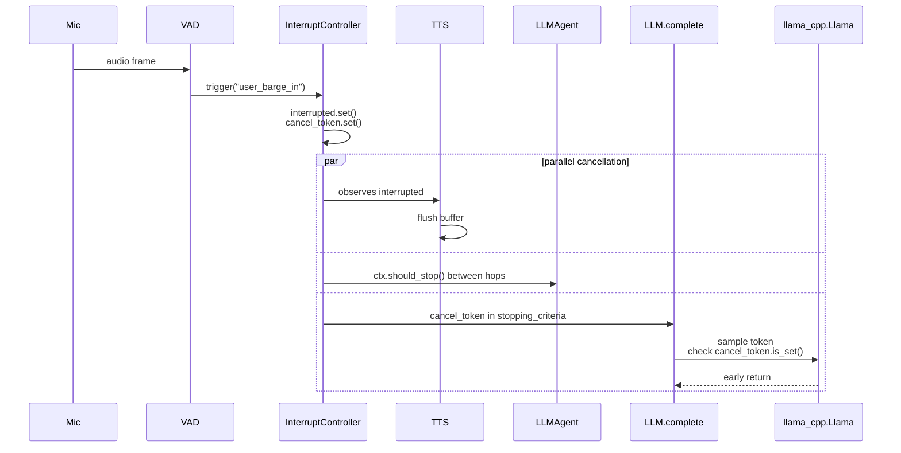

# Interrupts & barge-in

Voice-agent UX lives or dies on how fast the pipeline shuts up when the user starts talking. This page documents how EdgeVox's `InterruptController` coordinates barge-in across TTS, the LLM backend, and the agent loop — and the hard latency budget it enforces.

## Latency budget

| Stage | Target | Where it's enforced |
|---|---|---|
| VAD → `InterruptController.trigger()` | <20 ms | audio worker, pure-Python RMS / ONNX VAD |
| TTS flush | <100 ms | TTS worker observes `interrupted.is_set()` |
| LLM generation stops | **≤40 ms after trigger** | `cancel_token` piped into llama-cpp `stopping_criteria` |
| Skill cancel (opt-in) | <200 ms | poll loop inside `_dispatch_skill` |

The LLM number is the one that matters — before PR-1 wired the `cancel_token` through, a barge-in during a long reply left the LLM grinding through `max_tokens` for seconds. See [ADR-001](../adr/001-cancel-token-plumbing.md).

## Two signals

`InterruptController` exposes two `threading.Event` channels:

- **`interrupted`** — general "stop what you're doing". TTS, the agent loop between hops, and skill dispatch poll or wait on this.
- **`cancel_token`** — dedicated channel fed into `llama_cpp.Llama`'s `stopping_criteria` via `LLM.complete(stop_event=…)`. Only set when `InterruptPolicy.cancel_llm=True`. Gives us enforceable mid-generation cancellation (one decode step latency).

`reset()` clears both events and drops `latest` so a stale interrupt can't leak into the next turn. `history` is retained but ring-buffered to 500 entries to cap slow-leak in long voice sessions.

## Wiring



## `InterruptPolicy`

Tunable thresholds. Defaults reflect typical robot voice UX:

```python
@dataclass
class InterruptPolicy:
    min_duration_ms: int = 300        # sustained speech energy before trigger
    energy_threshold: float = 0.02    # normalized float32 RMS
    cancel_llm: bool = True           # set cancel_token on trigger
    cancel_skills: bool = False       # preserve mid-grasp skills through brief "um"s
    cut_tts_immediately: bool = True  # drop in-flight TTS sentence
```

`cancel_skills=False` is deliberate: interrupting a Panda mid-grasp because the user said "uh" is worse than letting the grasp finish. Opt in only when the skill surface is short (<200 ms).

## Producer side

A VAD or GUI-button worker calls `trigger()`:

```python
ic = InterruptController()
# ... attach to the agent context:
ctx = AgentContext(interrupt=ic)

# mic worker
for frame in mic_stream():
    if vad.is_speech(frame) and tts.is_playing():
        ic.trigger(reason="user_barge_in", rms=rms)
```

`trigger()` is idempotent: repeat calls while already interrupted still append to history but reuse the event flag. Subscribers (log workers, analytics) are notified synchronously — keep them fast.

## Consumer side

The TTS worker waits on the event and flushes:

```python
while not ic.interrupted.is_set() and pending:
    play(pending.pop(0))
if ic.interrupted.is_set():
    stop_stream()  # drop buffered audio
```

The agent loop (`LLMAgent._drive`) calls `ctx.should_stop()` between hops (both `ctx.stop` and `ctx.interrupt.should_stop()`), and threads `ctx.interrupt.cancel_token` into every `llm.complete`:

```python
cancel_token = None
if ctx.interrupt is not None and ctx.interrupt.policy.cancel_llm:
    cancel_token = ctx.interrupt.cancel_token
result = llm.complete(messages, tools=..., stop_event=cancel_token)
```

Skill dispatch polls `ctx.should_stop()` every 50 ms and calls `handle.cancel()` on hit.

## Defaults at a glance

EdgeVox enables echo cancellation by default so barge-in works out of the box on typical USB-mic + laptop-speaker setups. The chain:

1. **`AEC = specsub`** (frequency-domain spectral subtraction, pure numpy, no extra deps). Set by both `edgevox-cli --aec ...` and the TUI. Pass `--aec none` to opt out.
2. **Energy-ratio gate** in `AudioRecorder._process_loop`. Even after AEC, the mic must clearly dominate the speaker reference (`mic_rms ≥ 3 × player.last_output_rms`) for VAD to be trusted. This is the defense against "AEC residual fools VAD" — the most common failure mode without it.
3. **VAD on cleaned audio** (Silero, run on the AEC-cleaned chunk).
4. **Sustained-speech window** (`INTERRUPT_SPEECH_FRAMES = 8`, ~256 ms) to suppress one-off noise (door slam, cough).
5. **Echo cooldown** (`ECHO_COOLDOWN_SECS = 1.5`) after TTS stops, so the mic isn't trusted while reverb / AEC tail dies down.

When the speaker is effectively silent (`player.last_output_rms < 0.005`) the energy-ratio gate is bypassed so quiet user speech still triggers — sensitivity isn't traded against the anti-self-trigger work.

If you write your own pipeline and don't want the recorder, the standalone `EnergyBargeInWatcher` adds the same protections: pass `tts_energy_provider=lambda: player.last_output_rms` to give it the live reference signal.

## Tuning checklist

If barge-in is **still self-triggering** with the defaults:

- Confirm AEC is actually active — `edgevox-cli --aec specsub` (or `--aec dtln` for a stronger but heavier model).
- Lower the speaker volume by 6–10 dB; mic input gain often clips on cheap hardware.
- Raise `INTERRUPT_RMS_RATIO` from 3.0 to 3.5–4.0 in `edgevox/audio/_original.py` (constants block at the top).

If real user speech is **not triggering**:

- Lower `InterruptPolicy.energy_threshold` (default `0.012`) — try `0.008` for very quiet rooms.
- Reduce `min_duration_ms` (default `250`) to `200` if users speak in short bursts.
- Lower `INTERRUPT_MIN_RMS` (default `0.01`) if your mic gain is unusually low.

## Repeatable interrupts

Back-to-back barge-ins must re-arm cleanly even when the consumer (TUI / VoiceBot) hasn't finished tearing down the previous turn. Two mechanisms keep this working:

- **Synchronous post-interrupt re-arm**. After `_on_interrupt` fires, the recorder immediately bumps `_suppress_gen` and clears `_suppressed = False`. The captured user-speech buffer flushes into the next chunk's VAD pass without waiting for the consumer's `force_resume(delay=0.1)`.
- **Generation-counter cooldown invalidation**. `play()` schedules a 1.5 s `resume_after_cooldown`; `force_resume` schedules a 0.1 s reset; the synchronous re-arm above. All three check `_suppress_gen` against the value captured at scheduling, so whichever runs first wins and the others no-op cleanly.

The old behaviour — `force_resume(delay=0.3)` was the only re-arm path, and the captured user speech could be lost if its silence-detection window crossed the cooldown — has been removed. The 0.3 s default in `force_resume` is now 0.1 s and serves only as defense in depth on the post-turn happy path.

## VAD backends

Today the only shipped watcher is `EnergyBargeInWatcher` — pure RMS threshold with echo-floor calibration + reference-signal gate, numpy-optional. The production pipeline uses Silero VAD on AEC-cleaned audio inside `AudioRecorder` (not this watcher) — `EnergyBargeInWatcher` is for users who write their own pipelines.

Planned (PR-7):

| Backend | Install | Latency | Accuracy notes |
|---|---|---|---|
| Energy (current) | built-in | <1 ms | 5–15% false triggers in noisy rooms |
| `py-webrtcvad` | `pip install webrtcvad` | <1 ms | GMM baseline; much better than RMS |
| Silero VAD (ONNX) | `edgevox[voice-vad]` | ~1 ms | community default; ~1–2% false triggers |
| TEN VAD (ONNX) | `edgevox[voice-vad]` | <1 ms | 306 KB model; lowest latency |

All four will implement one `BargeInVAD` Protocol. Document the trade-offs in this page when they land.

## Subscribing to events

`InterruptController.subscribe(handler)` lets ad-hoc observers log or react. Handlers run on the triggering thread (synchronous) — keep them tiny. Returns an unsubscribe callable:

```python
unsub = ic.subscribe(lambda ev: metrics.inc("interrupts", reason=ev.reason))
...
unsub()
```

Handler exceptions are logged but don't propagate.

## See also

- [ADR-001](../adr/001-cancel-token-plumbing.md) — why `cancel_token` exists.
- [`agent-loop.md`](./agent-loop.md) — where the loop checks `ctx.should_stop()`.
- [`pipeline.md`](./pipeline.md) — how the audio stack plugs in.
