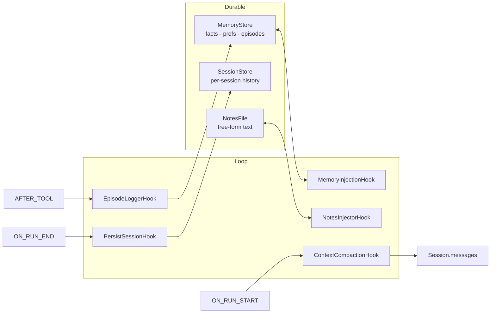

# Memory

EdgeVox agents have three complementary memory surfaces, all optional and all pluggable via Protocols:

- **`MemoryStore`** — long-term durable facts, preferences, and episodes.
- **`SessionStore`** — whole-conversation persistence keyed by session id.
- **`NotesFile`** — plain-text working-memory scratchpad (Anthropic NOTES.md pattern).

Plus a **`Compactor`** that summarises old turns when the session crosses a token budget.



## `MemoryStore`

A `Protocol`; two implementations ship today:

| Class | Backing | Use case |
|---|---|---|
| `JSONMemoryStore` | debounced JSON file | default; simple, human-readable, thread-safe |
| `SQLiteMemoryStore` (PR-12, planned) | stdlib `sqlite3` | atomic writes, crash-safe, queryable |

### Data model

- **`Fact(key, value, scope, source)`** — durable key/value with scope (`"global"`, `"user"`, `"env:kitchen"`, …).
- **`Preference(key, value)`** — user preferences, rendered separately.
- **`Episode(kind, payload, outcome, agent)`** — one-line records of tool/skill outcomes. Ring-buffered at 500 by default.

### Rendering

`store.render_for_prompt(max_facts=20, max_episodes=5)` returns a markdown block ready to splice into the system prompt. `MemoryInjectionHook` does this at `BEFORE_LLM` with an idempotent marker check so re-injection across tool hops is free.

## `NotesFile`

Plain-text scratchpad. Agents append via a tool (or directly); `NotesInjectorHook` feeds the tail into the system prompt at `BEFORE_LLM`.

Soft-bounded at 64 KiB by default (configurable via `max_size_chars`). When an append would exceed the bound, the file is rewritten keeping the newest bytes plus a single `(earlier notes truncated)` marker — a long-running voice session that logs a note per turn can't slow-leak disk or prompt space. `max_size_chars=0` disables the cap for power users.

## `Compactor`

Summarises middle turns when the session crosses `trigger_tokens` (default 4000). Preservation priority follows Anthropic's context-engineering guidance:

1. **System prompt** — always kept verbatim, position 0.
2. **Last `keep_last_turns`** — verbatim (default 4).
3. **Middle** — compressed into one assistant message via an LLM call.

Wired to the loop via `ContextCompactionHook` at `ON_RUN_START` (never mid-turn — would break tool-call chains).

## `estimate_tokens`

```python
estimate_tokens(messages: Iterable[dict], llm: LLM | None = None) -> int
```

When `llm` is supplied, every message body is tokenised exactly via `LLM.count_tokens` (uses the loaded GGUF's tokenizer). Without it, the function falls back to `chars // 4` — which is known-wrong for code (~15-25% under) and for CJK / Vietnamese / Thai (massively under).

`TokenBudgetHook` and `ContextCompactionHook` read `ctx.llm` and pass it through, so the running agent's real tokenizer drives every context-window decision. Test doubles without a tokenizer fall back gracefully.

## Typical wiring

```python
from edgevox.agents import LLMAgent
from edgevox.agents.memory import JSONMemoryStore, Compactor, NotesFile
from edgevox.agents.hooks_builtin import (
    MemoryInjectionHook, EpisodeLoggerHook,
    NotesInjectorHook, ContextCompactionHook,
    TokenBudgetHook, PersistSessionHook,
)

store = JSONMemoryStore("~/.edgevox/memory/kitchen.json")
notes = NotesFile("~/.edgevox/memory/kitchen-notes.md")

agent = LLMAgent(
    name="kitchen",
    description="Home-kitchen assistant",
    instructions="You help in the kitchen.",
    hooks=[
        MemoryInjectionHook(store),
        NotesInjectorHook(notes),
        TokenBudgetHook(max_context_tokens=3500),
        ContextCompactionHook(Compactor(trigger_tokens=3000)),
        EpisodeLoggerHook(store, agent_name="kitchen"),
        PersistSessionHook(session_store=..., session_id="kitchen"),
    ],
)
```

## Roadmap

SOTA research (Letta/MemGPT, Mem0, Zep/Graphiti, Anthropic memory tool) suggests several upgrades tracked in the harness refactor queue:

- **Bi-temporal facts** (PR-10): `valid_from`/`valid_to` + `supersedes` so the agent can answer "what did I believe at t?".
- **Memory-as-tools** (PR-14+): let the SLM curate its own facts via `remember_fact` / `forget_fact` tools.
- **Vector retrieval** (PR-14+): optional `VectorMemoryStore` backed by sqlite-vec + llama.cpp embedding mode — offline, MIT, reuses the already-loaded llama runtime.
- **Importance/decay scoring**: prioritise episodes by recency × access × self-assigned importance rather than FIFO.

See the harness refactor history under `docs/adr/` for what's been adopted and why.

## See also

- [`hooks.md`](./hooks.md) — memory-related hooks + composition.
- [`agent-loop.md`](./agent-loop.md) — where compaction + injection hooks fire.
