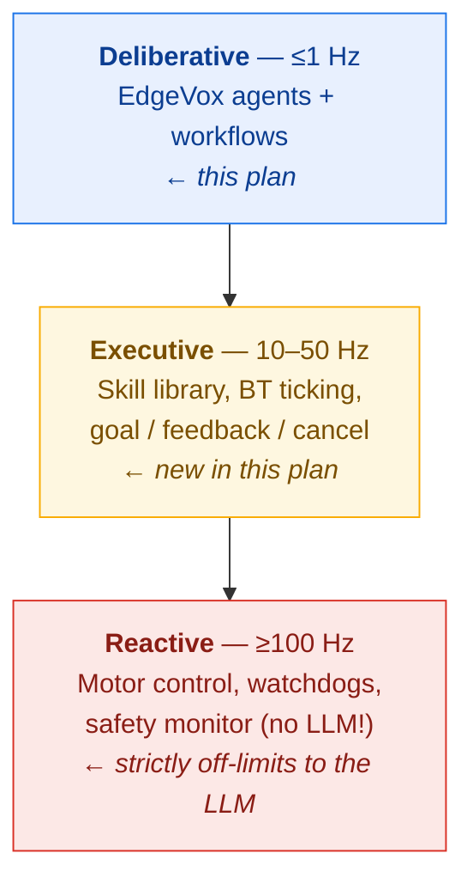
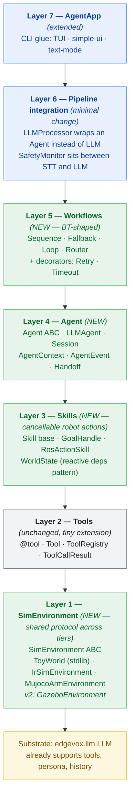

# EdgeVox Agent Framework — Architecture Plan (v4: robotics-aware + sim tiers)

## Context

EdgeVox today has a **tool layer** (`@tool`, `ToolRegistry`, bounded loop inside `LLM._run_agent`) and a thin **app layer** (`AgentApp`). The goal is to grow EdgeVox from "local agent builder" → "agent framework for robotics". Open gaps:

- No first-class `Agent` abstraction. No multi-step / multi-agent workflows.
- Every robot example is named "Vox" because `persona` never flowed out to the app layer.
- State lives in module globals (`STATE = House()`).
- **The pipeline's interrupt path is unsafe for real robots.** `Pipeline.interrupt()` cuts TTS, but tools execute synchronously inside `_run_agent` — a long-running tool (`navigate_to("kitchen")`) blocks the pipeline loop and can't be preempted until it returns. This is the exact anti-pattern robotics teams get burned by.
- No notion of a **skill** (cancellable robot action) distinct from a **tool** (fast pure function).
- No **simulation** story. Developers can't test voice → agent → skill → effect loops without real hardware, and the examples use ad-hoc in-memory "worlds" (`House`, `RobotState`) that can't graduate to real simulators.
- The ROS2 bridge (`integrations/ros2_bridge.py`) is pub/sub only — no action client for goal/feedback/result.

This plan synthesizes research across eight frameworks (ADK, smolagents, Pipecat, LangGraph, OpenAI Agents SDK, PydanticAI, VLA systems like RT-2/Helix, BehaviorTree.CPP/PyTrees) and seven simulators (Gazebo, Isaac Sim, MuJoCo, PyBullet, Webots, Genesis, Drake), plus a focused assessment of **IR-SIM** as the Python-native lightweight option.

## The hard constraints — two of them

### Constraint 1: Three-layer robotics architecture

Classical robotics partitions the stack by latency budget. EdgeVox agents live ONLY in the deliberative layer. The wrong design produces robots that ignore "STOP."



**Rule:** the LLM never enters the reactive layer. Safety reflexes bypass it. Skills expose intents (`navigate_to(room)`), not control (`set_speed(mps)`). Every other choice flows from this.

### Constraint 2: "10 minutes from `pip install` to a talking robot in a window"

EdgeVox's moat is *pure-Python, offline, laptop-friendly*. Any sim integration that breaks that positioning is wrong, no matter how technically impressive. This eliminates Isaac Sim (RTX-mandatory, 30-50 GB), Genesis (no ROS2 bridge yet), and even Gazebo as a *day-one* sim (1-2 GB + Ubuntu-only + ROS2 setup is too much friction for persona 1).

## Simulation strategy — three tiers, IR-SIM is tier 1

Research revealed a sharp split between "hobbyist first-run" sim needs and "graduation-to-real-robot" sim needs. No single simulator serves both. The strategy is three tiers sharing one protocol:

| Tier | Sim | Role | Dependencies | Status |
|---|---|---|---|---|
| **Tier 0** | Built-in headless toy world | Unit tests + trivial examples (`House`, `RobotState`) | None (pure Python stdlib) | shipped |
| **Tier 1** | **IR-SIM** (hanruihua/ir-sim) | Day-one "pip install → matplotlib window → voice agent drives a 2D robot" | `pip install ir-sim` (one line, MIT, pure Python, active in April 2026) | shipped |
| **Tier 2** | **MuJoCo — tabletop arm** | 3D pick-and-place demo + mid-motion interrupts | `pip install 'edgevox[sim-mujoco]'` (Franka Panda, auto-fetched from HuggingFace) | shipped |
| **Tier 2b** | **MuJoCo — humanoid locomotion** (Unitree G1 / H1) | Procedural gait on Menagerie meshes + pluggable ONNX walking policy | Same MuJoCo dep; model auto-fetched from `nrl-ai/edgevox-models` | **shipped** |
| **Tier 3** | **ExternalROS2Environment** — drive any external ROS2 sim or real robot | Subscribes `odom`/`scan`/`camera/image_raw`, publishes `cmd_vel`/`goal_pose` | Sourced ROS2 workspace (Gazebo, Isaac Sim via ROS2 bridge, real hardware) | **shipped** |

**Why IR-SIM is the right Tier 1 pick:**

- **Pure Python + pip installable** — matches EdgeVox's install story exactly. No Ubuntu-specific packages, no ROS2 prerequisite, no GPU.
- **2D only, matplotlib renderer** — a hobbyist runs `edgevox-agent robot` and sees a differential-drive bot driving around in a window. Gratification in seconds, not hours.
- **YAML world config + diff-drive/Ackermann/omni + 2D LiDAR + RVO/ORCA collision avoidance** — rich enough to demo real multi-agent scenarios without URDF/mesh setup.
- **Actively maintained** — v2.9.3 April 2026, 1552 commits, MIT licensed, contribution-welcoming.
- **Honest limitations aligned with EdgeVox's graduation story** — no URDF, no ROS2, no sim-to-real claim. That's *correct* for Tier 1: IR-SIM is where you learn and validate agent logic; when you're ready to transfer, you graduate to Tier 2.

**Why NOT MuJoCo as Tier 1:** technically excellent but 3D-first. You need meshes/URDFs before anything appears on screen, and headless rendering needs EGL/OSMesa setup. That's a day-two experience, not a day-one one. MuJoCo still lands in v1.1 as a Tier 2 adapter — see [Tier 2 preview — MuJoCo phased rollout](#tier-2-preview--mujoco-phased-rollout) below.

**Why NOT Gazebo as Tier 1:** 1-2 GB download, Ubuntu-only, requires ROS2 setup. Great Tier 2 target, wrong day-one pick.

**Why NOT ship multiple Tier 1 sims in v1:** they'd compete for examples and docs attention. Ship one, make it excellent, let users migrate to Tier 2 adapters in v2 as demand shows up.

## Framework comparison — condensed

| | ADK | smolagents | Pipecat | LangGraph | OpenAI SDK | PydanticAI | BT.CPP / PyTrees | **EdgeVox v4** |
|---|---|---|---|---|---|---|---|---|
| First-class Agent | yes | yes | no | no (nodes) | yes | yes | N/A | **yes** |
| Voice-first | no | no | yes | no | no | no | no | **yes** |
| Multi-agent | WorkflowAgent | sub-as-tool | no | Supervisor/Swarm | **Handoff-as-return** | Delegation | N/A | **Handoff** |
| Workflow primitives | Seq/Par/Loop | — | — | StateGraph | Runner sequence | pydantic-graph | **Seq/Fallback/Par/Decorators** | **BT-shaped** |
| Cancellable skills | LongRunningFunctionTool | no | frame-level cancel | no | no | no | SUCCESS/RUNNING/FAILURE tick | **GoalHandle** |
| Safety monitor | no | no | frame interrupt only | no | no | no | reactive leaves | **SafetyMonitor** |
| Reactive world state | no | no | Service context | State graph | — | deps_type | Blackboard | **WorldState deps** |
| Built-in sim | no | no | no | no | no | no | no | **IR-SIM adapter** |
| Local GGUF | LiteLLM | Transformers | Ollama | Ollama | LiteLLM | Ollama | N/A | **native** |
| Core LOC target | large | ~1000 | large | large | moderate | moderate | ~few k | **<900** |

**Key decisions inherited from the cross-framework research:**

1. **Handoff-as-return-value for delegation** (OpenAI Agents SDK). Saves 1 LLM hop per handoff vs smolagents' sub-agent-as-tool pattern — critical for voice TTFT.
2. **BT-shaped workflow primitives** (BT.CPP / PyTrees). Proven executive-layer orchestrator; gives a clean graduation path to production robot planners.
3. **Dependency-injection `deps` pattern** (PydanticAI). Replaces module globals in examples.
4. **SafetyMonitor bypasses the LLM** (Brown/CMU Safety Chip 2024). Stop-words preempt without waiting on token generation.
5. **No CodeAgent** (smolagents gap). Gemma 4 E2B can't reliably write executable Python.
6. **No parallel workflow in v1** (GIL + single-GGUF memory budget). Defer to v2.
7. **Keep the frame-based pipeline** (Pipecat confirmation). Already correct; agents plug in at `LLMProcessor`.

## The 7-layer architecture



### Layer 1: SimEnvironment — NEW (`edgevox/agents/sim.py`)

Thin protocol + one stdlib-only reference. No physics engine ambition.

```python
# edgevox/agents/sim.py  (new, ~90 LOC)

class SimEnvironment(Protocol):
    """Minimal protocol every sim adapter implements.
    Used as AgentContext.deps — the agent code doesn't know whether
    it's talking to a toy dict, IR-SIM, or Gazebo."""

    def reset(self) -> None: ...
    def step(self, dt: float) -> None: ...
    def get_world_state(self) -> dict[str, Any]: ...
    def apply_action(self, action: str, **kwargs: Any) -> GoalHandle: ...
    def render(self) -> None: ...                  # may be no-op

class ToyWorld:
    """Stdlib-only reference env. Replaces the hand-rolled House and
    RobotState globals in the existing examples with a formal, testable
    shape. ~100 LOC, zero dependencies, ASCII debug render."""
    def __init__(self, rooms: list[str], robot_pose=(0,0,0)): ...
```

### Layer 2: Tools — existing + ctx injection

Keep `edgevox/llm/tools.py` as-is. One additive change: `@tool` detects an optional `ctx: AgentContext` parameter, strips it from the JSON schema the model sees, and injects it at dispatch.

```python
@tool
def get_light_status(room: str, ctx: AgentContext) -> str:
    """Return the current on/off state of a room's light."""
    return "on" if ctx.deps.lights.get(room) else "off"
```

Tools stay the right shape for pure, fast (<1 ms) "query" functions.

### Layer 3: Skills — NEW (`edgevox/agents/skills.py`)

Skills are **cancellable, potentially long-running** actions. They follow the ROS2 Action pattern: submit a goal, receive feedback, receive a result, support cancellation.

```python
# edgevox/agents/skills.py  (new, ~180 LOC)

class GoalStatus(Enum):
    PENDING = auto()
    RUNNING = auto()
    SUCCEEDED = auto()
    CANCELLED = auto()
    FAILED = auto()

@dataclass
class GoalHandle:
    id: str
    status: GoalStatus
    result: Any = None
    error: str | None = None
    def poll(self, timeout: float | None = None) -> GoalStatus: ...
    def cancel(self) -> None: ...
    def feedback(self) -> Iterator[Any]: ...

class Skill(Protocol):
    name: str
    description: str
    latency_class: Literal["fast", "slow"]
    def start(self, ctx: AgentContext, **kwargs: Any) -> GoalHandle: ...

def skill(
    *, name: str | None = None, description: str | None = None,
    latency_class: Literal["fast", "slow"] = "slow",
    timeout_s: float = 30.0, cancellable: bool = True,
) -> Callable[..., Skill]: ...
```

**Dispatch split** inside `LLMAgent._run_agent`: tools run synchronously (today's behavior). Skills call `skill.start(ctx, **args)` → get a `GoalHandle` → block on `handle.poll(timeout)` *on a worker thread* so the pipeline can still receive `StopFrame`. On stop, call `handle.cancel()` and abort the agent loop cleanly.

**ROS2 adapter** (`edgevox/integrations/ros_skills.py`, new, optional import):

```python
class RosActionSkill(Skill):
    """Wraps an rclpy ActionClient as an EdgeVox skill."""
    def __init__(self, node, action_type, action_name, *,
                 name, description, latency_class="slow"): ...
    def start(self, ctx, **kwargs) -> GoalHandle: ...
```

### Layer 4: Agent — NEW (`edgevox/agents/base.py`)

```python
# edgevox/agents/base.py  (new, ~240 LOC)

@dataclass
class Session:
    messages: list[dict] = field(default_factory=list)
    state: dict[str, Any] = field(default_factory=dict)
    def reset(self) -> None: ...

@dataclass
class AgentContext:
    """PydanticAI-style DI + runtime plumbing."""
    session: Session
    deps: Any = None                              # WorldState, House, RobotState, ROS2 Node, ...
    on_event: Callable[[AgentEvent], None] | None = None
    stop: threading.Event = field(default_factory=threading.Event)  # safety cancellation

@dataclass
class AgentEvent:
    kind: Literal["agent_start", "agent_end", "tool_call", "skill_goal",
                  "skill_feedback", "skill_cancelled", "handoff", "safety_preempt"]
    agent_name: str
    payload: Any

@dataclass
class AgentResult:
    reply: str
    agent_name: str
    elapsed: float
    tool_calls: list[ToolCallResult]
    skill_goals: list[GoalHandle]
    handed_off_to: str | None = None
    preempted: bool = False

@dataclass
class Handoff:
    """Sentinel return indicating control should transfer."""
    target: "Agent"
    task: str | None = None

class Agent(Protocol):
    name: str
    description: str
    def run(self, task: str, ctx: AgentContext) -> AgentResult: ...
    def run_stream(self, task: str, ctx: AgentContext) -> Iterator[str]: ...

class LLMAgent:
    def __init__(
        self, name: str, description: str, instructions: str,
        tools: ToolsArg = None,
        skills: list[Skill] | None = None,
        llm: LLM | None = None,                   # injected by workflow/AgentApp
        handoffs: list[Agent] | None = None,
        max_tool_hops: int = 3,
    ): ...
```

**Key mechanics:**

1. **LLM sharing.** Multiple `LLMAgent`s share a single `LLM` instance — swapping `persona` / `tools` / history per run. Avoids duplicating the GGUF in memory.
2. **Handoff short-circuit** (OpenAI SDK pattern). When `handoffs=[agent_a, agent_b]`, `LLMAgent.__init__` synthesizes one handoff tool per target. When `_run_agent` sees a `Handoff` return, it transfers control to `handoff.target.run(...)` *instead of* running another LLM pass. Total cost: **2 LLM calls** (router + specialist), not 3.
3. **Persona per agent.** Fixes "every robot is Vox." Each built-in example gets a distinct identity (Casa, Scout, Byte).
4. **Observability.** Every tool call, skill goal, handoff, and safety preempt fires an `AgentEvent`. The TUI chat log subscribes and renders each with a distinct color.
5. **Streaming on the fast path.** Leaf `LLMAgent` with no tools / skills / handoffs still streams token-by-token. Tool/skill/handoff turns fall back to single-chunk final reply.

### Layer 5: Workflows — NEW, BT-shaped (`edgevox/agents/workflow.py`)

Pure-Python subset of Behavior Tree node semantics. Every workflow implements the `Agent` protocol so workflows nest transparently.

```python
# edgevox/agents/workflow.py  (new, ~220 LOC)

class Sequence:
    """BT Sequence: run each agent in order; stop on first failure."""

class Fallback:
    """BT Fallback / Selector: try agents in order, return on first success."""

class Loop:
    """BT Loop (Do-Until): repeat while until(session.state) == False."""

class Router:
    """Syntactic sugar for LLMAgent with only handoff tools.
    Voice-optimized multi-agent primitive. 2 LLM calls total."""

# Decorators — wrap another Agent, implement the Agent protocol
class Retry:    """Re-run up to N times on failure."""
class Timeout:  """Wall-clock deadline; cancels in-flight skills on expiry."""
```

**Latency table (critical for voice):**

| Pattern | LLM calls per user turn | Streaming? |
|---|---|---|
| Leaf `LLMAgent`, chitchat | 1 | yes |
| Leaf `LLMAgent`, one tool call | 2 | no |
| `Router` leaf = chitchat | 2 | no |
| `Router` leaf = tool call | 3 | no |
| `Sequence([A, B])` | 2+ | no |
| `Loop(A, max=3)` | up to 3 | no |

**Dropped from v1: `Parallel`.** Single `LLM` is GIL-bound; true parallelism needs N `LLM` instances which blows memory budget on an edge device.

### Layer 6: Pipeline integration — minimal change

**6a. `LLMProcessor` accepts optional `agent=`.** When set, the processor delegates to `agent.run(frame.text, ctx)` instead of `llm.chat_stream`. Back-compat: no `agent=` → unchanged behavior.

**6b. New `SafetyMonitor` processor** between `STTProcessor` and `LLMProcessor`:

```python
class SafetyMonitor(Processor):
    """Preempts the pipeline on stop-words without invoking the LLM.
    Inspired by Brown/CMU 'Safety Chip' — hardcoded constraint monitor
    that never shares critical-path latency with the LLM."""

    DEFAULT_STOP_WORDS = ("stop", "halt", "freeze", "abort", "emergency")

    def process(self, frame):
        if isinstance(frame, TranscriptionFrame):
            if any(w in frame.text.lower().split() for w in self._stop_words):
                yield StopFrame()
                if self._on_stop:
                    self._on_stop()
                return
        yield frame
```

**Add `StopFrame` to `core/frames.py`** (distinct from `InterruptFrame`). `InterruptFrame` is "user spoke over the bot, cut TTS." `StopFrame` is "cancel the current action and any in-flight skill goals, *right now*." `Pipeline.interrupt()` also sets `AgentContext.stop` so skill dispatchers can cancel goals mid-poll.

**Why this matters:** today's pipeline can cut TTS but can't cancel a `navigate_to` in-flight. After this change, "stop" during navigation sets `ctx.stop` → skill dispatcher sees it on next poll → calls `GoalHandle.cancel()` → ROS2 action goal cancels. The LLM is never consulted.

### Layer 7: AgentApp — extended

```python
@dataclass
class AgentApp:
    name: str
    agent: Agent | None = None
    tools: ToolsArg | None = None
    skills: list[Skill] | None = None
    instructions: str | None = None
    greeting: str | None = None
    deps: Any = None
    language: str = "en"
    default_model: str | None = None
    description: str = ""
    stop_words: tuple[str, ...] | None = None

    def __post_init__(self):
        if self.agent is None:
            if self.tools is None and self.skills is None:
                raise ValueError("AgentApp needs agent= or tools= or skills=")
            self.agent = LLMAgent(
                name=self.name,
                description=self.description,
                instructions=self.instructions or DEFAULT_PERSONA,
                tools=self.tools,
                skills=self.skills,
            )
```

### Tier 1 adapter: IR-SIM (`edgevox/integrations/sim/irsim.py`)

Optional dependency, import-guarded. `pip install edgevox[sim]` pulls in `ir-sim>=2.9`.

```python
# edgevox/integrations/sim/irsim.py  (new, ~180 LOC)

class IrSimEnvironment(SimEnvironment):
    """IR-SIM adapter. Pure-Python 2D robot sim with matplotlib renderer.
    Maps EdgeVox skill vocabulary onto IR-SIM's diff-drive / Ackermann /
    omni kinematics, LiDAR sensor reads, and RVO/ORCA collision avoidance.
    """
    def __init__(self, yaml_world: str | Path, *, render: bool = True): ...

    def reset(self) -> None: ...
    def step(self, dt: float) -> None: ...
    def get_world_state(self) -> dict[str, Any]:
        return {
            "pose": self._env.robot.state,
            "lidar": self._env.robot.sensors.get("lidar"),
            "battery_pct": self._battery,
            "goal_active": self._goal is not None,
        }
    def apply_action(self, action: str, **kwargs) -> GoalHandle: ...
```

Two skills ship with the adapter:

```python
@skill(latency_class="slow", timeout_s=60.0)
def navigate_to(x: float, y: float, ctx: AgentContext) -> GoalHandle:
    """Drive the robot to a named position."""
    return ctx.deps.apply_action("navigate_to", x=x, y=y)

@skill(latency_class="fast")
def get_robot_pose(ctx: AgentContext) -> GoalHandle:
    """Read the robot's current pose."""
    return ctx.deps.apply_action("get_pose")
```

**End-to-end safety flow** when the user says "STOP" mid-navigation:
1. STT produces `TranscriptionFrame(text="stop")`.
2. `SafetyMonitor` sees "stop", yields `StopFrame`, does NOT forward to LLM.
3. `Pipeline.interrupt()` sets `ctx.stop.set()`.
4. Skill dispatcher in `_run_agent` is in `handle.poll(timeout=0.1)`. On next poll sees `ctx.stop`, calls `handle.cancel()`.
5. `navigate_to`'s worker thread receives cancellation, emits `skill_cancelled` event.
6. Agent loop emits `AgentEvent(kind="safety_preempt")`, returns `preempted=True` `AgentResult` with reply `"Stopped."`
7. TTS says "stopped." within ~200 ms. The robot circle actually freezes.

**Zero LLM involvement on the safety path.**

## Tier 2 — MuJoCo phased rollout

MuJoCo is an optional Tier 2 adapter **without disrupting IR-SIM as the day-one default**. The bar is: `pip install 'edgevox[sim-mujoco]'`, one command, a viewer window opens, a talking arm moves cubes around. No Menagerie clone, no mesh hunting, no EGL/OSMesa on day one.

```mermaid
flowchart LR
    subgraph P1["Phase 1 — Tabletop manipulation (shipped)"]
        A1[MujocoArmEnvironment] --> A2[move_to · grasp · release · goto_home]
        A2 --> A3["`Self-contained gantry MJCF
3-DOF + 2-finger gripper + 3 cubes`"]
        A3 --> A4["`edgevox-agent robot-panda
voice pick-and-stack`"]
    end
    subgraph P2["Phase 2 — Humanoid locomotion (shipped)"]
        B1[MujocoHumanoidEnvironment<br/>Unitree G1 / H1 from Menagerie] --> B2[Procedural walking gait<br/>on {side}_hip_pitch / knee / ankle actuators]
        B2 --> B3[walk_forward · turn_left · turn_right · stand]
        B3 --> B4["edgevox-agent robot-humanoid"]
        B2 --> B5[set_walking_policy&#40;&#41; plug-in for ONNX RL policies]
    end
    P1 -. shared threading / safety / goal model .-> P2
    classDef p1 fill:#e6f4ea,stroke:#34a853,color:#0d652d
    classDef p2 fill:#e6f4ea,stroke:#34a853,color:#0d652d
    class A1,A2,A3,A4 p1
    class B1,B2,B3,B4,B5 p2
```

### Phase 1 — tabletop manipulation (shipped)

- **New file**: `edgevox/integrations/sim/mujoco_arm.py` — `MujocoArmEnvironment(SimEnvironment)`.
- **Threading model mirrors IR-SIM**: physics runs on a daemon thread, `mujoco.viewer` pumps on the main thread via `MainThreadScheduler`. Rendering stays main-thread-only; physics stays thread-safe under an `RLock`.
- **Bundled scene**: `edgevox/integrations/sim/worlds/tabletop_arm.xml` — self-contained MJCF. An XYZ gantry (3 prismatic actuators) with a 2-finger gripper above a table with three coloured cubes. Zero external meshes so the day-one install has no extra download. No IK solve is needed — Cartesian joints map directly to end-effector position.
- **Grasping** uses a kinematic attach: when `grasp` succeeds within tolerance of an object's pose, the physics loop pins that body to the gripper site each tick. Trades physical realism for a demo that works reliably on commodity hardware without contact-friction tuning.
- **Actions**: `move_to(x, y, z)`, `grasp(object_name)`, `release`, `get_ee_pose`, `list_objects`, `goto_home`.
- **Safety path identical to IR-SIM**: `ctx.stop` → physics loop observes cancellation on the next tick → arm freezes, any active attach is preserved. `SafetyMonitor` stop-words still never reach the LLM.
- **New example**: `edgevox/examples/agents/robot_panda.py`, registered as `edgevox-agent robot-panda`. Persona: "Panda, a terse pick-and-place assistant." Skills: the six above. The voice demo script is *"pick up the red cube and place it on the blue one"* → planner emits a three-skill sequence → user says *"stop"* → arm freezes mid-motion.
- **New optional dep group**: `sim-mujoco = ["mujoco>=3.2"]`. Import-guarded exactly like `ir-sim`.

**Phase 1 scope caps (what it explicitly does *not* do):**

- No real Franka meshes in the bundled scene. Users who want the real Franka point `model_path=` at a local `mujoco_menagerie/franka_emika_panda/scene.xml` — the adapter is model-agnostic by construction.
- No learned policies. Motion is scripted waypoints + linear interpolation in joint space.
- No VLA / vision input. Object poses come directly from `mjData.xpos`.
- No dexterous in-hand manipulation, no force feedback, no tactile sensing.

### Phase 2 — humanoid locomotion (shipped)

New file `edgevox/integrations/sim/mujoco_humanoid.py` — `MujocoHumanoidEnvironment(SimEnvironment)`. Reuses the arm adapter's threading / rendering / cancellation model unchanged.

- **Models**: Unitree G1 (29-DoF) and H1 — auto-fetched from `nrl-ai/edgevox-models/mujoco_scenes/` on HuggingFace (fast, one-time ~15-17 MB per robot), with a `git sparse-checkout` fallback to upstream `google-deepmind/mujoco_menagerie`.
- **Default pose**: Menagerie's `home` keyframe — the humanoid starts standing balanced, no RL policy required.
- **Locomotion**: procedural walking gait drives `{side}_hip_pitch` / `{side}_knee` / `{side}_ankle_pitch` and counter-swinging `{side}_shoulder_pitch` / `{side}_elbow` actuators so legs + arms visibly step while the freejoint advances at commanded speed. Joint roles are discovered by substring matching, so the same generator drives any Menagerie humanoid that follows the convention.
- **ONNX policy slot**: `MujocoHumanoidEnvironment.set_walking_policy(policy)` replaces the procedural gait with a caller-supplied policy matching the `WalkingPolicy` protocol (`reset()` / `step(obs, command) -> action`). No training code in-repo; no JAX/MJX dependency.
- **Skills** on `edgevox-agent robot-humanoid`: `walk_forward(distance)`, `walk_backward(distance)`, `turn_left(degrees)`, `turn_right(degrees)`, `stand`, `get_pose`. Cancellable mid-motion via `ctx.stop`, same contract as Phase 1.
- **ROS2 interop** inherited from the `RobotROS2Adapter`: `get_pose2d()` drives the TF2 `map → base_link` broadcast, `get_ee_pose()` publishes the head as the camera frame, `apply_velocity()` consumes `geometry_msgs/Twist` on `cmd_vel`, `get_camera_frame()` publishes `sensor_msgs/Image` from a MuJoCo head camera.

**Honest scope caps:**

- The procedural gait is a visual/demo controller, not a validated balanced gait. Push-recovery and stairs need a real RL policy plugged in via `set_walking_policy`.
- Dexterous manipulation, terrain, falling recovery remain out of scope for this tier.

## Anti-patterns encoded in the design

| Anti-pattern (from robotics research) | Encoded defense |
|---|---|
| LLM on the critical safety path | `SafetyMonitor` preempts before `LLMProcessor` — stop-words never reach the model |
| Synchronous tool blocks cancellation | `Skill` + `GoalHandle.cancel()` + `ctx.stop` event let the dispatcher abort mid-run |
| LLM hallucinates a "safe stop" tool | Safety is a pipeline processor, not a tool. No LLM tool is named `stop`/`emergency`/`halt`. |
| LLM decides fine-grained motor behavior | Skills expose high-level intents. Docs forbid `set_speed(mps)`-style primitives. |
| Slow skill blows voice latency for quick questions | `latency_class` field; fast skills run inline, slow skills run on worker |
| Flaky network tool fails the whole turn | `Retry` decorator wraps an agent with bounded retries |
| Runaway LLM tool loop | `max_tool_hops` (existing) + new `Timeout` decorator at workflow level |
| Tool re-fetches world state every call | `WorldState` reactive deps — ROS2 topics / timers / IR-SIM step writes the fields |
| Sim test passes but real robot fails | Three-tier sim strategy with **same `SimEnvironment` protocol** across toy/IR-SIM/Gazebo — agent code doesn't change |
| Developer accidentally shares tool state across users | `AgentContext.deps` is per-run, not module-global |

## Critical files

### Create (new)

- `edgevox/agents/__init__.py`
- `edgevox/agents/base.py` — Session, AgentContext, AgentEvent, AgentResult, Handoff, Agent, LLMAgent (~240 LOC)
- `edgevox/agents/skills.py` — Skill, GoalHandle, GoalStatus, `@skill` (~180 LOC)
- `edgevox/agents/workflow.py` — Sequence, Fallback, Loop, Router, Retry, Timeout (~220 LOC)
- `edgevox/agents/sim.py` — SimEnvironment protocol, ToyWorld reference (~90 LOC)
- `edgevox/agents/world_state.py` — WorldState base + helpers (~80 LOC)
- `edgevox/integrations/sim/__init__.py`
- `edgevox/integrations/sim/irsim.py` — **IR-SIM adapter** (~180 LOC, optional import)
- `edgevox/integrations/sim/mujoco_arm.py` — **MuJoCo tabletop arm adapter** (v1.1, ~260 LOC, optional import)
- `edgevox/integrations/sim/worlds/tabletop_arm.xml` — self-contained gantry MJCF scene
- `edgevox/examples/agents/robot_panda.py` — voice pick-and-place demo
- `edgevox/integrations/ros_skills.py` — `RosActionSkill` adapter (~120 LOC, optional import)
- `edgevox/examples/agents/smart_home_router.py` — multi-agent router demo
- `edgevox/examples/agents/robot_skills_demo.py` — skills + safety preempt with `ToyWorld`
- `edgevox/examples/agents/robot_irsim_demo.py` — **IR-SIM demo with matplotlib window**
- `edgevox/examples/agents/worlds/irsim_default.yaml` — bundled IR-SIM world config
- Tests: `tests/test_agents_base.py`, `tests/test_agents_skills.py`, `tests/test_agents_workflow.py`, `tests/test_agents_handoff.py`, `tests/test_safety_monitor.py`, `tests/test_agents_sim.py`, `tests/test_integrations_irsim.py` (guarded by `ir-sim` install)

### Modify (existing)

- `edgevox/llm/tools.py` — add `ctx: AgentContext` parameter detection (~40 LOC)
- `edgevox/llm/llamacpp.py::_run_agent` — split tool vs skill dispatch; skills run on worker thread with `ctx.stop` polling (~50 LOC added)
- `edgevox/core/frames.py` — add `StopFrame` (distinct from `InterruptFrame`)
- `edgevox/core/processors.py` — new `SafetyMonitor` processor; optional `agent=` on `LLMProcessor`
- `edgevox/core/pipeline.py::interrupt()` — also set `AgentContext.stop` event
- `edgevox/cli/main.py::VoiceBot,TextBot` — accept `agent=`, `deps=`, `skills=`
- `edgevox/tui.py::EdgeVoxApp` — accept `agent=`, `deps=`, `skills=`; chat log subscribes to `AgentEvent`
- `edgevox/examples/agents/framework.py::AgentApp` — accept `agent=`, `skills=`, `deps=`, `stop_words=`
- `edgevox/examples/agents/{home_assistant,robot_commander,dev_toolbox}.py` — distinct personas, migrate module globals to `ToyWorld`-backed `deps`
- `edgevox/examples/agents/cli.py` — register `smart-home`, `robot-skills`, `robot-sim` subcommands
- `pyproject.toml` — add `sim` optional dependency group: `sim = ["ir-sim>=2.9"]` and `sim-mujoco = ["mujoco>=3.2"]`
- `docs/guide/agents.md` — new sections:
  - "Tools vs Skills" (latency classes, cancellability)
  - "Multi-agent workflows" (Router, Sequential, handoff cost math)
  - "Safety for robots" (SafetyMonitor, stop-words, three-layer boundary)
  - "Testing in simulation" (three tiers: ToyWorld → IR-SIM → Gazebo/MuJoCo)
  - "Running your agent on a real robot" (RosActionSkill, graduation path)

### Reuse unchanged

- `edgevox/llm/llamacpp.py::LLM` — constructor and persona plumbing already correct
- `edgevox/llm/tools.py` core — unchanged except ctx parameter detection
- `edgevox/core/pipeline.py` — frame execution model unchanged
- `edgevox/integrations/ros2_bridge.py` — telemetry bridge unchanged

## Public API — what a developer writes

**Simple voice home agent (unchanged):**

```python
from edgevox.examples.agents.framework import AgentApp
from edgevox.llm import tool

@tool
def set_light(room: str, on: bool) -> str: ...

AgentApp(
    name="Casa",
    instructions="You are Casa, a household helper.",
    tools=[set_light],
).run()
```

**Multi-agent with router (new):**

```python
from edgevox.agents import LLMAgent, Router

light_agent = LLMAgent(
    name="lights",
    description="Controls and queries household lights.",
    instructions="You are Sparky. Call light tools. Be terse.",
    tools=[set_light, get_light_status],
)

weather_agent = LLMAgent(
    name="weather",
    description="Answers weather questions for any city.",
    instructions="You are Skye. Give a one-sentence forecast.",
    tools=[get_weather],
)

casa = Router.build(
    name="casa",
    instructions="You are Casa. Route to the right specialist.",
    routes={"lights": light_agent, "weather": weather_agent},
)

AgentApp(name="Casa", agent=casa).run()
```

**Voice robot running in IR-SIM with safety monitor:**

```python
from edgevox.examples.agents.framework import AgentApp
from edgevox.integrations.sim.irsim import (
    IrSimEnvironment, navigate_to, get_robot_pose,
)

world = IrSimEnvironment("worlds/irsim_default.yaml", render=True)

AgentApp(
    name="Scout",
    instructions="You are Scout, a terse robot controller. "
                 "Confirm each command with what you did in one short sentence.",
    skills=[navigate_to, get_robot_pose],
    deps=world,
    stop_words=("stop", "halt", "freeze"),
).run()
```

Run it: `edgevox-agent robot-sim` → matplotlib window opens → say "go to the kitchen" → blue circle drives across screen → say "STOP" → circle freezes in <200 ms. No ROS2, no GPU, no real robot.

**Graduation to a real robot (v2 preview):**

```python
# The ONLY change is the deps: swap IrSimEnvironment for a ROS2-backed one.
from edgevox.integrations.ros_skills import RosActionSkill

nav_skill = RosActionSkill(
    node, NavigateToPose, "/navigate_to_pose",
    name="navigate_to", description="Drive the robot to a named position.",
)

AgentApp(
    name="Scout",
    instructions="...",                # same persona
    skills=[nav_skill, get_robot_pose], # swapped backing
    deps=robot_node,                    # live ROS2 Node, not a sim
    stop_words=("stop", "halt", "freeze"),
).run()
```

The agent, workflow, persona, safety monitor, tests — all unchanged.

## Verification

1. **Unit tests** — `uv run pytest tests/ --ignore=tests/integration -q`. Target: ~80 new tests; existing 327 still pass.
2. **Handoff cost test** (mocked LLM) — counts `create_chat_completion.call_count` for router → specialist → final reply. Must equal 2 (or 3 with a leaf tool). Catches smolagents-style 3-hop regression.
3. **Skill cancellation test** — spawn a skill that feeds back for 5 s. 100 ms in, set `ctx.stop`. Assert `GoalHandle.status == CANCELLED` within 200 ms and the worker thread exits.
4. **SafetyMonitor stop-word test** — feed `TranscriptionFrame(text="please stop")` through a pipeline with a mocked LLM; assert LLM's `create_chat_completion` is never called, a `StopFrame` is yielded, `on_stop` fires once.
5. **DI test** — a tool that reads `ctx.deps.counter` and increments works with a mocked LLM emitting one tool call.
6. **ToyWorld unit test** — trivially step/reset/apply_action/get_world_state covered so examples can rely on it.
7. **IR-SIM adapter integration test** — guarded by `pytest.importorskip("irsim")`. Runs an IR-SIM env for 3 sim-steps, issues a `navigate_to` goal via the adapter, asserts the robot's pose moves, then cancels mid-goal and asserts it freezes.
8. **Persona verification (live Gemma)** — `edgevox-agent home --text-mode`, "what's your name?" → "Casa". Same for `robot` → "Scout", `dev` → "Byte".
9. **Multi-agent live run (live Gemma)** — `edgevox-agent smart-home --text-mode`: lights/weather/chitchat paths each exercise the expected handoff events.
10. **Robot sim live run (live Gemma)** — `edgevox-agent robot-sim`:
    - "Navigate to the kitchen" → matplotlib window shows the robot moving; skill feedback events fire; final reply "arrived".
    - Same prompt, type "stop" 1 s in → skill cancels, `safety_preempt` event, reply "Stopped.", measurably < full skill duration.
11. **Latency smoke test** — record TTFT for leaf chitchat, router chitchat, router-to-tool, router-to-skill, router-to-irsim-skill on real Gemma. Document in `docs/guide/agents.md`.
12. **TUI regression** — `edgevox-agent robot` still launches TUI, streams leaf replies, and now also surfaces skill feedback + safety preempts in the chat log.
13. **Ruff + lint clean** across all new files.
14. **Optional-dependency graceful degradation** — `edgevox-agent home --text-mode` works with neither `ir-sim` nor `rclpy` installed. The `sim.irsim` and `ros_skills` modules are import-guarded.

## Phased implementation order

Suggested landing sequence so each phase is independently mergeable and testable:

1. **Phase 1: Foundations** — `Session`, `AgentContext`, `AgentEvent`, `AgentResult`, `Handoff`, `Agent` protocol, minimal `LLMAgent` without skills. Ship unit tests. No example changes yet.
2. **Phase 2: Handoff + Router** — `Router.build`, handoff short-circuit, smart_home_router example. Live Gemma multi-agent test.
3. **Phase 3: Sim protocol + ToyWorld** — `SimEnvironment`, `ToyWorld`, migrate the three existing examples to use `ToyWorld` via `deps=`. Fix personas (Casa / Scout / Byte).
4. **Phase 4: Skills + safety** — `Skill`, `GoalHandle`, `@skill`, `SafetyMonitor`, `StopFrame`, dispatch split inside `_run_agent`. Unit + skill cancellation tests.
5. **Phase 5: Workflows** — `Sequence`, `Fallback`, `Loop`, `Retry`, `Timeout` (drops `Parallel`). Unit tests.
6. **Phase 6: IR-SIM adapter** — `IrSimEnvironment`, bundled YAML world, `robot_irsim_demo` example, `edgevox-agent robot-sim` subcommand, optional dependency group.
7. **Phase 7: ROS2 action adapter stub** — `RosActionSkill` import-guarded helper. Not wired into examples yet; exists for users.
8. **Phase 8: Docs** — update `docs/guide/agents.md` with the five new sections. Cross-link from the new plan doc.
9. **Phase 9: MuJoCo tabletop arm (v1.1)** — `MujocoArmEnvironment`, bundled `tabletop_arm.xml`, `robot_panda` example, `edgevox-agent robot-panda` subcommand, `sim-mujoco` optional dep group. Headless integration tests guarded by `pytest.importorskip("mujoco")`.
10. **Phase 10: MuJoCo humanoid locomotion (v1.2)** — `MujocoHumanoidEnvironment` (Unitree G1 / H1 from Menagerie), `robot_humanoid` example, procedural walking gait with an ONNX policy slot via `set_walking_policy`. *Shipped.*
11. **Phase 11: ROS2 horizontal stack (v1.2)** — voice-pipeline bridge (`ROS2Bridge`), Nav2/TF2/sensor adapter (`RobotROS2Adapter`), ExecuteSkill action server (`ros2_actions.py` + `edgevox_msgs` colcon package), external-ROS2 sim (`ExternalROS2Environment`), `edgevox-agent robot-external` subcommand. *Shipped.*

Phases 1–3 unlock the "agent builder" v1 positioning. Phases 4–7 unlock the "robotics framework" direction. Phase 8 closes the doc loop. Phases 9–11 add the 3D demos, the humanoid tier, and the full ROS2 surface.

## Out of scope for v1 (v2 candidates)

- **Dedicated Gazebo Harmonic adapter** — the generic `ExternalROS2Environment` already drives any Gazebo world that publishes standard `nav_msgs/Odometry` + accepts `geometry_msgs/Twist`. A Gazebo-specific adapter with model spawn / pause / reset hooks is worthwhile when users demand it.
- **Isaac Sim native adapter** — Isaac Sim's ROS2 bridge already works with `ExternalROS2Environment` today; an in-process Python binding (no ROS2 hop) is v2.
- **Pre-trained walking policies bundled with the repo** — users plug their own ONNX via `set_walking_policy`; shipping a policy tied to a specific humanoid + mass model is out of scope until a high-quality open policy stabilises.
- **Parallel workflow** + multi-LLM instances (requires another GGUF loaded in RAM).
- **Async `Agent.run_async()`** + `AsyncIterator[AgentEvent]`.
- **Full BT exporter** (EdgeVox workflow tree → BT.CPP XML) for graduation to production robot planners.
- **VLA-style vision input** (requires multimodal LLM backend).
- **Long-term memory / retrieval-augmented sessions.**
- **Planning step** (`planning_interval`).
- **LangGraph-style explicit `StateGraph`.**
- **Checkpointing / session persistence.**
- **Formal constraint monitor** beyond stop-words (e.g., Brown/CMU Safety Chip FSA).
- **`CodeAgent`** — wrong model class for the feature.
